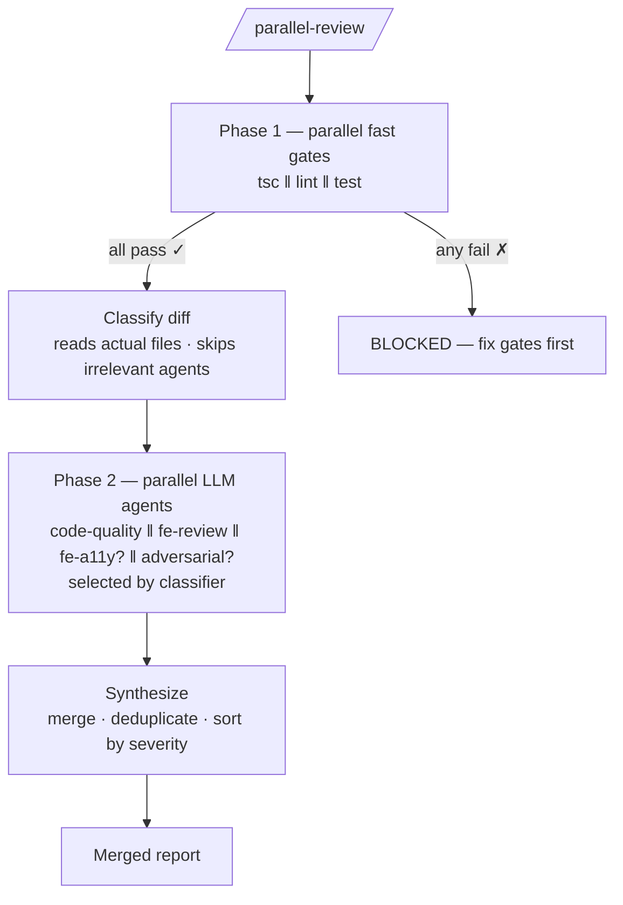
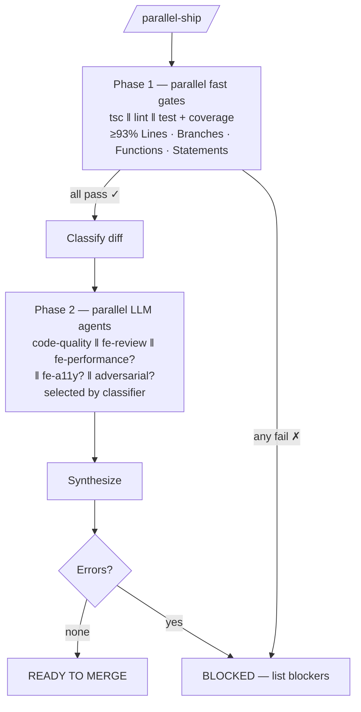
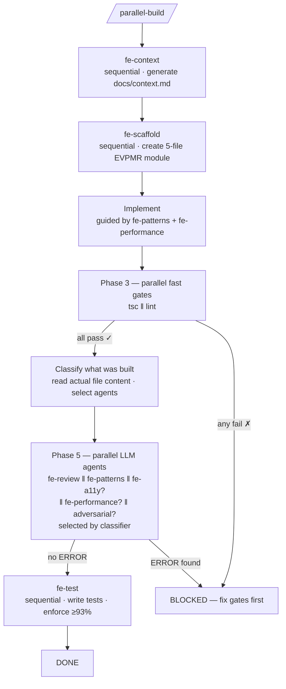
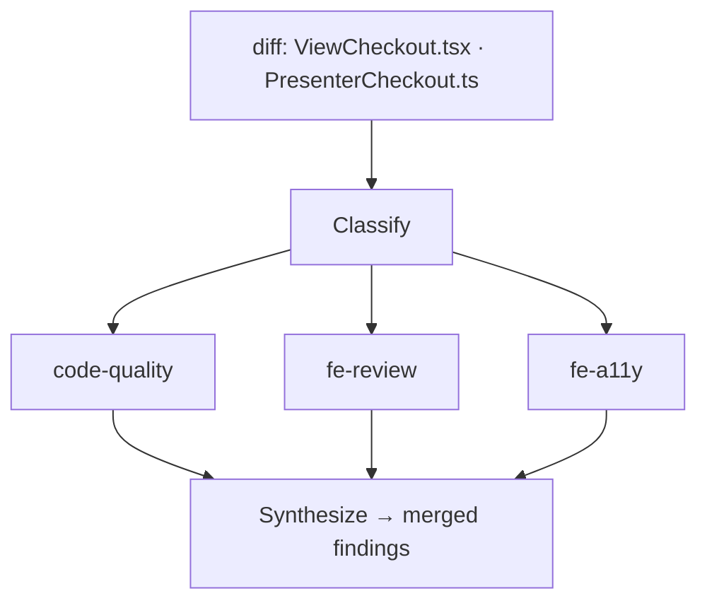
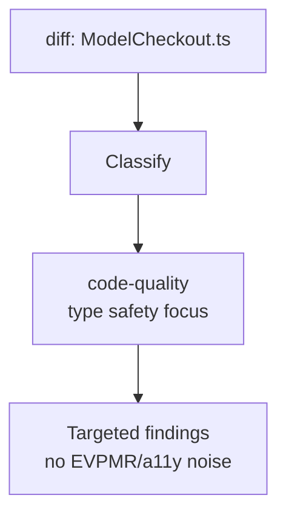
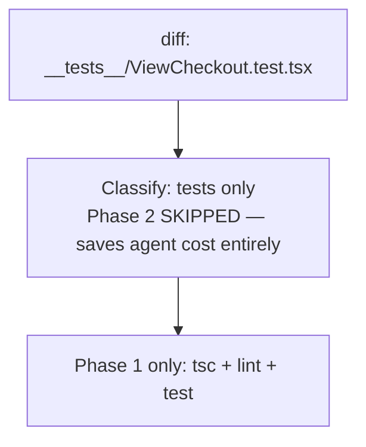
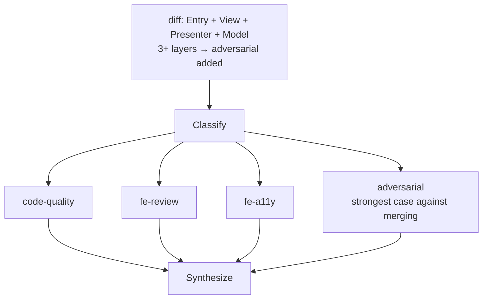
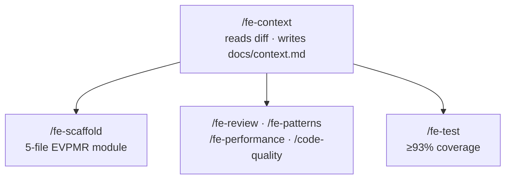

# craftkit `v1.8.2`

One repo of AI coding skills that auto-syncs across **Claude Code**, **Cursor**, **GitHub Copilot**, **Gemini CLI**, **Codex CLI**, and **Crush**. Pull once — every AI tool gets the same workflows, rules, and commands.

---

## Table of contents

- [Why bother?](#why-bother) — token savings with RTK + Caveman + Ponytail
- [Install](#install)
- [How it works](#how-it-works)
- [Using the workflows](#using-the-workflows)
  - [Just say what you want](#just-say-what-you-want)
  - [Dynamic workflows](#dynamic-workflows-default) — `/parallel-review`, `/parallel-ship`, `/parallel-build`
  - [How the classifier picks agents](#how-the-classifier-picks-agents)
  - [Sequential fallback](#sequential-fallback) — `/review`, `/ship`, `/build`
  - [Fix, tests, and PR message](#fix-tests-and-pr-message)
- [Skills reference](#skills-reference)
- [Agents reference](#agents-reference)
- [Architecture (EVPMR)](#architecture-evpmr)
- [Model routing](#model-routing)
- [Managing skills](#managing-skills)
- [Tooling](#tooling) — RTK, Caveman, Ponytail, Karpathy Guidelines
- [Changelog](#changelog)

---

## Why bother?

AI coding sessions are expensive. Two things drain tokens fast: **verbose shell output** the AI has to read, and **verbose AI responses** you have to read. This repo ships two compression layers that cut both.

### RTK — compresses what the AI reads (shell output)

Shell commands like `git diff` and `jest` dump noise before the signal. RTK filters it out before it reaches the AI.

```
── WITHOUT RTK (38 tokens) ──────────────────────────────────────────
On branch feature/checkout-flow
Your branch is ahead of 'origin/feature/checkout-flow' by 3 commits.
  (use "git push" to publish your local commits)

Changes not staged for commit:
  (use "git add <file>..." to update staging area)

        modified:   src/checkout/ViewCheckout.tsx
        modified:   src/checkout/PresenterCheckout.ts

Untracked files:
        src/checkout/__tests__/ViewCheckout.test.tsx

── WITH RTK (6 tokens) ──────────────────────────────────────────────
M src/checkout/ViewCheckout.tsx
M src/checkout/PresenterCheckout.ts
? src/checkout/__tests__/ViewCheckout.test.tsx
```

**~84% reduction** on a single call. Across a full session — `git diff`, `tsc`, `jest`, `lint` — compounds to **60–90% savings on AI input tokens**.

### Caveman — compresses what you read (AI output)

The `caveman` rule strips filler, hedging, and pleasantries from every response. Same findings, fewer words.

```
── WITHOUT CAVEMAN (~65 tokens) ─────────────────────────────────────
Sure! After carefully reviewing the code, I can see that there's
actually an issue in the ViewCheckout component. It looks like
there's a useState hook being used directly in the View layer,
which basically violates the EVPMR architecture pattern. You'll
want to move that state logic into the Presenter layer instead.

── WITH CAVEMAN (~18 tokens) ────────────────────────────────────────
[ERROR] ViewCheckout.tsx:14 — useState in View layer.
  Why: violates EVPMR.
  Fix: move to PresenterCheckout.ts.
```

**~72% reduction** per response. Full review sessions with reasoning and multi-step output: **40–60% output savings**.

### Combined impact

### Ponytail — compresses what the AI generates (code output)

The `ponytail` decision ladder enforces YAGNI before any code is written. Before generating code, the AI stops at the first rung that holds: does this need to exist? is it in stdlib? is it a native feature? is an installed dep enough? can it be one line? Only then: minimal code. Deliberate shortcuts are marked with `ponytail:` comments naming their ceiling and upgrade path.

```
── WITHOUT PONYTAIL ─────────────────────────────────────────────────
// custom retry logic with exponential backoff + jitter
class RetryManager {
  private attempts = 0;
  async execute<T>(fn: () => Promise<T>, maxRetries = 3): Promise<T> { ... }
  private calcDelay(attempt: number): number { ... }
}

── WITH PONYTAIL ────────────────────────────────────────────────────
// ponytail: no retry lib — inline for now. ceiling: >3 callers → extract.
const withRetry = (fn, n = 3) => fn().catch(e => n > 0 ? withRetry(fn, n-1) : Promise.reject(e));
```

**80–94% code reduction** on over-engineered solutions. Pairs with `/ponytail-review` (audit a diff), `/ponytail-audit` (scan the whole repo), `/ponytail-debt` (track deferred shortcuts).

### Combined impact

| Layer | Compresses | Typical savings |
|-------|------------|-----------------|
| RTK | Shell output → AI input | 60–90% on dev operations |
| Caveman | AI output → your reading | 40–60% on prose responses |
| Ponytail | Code generated | 80–94% on over-engineered solutions |
| **Together** | All directions | **50–80% total session cost** |

Typical feature review session without compression: ~40,000 tokens. With RTK + Caveman + Ponytail: ~8,000–20,000 tokens.

---

## Install

**Option A — npm** (version pinning + rollback):
```bash
npm install -g @raditia/craftkit
```

Pin a version or roll back:
```bash
npm install -g @raditia/craftkit@1.5.0
```

**Option B — git** (auto-update on `git pull`):
```bash
git clone git@github.com:raditia/craftkit.git ~/craftkit
cd ~/craftkit
bash install.sh
```

`install.sh` wires up the post-merge hook and runs the first sync. After that, `git pull` keeps every AI tool up to date automatically.

**Requirements:** bash 3.2+, curl. macOS ships bash 3.2 by default.  
**Optional:** `jq` for Copilot VS Code settings integration.

**Per-project Copilot `@` agents** (run inside any project repo):
```bash
bash ~/craftkit/scripts/init-copilot-agents.sh
# commit .github/ to share with your team
```

---

## How it works

Every `git pull` triggers a sync that installs rules and skills into each AI tool:

```
git pull
   │
   └─► post-merge hook
           │
           └─► sync.sh
                   │
                   ├─► RTK + Caveman          (token compression tools)
                   ├─► rules/*.md             → always-on rules (every session)
                   ├─► skills/*/SKILL.md      → on-demand slash commands
                   └─► commands/*.md          → on-demand workflow orchestrators
```

Three namespaces, one source of truth:

| Directory | Loaded | Invoked |
|-----------|--------|---------|
| `rules/` | Every session, automatically | Never — always present |
| `skills/` | On demand | Slash command or natural language |
| `commands/` | On demand | Slash command or natural language |

### Where files land per AI tool

```
rules/  →  ALWAYS-ON
┌──────────────┬────────────────────────────────────────────────────┐
│ Claude Code  │ ~/.claude/CLAUDE.md           (managed block)      │
│ Cursor       │ ~/.cursor/rules/*.mdc         (alwaysApply)        │
│ Copilot      │ codeGeneration.instructions                        │
│ Gemini CLI   │ ~/GEMINI.md                   (managed block)      │
│ Codex CLI    │ ~/.codex/AGENTS.md            (managed block)      │
│ Crush        │ ~/.config/crush/CRUSH.md      (managed block)      │
└──────────────┴────────────────────────────────────────────────────┘

skills/ and commands/  →  ON-DEMAND
┌──────────────┬────────────────────────────────────────────────────┐
│ Claude Code  │ ~/.claude/commands/<name>.md  → /<name>            │
│ Cursor       │ ~/.cursor/rules/*.mdc         (alwaysApply:false)  │
│ Copilot      │ codeGeneration.instructions                        │
│ Gemini CLI   │ ~/GEMINI.md                   (managed block)      │
│ Codex CLI    │ ~/.codex/AGENTS.md            (managed block)      │
│ Crush        │ ~/.config/crush/skills/<name>.md → command         │
└──────────────┴────────────────────────────────────────────────────┘
```

---

## Using the workflows

### Just say what you want

Natural language routes to the right command automatically. No slash commands required.

```
"review this"           →  /parallel-review
"build this feature"    →  /parallel-build
"ship this"             →  /parallel-ship
"fix this bug"          →  /fix
"write tests for this"  →  /fe-test
"generate PR message"   →  /pr-message
```

---

### Dynamic workflows (default)

Build, review, and ship use **dynamic parallel execution** — a classifier reads your actual diff, selects only the agents that matter, and runs them concurrently. Test-only diffs skip deep review entirely.

#### /parallel-review

> Triggered by: `"review this"` / `"help me review"` / `"code review"` / `"LGTM check"`



#### /parallel-ship

> Triggered by: `"ship this"` / `"prepare for PR"` / `"is this ready?"` / `"get this ready to merge"`



#### /parallel-build

> Triggered by: `"build feature X"` / `"implement X"` / `"create a new screen"`



---

### How the classifier picks agents

The classifier reads your actual changed files — not just filenames — and selects only the agents that apply. Irrelevant agents are skipped entirely.

```
git diff shows:                          agents selected:
──────────────────────────────────────────────────────────
View*.tsx                           →   code-quality + fe-review + fe-a11y
Presenter*.ts                       →   code-quality + fe-review
Model*.ts                           →   code-quality (type/correctness focus)
Entry*.tsx or Resource*.ts          →   fe-review
View or Presenter + /parallel-ship  →   + fe-performance
3+ EVPMR layers changed             →   + adversarial (devil's advocate)
auth / payment / credential paths   →   code-quality (security emphasis)
test files only                     →   Phase 2 SKIPPED entirely
```

**Example A — View + Presenter changed**



**Example B — Model only**



**Example C — Test files only**



**Example D — 4 EVPMR layers → adversarial triggered**



---

### Sequential fallback

When you want a lightweight, single-pass run — use the explicit slash command.

| Command | When to prefer |
|---------|---------------|
| [`/review`](commands/review.md) | Quick sanity check, small diff |
| [`/ship`](commands/ship.md) | Simple pre-merge gate, tests already passing |
| [`/build`](commands/build.md) | Scaffold-only, no parallel validation needed |

---

### Fix, tests, and PR message

```
"something is broken" / "fix this bug" / "this crashes"
  /fix  →  fe-context → reproduce → isolate → fix → regression test

"write tests" / "add tests" / "coverage is low"
  /fe-test  →  write tests for all changed paths, enforce ≥93% coverage

"generate PR message" / "draft a PR" / "what should my PR say"
  /pr-message  →  read diff → write title + summary + goal + changes + coverage → humanize (if installed) → copy to clipboard
```

---

## Skills reference

### Always-active rules

Loaded automatically on every session. Never invoke these — they're always present.

| Rule | Enforces |
|------|---------|
| [`caveman`](rules/caveman.md) | Terse responses — no filler, no hedging. lite / full / ultra modes |
| [`fe-rules`](rules/fe-rules.md) | EVPMR layer constraints, TypeScript strict, styling tokens, React correctness, tracking |
| [`karpathy-guidelines`](rules/karpathy-guidelines.md) | Think before coding, simplicity, surgical changes, goal-driven, read before write, tests verify intent, checkpoint after steps |
| [`using-agent-skills`](rules/using-agent-skills.md) | Skill routing (mandatory gate — classify before every response, announce match or "No skill matched."), model selection, severity labels, parallel classifier, model for judgment only, surface conflicts |

### Frontend skills — on demand

Use when a task is narrower than a full workflow.

| Skill | When to use | Escalate if |
|-------|-------------|-------------|
| [`fe-context`](skills/fe-context/SKILL.md) | Generate `docs/context.md` from branch diff | Diff spans > 10 interdependent files |
| [`fe-scaffold`](skills/fe-scaffold/SKILL.md) | Create a new 5-file EVPMR module | Novel architecture outside EVPMR |
| [`fe-review`](skills/fe-review/SKILL.md) | EVPMR pattern review only | Architectural conflicts with non-obvious resolution |
| [`fe-patterns`](skills/fe-patterns/SKILL.md) | Composition patterns, hooks discipline, state location | Novel state architecture |
| [`fe-performance`](skills/fe-performance/SKILL.md) | Waterfall elimination, bundle size, re-renders | Lighthouse regressions with non-obvious root cause |
| [`fe-a11y`](skills/fe-a11y/SKILL.md) | Labels, roles, focus management, reduced motion — RN & Next.js | Complex focus flows spanning multiple routes |
| [`fe-test`](skills/fe-test/SKILL.md) | Write/improve tests — enforces ≥93% coverage | Can't reach 93%, root cause unclear |

### General skills — on demand

| Skill | When to use | Escalate if |
|-------|-------------|-------------|
| [`code-quality`](skills/code-quality/SKILL.md) | Review (5-axis) or simplify complex code | Security-sensitive review, or refactor > 500 lines |
| [`debug`](skills/debug/SKILL.md) | Structured reproduce → isolate → fix | No hypothesis after 2 isolation attempts |
| [`ponytail-review`](skills/ponytail-review/SKILL.md) | Over-engineering audit on a diff or file — what to delete/shrink | Correctness or security concerns → use `code-quality` |
| [`ponytail-audit`](skills/ponytail-audit/SKILL.md) | Whole-repo bloat scan — ranked list of removals | — |
| [`ponytail-debt`](skills/ponytail-debt/SKILL.md) | Ledger of all `ponytail:` shortcuts — surfaces deferred simplifications | — |

---

## Agents reference

Cold sub-agents spawned by parallel workflows. Each has a fixed system prompt (role + checklist), enforced tool restrictions (`Read, Grep, Glob` — no writes), and a set model. Orchestrators pass content (diff or files) as the user message when spawning.

Auto-synced to `~/.claude/agents/` on `git pull` (Claude Code only).

| Agent | Role | Spawned by | Model |
|-------|------|-----------|-------|
| [`code-quality`](agents/code-quality.md) | 5-axis review: correctness, readability, EVPMR arch, security, performance | `parallel-review`, `parallel-ship` | sonnet |
| [`fe-review`](agents/fe-review.md) | EVPMR layer violations, TypeScript, styling, React correctness, tracking | `parallel-review`, `parallel-build`, `parallel-ship` | sonnet |
| [`fe-a11y`](agents/fe-a11y.md) | Accessibility: labels, roles, focus, announcements, reduced motion | `parallel-review`, `parallel-build`, `parallel-ship` | sonnet |
| [`fe-patterns`](agents/fe-patterns.md) | Composition patterns, hooks discipline, state location | `parallel-build` | sonnet |
| [`fe-performance`](agents/fe-performance.md) | Waterfalls, bundle size, re-renders, server-side, RN patterns | `parallel-build`, `parallel-ship` | sonnet |
| [`adversarial`](agents/adversarial.md) | Devil's advocate — strongest case against merging/shipping | `parallel-review`, `parallel-build`, `parallel-ship` | sonnet |
| [`plan-roaster`](agents/plan-roaster.md) | Stress-test a plan before implementation — weakest assumption + failure modes | On demand | sonnet |

### Skill vs agent — when to add which

| Question | Answer → add |
|----------|-------------|
| Will you invoke it yourself (`/name`)? | **skill** |
| Does it need conversation history or prior context? | **skill** |
| Will it ever run in parallel with another instance? | **agent** |
| Is it purely internal — only spawned by a command, never invoked by you? | **agent only** (no skill needed) |
| Needs to work both ways? | **both** — skill for manual invocation, agent for parallel spawn |

`fe-review` is an example of both: `/fe-review` for manual use, `fe-review` agent for parallel workflows. `adversarial` is agent-only — you'd never invoke it directly.

> **Agent system prompts are cold copies.** Agents don't inherit rules or session context — anything the agent needs must be baked into `agents/<name>.md`. If you update `rules/fe-rules.md`, manually update any agent that duplicates its content.

### Add an agent

```bash
# create agents/<name>.md with frontmatter: name, description, tools, model, color
git add agents/<name>.md && git commit -m "feat: add <name> agent" && git push
# users: git pull → auto-installed to ~/.claude/agents/
```

### Use an agent in a command

```
Agent({ subagent_type: "<name>", prompt: "<content to review>" })
```

The harness loads the agent definition automatically — no inline prompt needed.

---

## Architecture (EVPMR)

All frontend features follow a strict 5-file module structure. Rules are enforced by `fe-rules` at all times — no invocation needed.

```
feature-name/
├── EntryFeatureName.tsx      ← ErrorBoundary + context providers
├── ViewFeatureName.tsx       ← Pure render — calls usePresenter*, no state/effects
├── PresenterFeatureName.ts   ← All hooks, state, React Query — returns plain object
├── ModelFeatureName.ts       ← TypeScript types + pure functions only
└── ResourceFeatureName.ts    ← All display strings
```

```
View       NEVER  useState / useEffect / API calls
Presenter  NEVER  return JSX
Model      NEVER  import React or cause side effects
Entry      ALWAYS wrap in <ErrorBoundary>
Resource   ALWAYS own display strings — never hardcode in View
Styles     ALWAYS StyleSheet.create() + Token.spacing.* / Token.color.*
```

Async data always as discriminated unions:
```ts
type AsyncData<T> =
  | { type: 'NOT_ASKED' }
  | { type: 'LOADING' }
  | { type: 'DATA_READY'; payload: T }
  | { type: 'ERROR'; error: string }
```

### How context flows between skills

`/fe-context` writes `docs/context.md` (≤ 600 lines). Every skill reads it instead of re-scanning the project — one diff scan, many skills benefit.



| Level | Source | What |
|-------|--------|------|
| L1 — Rules | Always-active skill files | EVPMR, tokens, Karpathy guidelines |
| L2 — Spec | `docs/context.md` | What's being built, constraints, decisions |
| L3 — Source | Diff output | Files touched by this branch |
| L4 — Errors | On demand | Failing tests, lint, TypeScript errors |
| L5 — History | Session | Conversation context |

---

## Model routing

Each skill runs on the everyday model. Escalation is inline — the AI consults the higher model for a specific question and continues without interrupting you.

| AI | Everyday | Escalate | Fusion panel |
|----|----------|----------|-------------|
| Claude Code | `claude-sonnet-5` | `claude-opus-4-8` | 2× opus → opus judge |
| Gemini CLI | `gemini-2.5-flash` | `gemini-2.5-pro` | — |
| Cursor | claude-sonnet / gpt-4o | claude-opus / o1 | — |
| Copilot | `claude-sonnet-5` | `claude-opus-4-8` | — |
| Codex CLI | `codex-mini-latest` | `o3` | — |
| Crush | provider-dependent | provider-dependent | — |

Escalation triggers: architecture decisions with non-obvious tradeoffs, security-sensitive code, debugging with no hypothesis after 2 attempts.

Fusion panel triggers: irreversible production changes, security architecture with meaningful attack surface, decisions where a single-model opinion may miss divergent reasoning paths. Runs 2 independent opus passes → opus synthesizes using Track A (artifact: run+merge) or Track B (analysis: consensus/contradictions/unique/blind spots).

---

## Managing skills

**Never edit installed files directly** in `~/.claude/`, `~/.cursor/`, or VS Code settings — `sync.sh` owns them and will overwrite on next pull. Always edit source files in this repo.

### Add a rule (always-on)

```bash
# 1. create the file
echo '---\nname: my-rule\ndescription: What it enforces\n---\n\n...' > rules/my-rule.md

# 2. ship it
git add rules/my-rule.md && git commit -m "feat: add my-rule" && git push
# users: git pull → auto-installed
```

### Add a skill (on-demand)

> Not sure whether to add a skill or an agent? See [Skill vs agent](#skill-vs-agent--when-to-add-which).

```bash
mkdir -p skills/my-skill
# create skills/my-skill/SKILL.md with frontmatter: name, description, alwaysApply: false
git add skills/my-skill && git commit -m "feat: add my-skill" && git push
```

### Add a command (orchestrator)

```bash
# create commands/my-command.md with frontmatter: name, description
git add commands/my-command.md && git commit -m "feat: add my-command" && git push
```

### Add an agent (cold sub-agent for Claude Code)

```bash
# create agents/my-agent.md with frontmatter: name, description, tools, model, color
git add agents/my-agent.md && git commit -m "feat: add my-agent agent" && git push
# users: git pull → auto-installed to ~/.claude/agents/
```

### Remove a skill, command, or agent

```bash
git rm -r skills/<name>/       # skill
git rm commands/<name>.md      # command
git rm agents/<name>.md        # agent → also remove from subagent_type references in commands/
git commit -m "remove: <name>" && git push
# users: git pull → auto-uninstalled from all AI tools
```

---

## Tooling

External tools and inspirations bundled or adopted into this repo.

| Tool | Source | Purpose | How it's used |
|------|--------|---------|---------------|
| **RTK** | [github.com/rtk-ai/rtk](https://github.com/rtk-ai/rtk) | Filters shell output before it reaches the AI — 60–90% input token savings | Auto-installed on `bash install.sh`. All commands prefixed with `rtk` |
| **Caveman** | [github.com/JuliusBrussee/caveman](https://github.com/JuliusBrussee/caveman) | Strips AI output verbosity — 40–60% response token savings | Always-active via `rules/caveman.md`. lite / full / ultra modes |
| **Ponytail** | [github.com/DietrichGebert/ponytail](https://github.com/DietrichGebert/ponytail) | YAGNI-first decision ladder + over-engineering audit — 80–94% code reduction | Decision ladder in `karpathy-guidelines`, `ponytail:` comment convention, 3 skills: `/ponytail-review`, `/ponytail-audit`, `/ponytail-debt` |
| **Karpathy Guidelines** | [karpathy.ai](https://karpathy.ai) — adapted | Behavioral rules to prevent LLM coding pitfalls: think before coding, surgical changes, goal-driven execution | Always-active via `rules/karpathy-guidelines.md` |
| **Jumbo** | [github.com/jumbocontext/jumbo.cli](https://github.com/jumbocontext/jumbo.cli) | Per-project memory/context orchestration — event-sourced goals, guidelines, invariants in `.jumbo/`; survives across sessions and tools | Auto-installed globally on `bash install.sh` (`ensure_tools`). Per-project memory: run `jumbo` inside a repo to init `.jumbo/` |

---

## Changelog

| Version | Date | Changes |
|---------|------|---------|
| `v1.8.2` | 2026-06-25 | Fixed a multi-minute stall in parallel workflows. The spawn → synthesize gap left no wait guidance, so the main thread improvised a `grep`/`while` busy-wait on `tasks/*.output` that kept spinning ~12 min after the agents had already come to rest (<2 min). Added a **Do not wait by polling** directive after the spawn paragraph in `parallel-review`, `parallel-ship`, `parallel-build`: the harness auto-wakes the main thread on agent completion — go straight to synthesis, never poll task files. |
| `v1.8.1` | 2026-06-25 | Fixed silent coverage loss in parallel workflows. `fe-a11y` agent was the only one on `model: haiku`; a haiku key 401 killed it and the run reported 4-of-5 agents as if the a11y axis were clean. Aligned `fe-a11y` to `sonnet` and added **Step 5 — Handle agent failures** to the classifier (`using-agent-skills`): a dead agent is now surfaced as a skipped coverage gap and gates the verdict to `INCOMPLETE` instead of `READY TO MERGE`/`DONE`. |
| `v1.8.0` | 2026-06-25 | Removed the iOS skill set from the public package — moved to a local-only overlay (gitignored, kept on disk so local sync still installs it, like `caveman*/` and `cavecrew/`). The skills hardcoded a private codebase's module layout and so don't generalize. |
| `v1.7.0` | 2026-06-24 | Added an on-demand iOS skill set (MVVM-C). _Superseded by v1.8.0 — moved to a local-only overlay; see above._ |
| `v1.6.2` | 2026-06-22 | `/pr-message` runs the generated message through the [humanizer](https://github.com/blader/humanizer) skill when installed (`~/.claude/skills/humanizer`) to strip AI-writing tells — optional, preserves markdown structure, no-op on tools without `/humanizer`. |
| `v1.6.1` | 2026-06-22 | `/pr-message` now emits a PR title (`#` heading) alongside the body — concise imperative, matches the branch's conventional-commit prefix when present. |
| `v1.6.0` | 2026-06-22 | Bundled [Jumbo](https://github.com/jumbocontext/jumbo.cli) — per-project memory/context CLI installed globally via `ensure_tools` (npm), alongside RTK. Per-project `.jumbo/` init stays a manual `jumbo` run inside each repo by design. Added to Tooling table. |
| `v1.5.0` | 2026-06-19 | Adopted fusion-fable independence-then-synthesis pattern. Model routing gains fusion panel tier (2× opus → opus judge) with Track A/B classification. Parallel command synthesis upgraded: [CONSENSUS]/[UNIQUE] confidence markers, explicit contradiction surfacing, adversarial findings reframed as blind spots. |
| `v1.4.0` | 2026-06-19 | New `agents/` folder with 7 cold sub-agent definitions (`code-quality`, `fe-review`, `fe-a11y`, `fe-patterns`, `fe-performance`, `adversarial`, `plan-roaster`). Auto-synced to `~/.claude/agents/` on `git pull`. Parallel commands (`parallel-review`, `parallel-ship`, `parallel-build`) updated to spawn agents by name — inline prompt duplication removed (~120 lines). |
| `v1.3.4` | 2026-06-19 | Replaced all ASCII flow diagrams with Mermaid — parallel-review, parallel-ship, parallel-build, classifier examples (A–D), and context flow. Fail/blocked paths added to ship and build diagrams. |
| `v1.3.3` | 2026-06-19 | Added Codex CLI adapter (`~/.codex/AGENTS.md` managed block) and Crush adapter (`~/.config/crush/CRUSH.md` rules + `~/.config/crush/skills/` per-command files). Both wired into sync.sh auto-sync on `git pull`. |
| `v1.3.2` | 2026-06-19 | Escalation model updated to `claude-opus-4-8` across all skills and commands. Context freshness check added to standard load procedure — detects branch/commit mismatch and auto-regenerates `docs/context.md`. Downgraded `fe-a11y`, `fe-scaffold` to cheapest model. Token optimizations: `fe-test` drops redundant context section + git log step. |
| `v1.3.1` | 2026-06-18 | Skill routing upgraded to mandatory gate: classify before every response, announce match or "No skill matched.", added as failure mode #11. Hook injects skill-first reminder every turn for per-turn reinforcement |
| `v1.3.0` | 2026-06-15 | Adopted ponytail: decision ladder in `karpathy-guidelines`, `ponytail:` comment convention, 3 new skills (`ponytail-review`, `ponytail-audit`, `ponytail-debt`), intent-first routing rule |
| `v1.2.0` | 2026-06-14 | Dynamic parallel workflows made default for `/build`, `/review`, `/ship`. README restructured with workflow diagrams, TOC, and token savings examples |
| `v1.1.0` | 2026-06-13 | Added `/parallel-review`, `/parallel-build`, `/parallel-ship` with classifier-based agent selection. Audited and cleaned all skills |
| `v1.0.3` | 2026-06-10 | Added `/pr-message` skill. Enforced `no-unused-vars` in `fe-rules`. Added `tsc --noEmit` verification after any TS change |
| `v1.0.2` | 2026-06-08 | Skill invocation announcements. Fluent tracker mock. Natural language triggers for `/fe-test`. Per-project Copilot agents auto-sync on `git pull` |
| `v1.0.1` | 2026-06-05 | Bash 3.2 support (macOS default). Natural language routing for `/fe-test`. `init-copilot-agents.sh` for per-project `@` agents |
| `v1.0.0` | 2026-06-01 | Three-tier namespace (`rules/`, `skills/`, `commands/`). `code-quality` skill. Inline model escalation. `fe-a11y` skill. Caveman embedded as rule. Skill auto-cleanup on `git pull` |
