# craftkit `v1.26.0`

One repo of AI coding skills that auto-syncs across **Claude Code**, **Cursor**, **Gemini CLI**, and **Codex CLI**. Pull once — every AI tool gets the same workflows, rules, and commands.

---

## Table of contents

- [Why bother?](#why-bother) — token savings with RTK + Caveman + Ponytail
- [Install](#install)
- [How it works](#how-it-works)
- [Using the workflows](#using-the-workflows)
  - [Just say what you want](#just-say-what-you-want)
  - [Dynamic workflows](#dynamic-workflows-default) — `/parallel-review`, `/parallel-ship`, `/parallel-build`
  - [How the classifier picks agents](#how-the-classifier-picks-agents)
  - [Sequential fallback](#sequential-fallback) — `/review`, `/ship`, `/build`
  - [Planning pipeline: /define](#planning-pipeline-define--before-you-build) — `/interview` → `/spec` → `/plan`
  - [Experimental: /team-build](#experimental-team-build--agent-teams) — agent-teams build
  - [Fix, tests, and PR message](#fix-tests-and-pr-message)
  - [Grill, research, and handoff](#grill-research-and-handoff) — stress-test plans, delegate reading, hand off sessions
- [Skills reference](#skills-reference)
- [Agents reference](#agents-reference)
- [Architecture (EVPMR)](#architecture-evpmr)
- [Model routing](#model-routing)
- [Managing skills](#managing-skills)
- [Tooling](#tooling) — RTK, Caveman, Ponytail, Karpathy Guidelines
- [Changelog](CHANGELOG.md)

---

## Why bother?

AI coding sessions are expensive. Two things drain tokens fast: **verbose shell output** the AI has to read, and **verbose AI responses** you have to read. This repo ships two compression layers that cut both.

### RTK — compresses what the AI reads (shell output)

Shell commands like `git diff` and `jest` dump noise before the signal. RTK filters it out before it reaches the AI.

```
── WITHOUT RTK (38 tokens) ──────────────────────────────────────────
On branch feature/checkout-flow
Your branch is ahead of 'origin/feature/checkout-flow' by 3 commits.
  (use "git push" to publish your local commits)

Changes not staged for commit:
  (use "git add <file>..." to update staging area)

        modified:   src/checkout/ViewCheckout.tsx
        modified:   src/checkout/PresenterCheckout.ts

Untracked files:
        src/checkout/__tests__/ViewCheckout.test.tsx

── WITH RTK (6 tokens) ──────────────────────────────────────────────
M src/checkout/ViewCheckout.tsx
M src/checkout/PresenterCheckout.ts
? src/checkout/__tests__/ViewCheckout.test.tsx
```

**~84% reduction** on a single call. Across a full session — `git diff`, `tsc`, `jest`, `lint` — compounds to **60–90% savings on AI input tokens**.

### Caveman — compresses what you read (AI output)

The caveman plugin strips filler, hedging, and pleasantries from every response. Same findings, fewer words.

```
── WITHOUT CAVEMAN (~65 tokens) ─────────────────────────────────────
Sure! After carefully reviewing the code, I can see that there's
actually an issue in the ViewCheckout component. It looks like
there's a useState hook being used directly in the View layer,
which basically violates the EVPMR architecture pattern. You'll
want to move that state logic into the Presenter layer instead.

── WITH CAVEMAN (~18 tokens) ────────────────────────────────────────
[ERROR] ViewCheckout.tsx:14 — useState in View layer.
  Why: violates EVPMR.
  Fix: move to PresenterCheckout.ts.
```

**~72% reduction** per response. Full review sessions with reasoning and multi-step output: **40–60% output savings**.

### Combined impact

### Ponytail — compresses what the AI generates (code output)

The `ponytail` decision ladder enforces YAGNI before any code is written. Before generating code, the AI stops at the first rung that holds: does this need to exist? is it in stdlib? is it a native feature? is an installed dep enough? can it be one line? Only then: minimal code. Deliberate shortcuts are marked with `ponytail:` comments naming their ceiling and upgrade path.

```
── WITHOUT PONYTAIL ─────────────────────────────────────────────────
// custom retry logic with exponential backoff + jitter
class RetryManager {
  private attempts = 0;
  async execute<T>(fn: () => Promise<T>, maxRetries = 3): Promise<T> { ... }
  private calcDelay(attempt: number): number { ... }
}

── WITH PONYTAIL ────────────────────────────────────────────────────
// ponytail: no retry lib — inline for now. ceiling: >3 callers → extract.
const withRetry = (fn, n = 3) => fn().catch(e => n > 0 ? withRetry(fn, n-1) : Promise.reject(e));
```

The **ponytail rubric** — six tags (`delete:` `stdlib:` `native:` `yagni:` `shrink:` `narrate:`) plus a protected list — lives in `karpathy-guidelines` (always active), so the writing side authors under the exact list the reviewing side scores by. Every turn that writes code runs a self-pass against it before reporting done, and findings are applied as deletion at the named `file:line`, never as a restructure. That is what keeps a later `/ponytail-review` from turning into a rewrite loop.

**80–94% code reduction** on over-engineered solutions. Pairs with `/ponytail-review` (audit a diff), `/ponytail-audit` (scan the whole repo), `/ponytail-debt` (track deferred shortcuts).

### Combined impact

| Layer | Compresses | Typical savings |
|-------|------------|-----------------|
| RTK | Shell output → AI input | 60–90% on dev operations |
| Caveman | AI output → your reading | 40–60% on prose responses |
| Ponytail | Code generated | 80–94% on over-engineered solutions |
| **Together** | All directions | **50–80% total session cost** |

Typical feature review session without compression: ~40,000 tokens. With RTK + Caveman + Ponytail: ~8,000–20,000 tokens.

---

## Install

**Option A — npm** (version pinning + rollback):
```bash
npm install -g @raditia/craftkit
```

Pin a version or roll back:
```bash
npm install -g @raditia/craftkit@1.5.0
```

**Option B — git** (auto-update on `git pull`):
```bash
git clone git@github.com:raditia/craftkit.git ~/craftkit
cd ~/craftkit
bash install.sh
```

`install.sh` wires up the post-merge hook and runs the first sync. After that, `git pull` keeps every AI tool up to date automatically.

**Requirements:** bash 3.2+, curl. macOS ships bash 3.2 by default.

**Upgrading from ≤ v1.23.0** — GitHub Copilot and Crush were retired in v1.24.0. The next sync uninstalls them from your machine automatically: Copilot's entries come out of VS Code `settings.json` and Crush's managed block out of `~/.config/crush/CRUSH.md`, then the state files are dropped so it never runs again. One thing it deliberately leaves alone: per-project Copilot `@` agents wrote real files into your other repos, possibly committed there, so sync prints those paths and lets you decide.

**Contributing to craftkit itself** — there is no build or test suite (the product is markdown), so `check.sh` is the gate:
```bash
bash check.sh   # content integrity — exit 0 required before commit
bash sync.sh    # distribute; a second consecutive run must report no work
```
It catches what a reader can't hold in their head: dangling `subagent_type` references, skill/command install-dest collisions, nested skills that never sync, frontmatter/path name drift, unresolvable `craftkitInject` sources, a routing hook advertising a renamed command or no longer resolving a platform from `cwd`, an orchestrator that covers RN/web but not native, an always-active rule contradicting the native skills, undocumented agents or skills, an adapter name listed in `sync.sh` with no sourced file behind it, a `parallel-*` orchestrator with no sequential twin mapped in both the rule and the hook, a routing hook pinned to a node version fnm can prune, and version drift across `package.json` + README header + newest `CHANGELOG.md` section. Every check exists because that exact bug shipped unnoticed — when you fix a new class, add a check and confirm it fails before making it pass.

---

## How it works

Every `git pull` triggers a sync that installs rules, skills, commands, and agents into each AI tool:

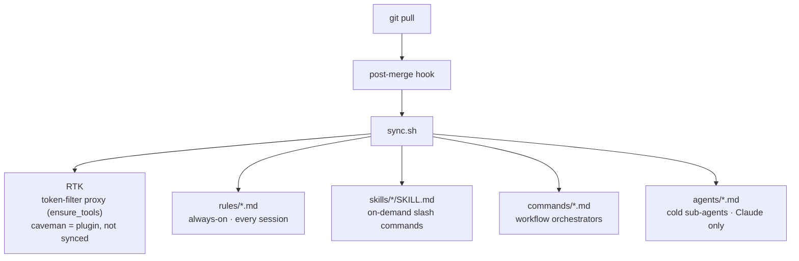
```mermaid
flowchart TD
    A[git pull] --> B[post-merge hook]
    B --> C[sync.sh]
    C --> T["RTK\ntoken-filter proxy (ensure_tools)\ncaveman = plugin, not synced"]
    C --> R["rules/*.md\nalways-on · every session"]
    C --> S["skills/*/SKILL.md\non-demand slash commands"]
    C --> M["commands/*.md\nworkflow orchestrators"]
    C --> G["agents/*.md\ncold sub-agents · Claude only"]
```

Four namespaces, one source of truth:

| Directory | Loaded | Invoked |
|-----------|--------|---------|
| `rules/` | Every session, automatically | Never — always present |
| `skills/` | On demand | Slash command or natural language |
| `commands/` | On demand | Slash command or natural language |
| `agents/` | Spawned by an orchestrator | `subagent_type:` — never directly (Claude only) |

### Where files land per AI tool

| Tool | Always-on (`rules/`) | On-demand (`skills/` + `commands/`) | Agents (`agents/`) |
|------|----------------------|--------------------------------------|--------------------|
| Claude Code | `~/.claude/CLAUDE.md` (managed block) | `~/.claude/commands/<name>.md` → `/<name>` | `~/.claude/agents/<name>.md` |
| Cursor | `~/.cursor/rules/*.mdc` (alwaysApply) | `~/.cursor/rules/*.mdc` (alwaysApply:false) | — |
| Gemini CLI | `~/GEMINI.md` (managed block) | `~/GEMINI.md` (managed block) | — |
| Codex CLI | `~/.codex/AGENTS.md` (managed block) | `~/.codex/AGENTS.md` (managed block) | — |

Agents are Claude-only — the other three tools have no cold sub-agent concept, so `sync.sh` skips the agent pass for them.

**Retired:** GitHub Copilot and Crush were supported through v1.23.0. Every kept tool exposes a headless entry point (`claude -p`, `cursor-agent`, `gemini -p`, `codex exec`), which is what lets one of them spawn work in another; Copilot is IDE-bound and Crush is TUI-only, so neither can participate in cross-tool agent fan-out.

---

## Using the workflows

### Just say what you want

Natural language routes to the right command automatically. No slash commands required.

```
"plan this feature"     →  /define   (interview → spec → plan, checkpoint-gated)
"review this"           →  /parallel-review
"build this feature"    →  /parallel-build
"ship this"             →  /parallel-ship
"fix this bug"          →  /fix
"write tests for this"  →  /fe-test · /android-test · /ios-test  (by platform)
"generate PR message"   →  /pr-message
"poke holes in my plan" →  /grill     (also: "grill this", "stress-test my design")
"research X for me"     →  /research  (background agent, primary sources)
"hand this session off" →  /handoff   (also: "summarize for the next agent")
```

Platform is not inferred. On every prompt `hooks/craftkit-routing.js` walks up from `cwd` for `settings.gradle` (Android), `Podfile` / `Package.swift` / `*.xcodeproj` (iOS), or `package.json` (RN/web) — nearest ancestor wins, several markers at one level report as mixed — and injects the answer. So `"write tests for this"` in an Android repo resolves to `/android-test`, never `/fe-test`.

---

### Dynamic workflows (default)

Build, review, and ship use **dynamic parallel execution** — a classifier detects the platform (RN/web, Android, iOS), reads your actual diff, selects only the agents that matter, and runs them concurrently. Test-only diffs skip deep review entirely. Every command below works on all three platforms; only the gates and the agent set change.

#### /parallel-review

> Triggered by: `"review this"` / `"help me review"` / `"code review"` / `"LGTM check"`

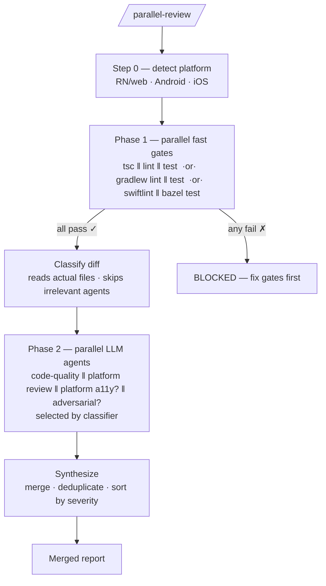
```mermaid
flowchart TD
    A[/parallel-review/] --> P["Step 0 — detect platform\nRN/web · Android · iOS"]
    P --> B["Phase 1 — parallel fast gates\ntsc ‖ lint ‖ test  ·or·  gradlew lint ‖ test  ·or·  swiftlint ‖ bazel test"]
    B -->|all pass ✓| C["Classify diff\nreads actual files · skips irrelevant agents"]
    C --> D["Phase 2 — parallel LLM agents\ncode-quality ‖ platform review ‖ platform a11y? ‖ adversarial?\nselected by classifier"]
    D --> E["Synthesize\nmerge · deduplicate · sort by severity"]
    E --> F[Merged report]
    B -->|any fail ✗| G[BLOCKED — fix gates first]
```

#### /parallel-ship

> Triggered by: `"ship this"` / `"prepare for PR"` / `"is this ready?"` / `"get this ready to merge"`

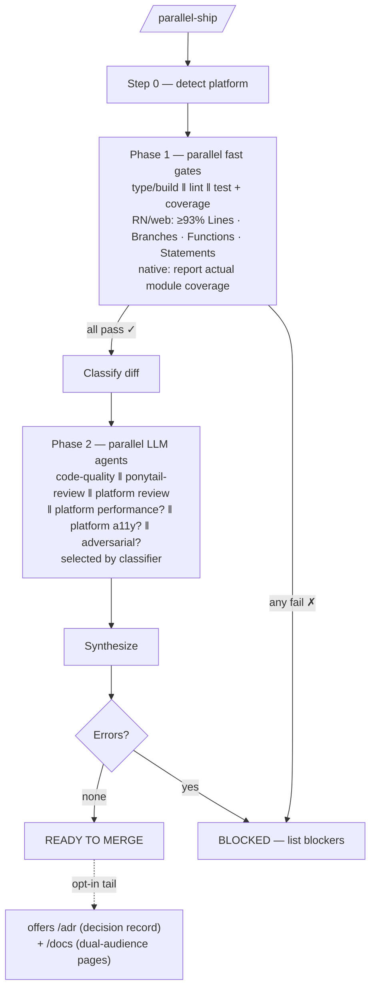
```mermaid
flowchart TD
    A[/parallel-ship/] --> P["Step 0 — detect platform"]
    P --> B["Phase 1 — parallel fast gates\ntype/build ‖ lint ‖ test + coverage\nRN/web: ≥93% Lines · Branches · Functions · Statements\nnative: report actual module coverage"]
    B -->|all pass ✓| C[Classify diff]
    C --> D["Phase 2 — parallel LLM agents\ncode-quality ‖ ponytail-review ‖ platform review\n‖ platform performance? ‖ platform a11y? ‖ adversarial?\nselected by classifier"]
    D --> E[Synthesize]
    E --> F{Errors?}
    F -->|none| G[READY TO MERGE]
    G -.->|opt-in tail| T["offers /adr (decision record)\n+ /docs (dual-audience pages)"]
    F -->|yes| H[BLOCKED — list blockers]
    B -->|any fail ✗| H
```

#### /parallel-build

> Triggered by: `"build feature X"` / `"implement X"` / `"create a new screen"`

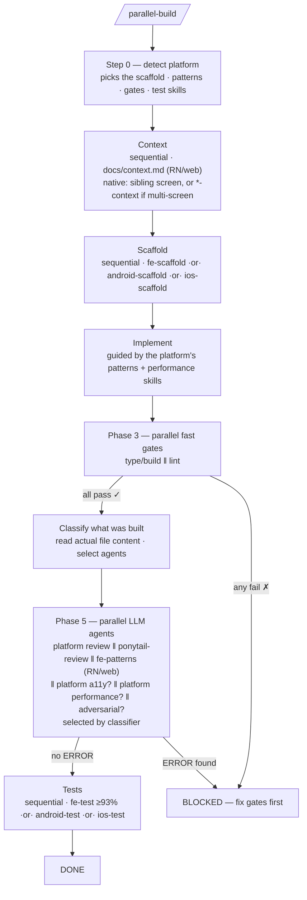
```mermaid
flowchart TD
    A[/parallel-build/] --> P["Step 0 — detect platform\npicks the scaffold · patterns · gates · test skills"]
    P --> B["Context\nsequential · docs/context.md (RN/web)\nnative: sibling screen, or *-context if multi-screen"]
    B --> C["Scaffold\nsequential · fe-scaffold ·or· android-scaffold ·or· ios-scaffold"]
    C --> D["Implement\nguided by the platform's patterns + performance skills"]
    D --> E["Phase 3 — parallel fast gates\ntype/build ‖ lint"]
    E -->|all pass ✓| F["Classify what was built\nread actual file content · select agents"]
    F --> G["Phase 5 — parallel LLM agents\nplatform review ‖ ponytail-review ‖ fe-patterns (RN/web)\n‖ platform a11y? ‖ platform performance? ‖ adversarial?\nselected by classifier"]
    G -->|no ERROR| H["Tests\nsequential · fe-test ≥93% ·or· android-test ·or· ios-test"]
    H --> I[DONE]
    E -->|any fail ✗| J[BLOCKED — fix gates first]
    G -->|ERROR found| J
```

---

### How the classifier picks agents

The classifier reads your actual changed files — not just filenames — and selects only the agents that apply. Irrelevant agents are skipped entirely.

```
RN / web (EVPMR)                         agents selected:
──────────────────────────────────────────────────────────
View*.tsx                           →   code-quality + fe-review + fe-a11y
Presenter*.ts                       →   code-quality + fe-review
Model*.ts                           →   code-quality (type/correctness focus)
Entry*.tsx or Resource*.ts          →   fe-review
View or Presenter + /parallel-ship  →   + fe-performance

Android (MVP)
──────────────────────────────────────────────────────────
*Activity/Fragment/Widget.kt, layout →  code-quality + android-review + android-a11y
*Presenter.kt, *ViewModel.kt         →  code-quality + android-review
*Repository/Interactor/UseCase.kt    →  code-quality
Dagger *Module/*Component.kt         →  android-review
Presenter/VM/adapter + /parallel-ship → + android-performance

iOS (MVVM-C)
──────────────────────────────────────────────────────────
*ViewController/View/Cell.swift      →  code-quality + ios-review + ios-a11y
*ViewModel.swift                     →  code-quality + ios-review
*Fetcher.swift                       →  code-quality + ios-performance
*Contract/Factory/Coordinator.swift  →  ios-review

All platforms
──────────────────────────────────────────────────────────
any non-test src + build/ship       →   + ponytail-review (over-engineering)
3+ architecture layers changed      →   + adversarial (devil's advocate)
auth / payment / credential paths   →   code-quality (security emphasis)
docs/context.md has PLANNING block  →   code-quality (spec conformance — diff vs planned acceptance criteria)
test files only                     →   Phase 2 SKIPPED entirely
```

**Example A — View + Presenter changed**

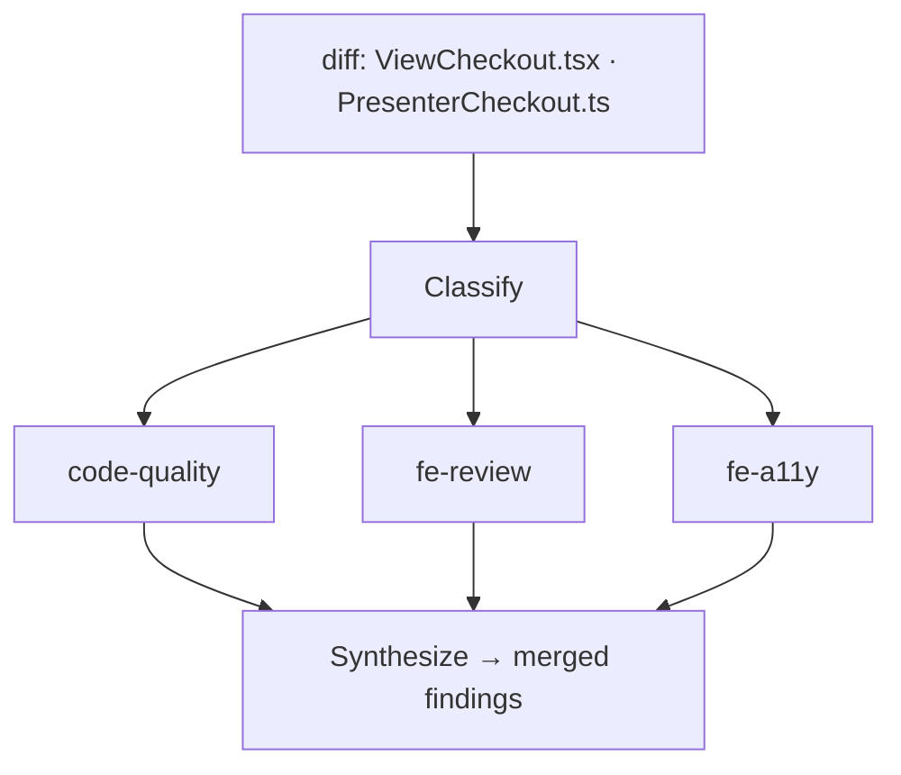
```mermaid
flowchart TD
    A["diff: ViewCheckout.tsx · PresenterCheckout.ts"] --> B[Classify]
    B --> C[code-quality]
    B --> D[fe-review]
    B --> E[fe-a11y]
    C & D & E --> F[Synthesize → merged findings]
```

**Example B — Model only**

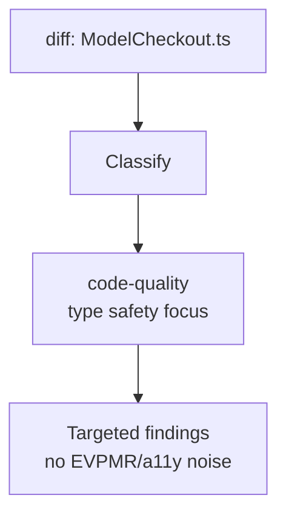
```mermaid
flowchart TD
    A["diff: ModelCheckout.ts"] --> B[Classify]
    B --> C["code-quality\ntype safety focus"]
    C --> D["Targeted findings\nno EVPMR/a11y noise"]
```

**Example C — Test files only**

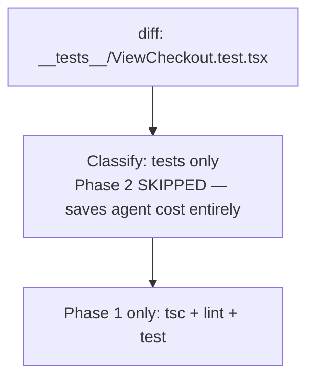
```mermaid
flowchart TD
    A["diff: __tests__/ViewCheckout.test.tsx"] --> B["Classify: tests only\nPhase 2 SKIPPED — saves agent cost entirely"]
    B --> C["Phase 1 only: tsc + lint + test"]
```

**Example D — 4 EVPMR layers → adversarial triggered**

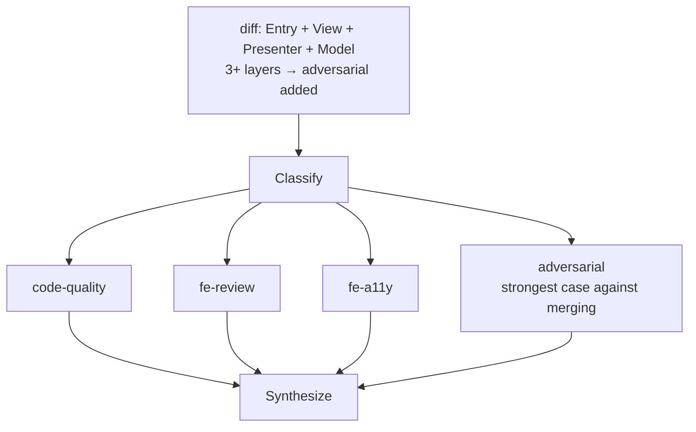
```mermaid
flowchart TD
    A["diff: Entry + View + Presenter + Model\n3+ layers → adversarial added"] --> B[Classify]
    B --> C[code-quality]
    B --> D[fe-review]
    B --> E[fe-a11y]
    B --> F["adversarial\nstrongest case against merging"]
    C & D & E & F --> G[Synthesize]
```

**Example E — Android screen (same command, native agents)**

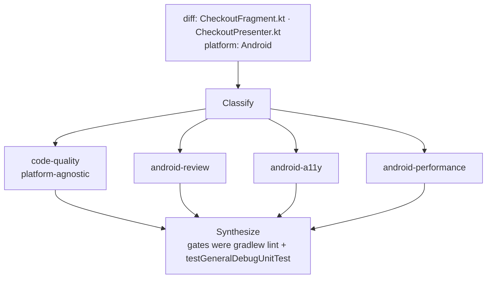
```mermaid
flowchart TD
    A["diff: CheckoutFragment.kt · CheckoutPresenter.kt\nplatform: Android"] --> B[Classify]
    B --> C["code-quality\nplatform-agnostic"]
    B --> D[android-review]
    B --> E[android-a11y]
    B --> F[android-performance]
    C & D & E & F --> G["Synthesize\ngates were gradlew lint + testGeneralDebugUnitTest"]
```

---

### Sequential fallback

When you want a lightweight, single-pass run — use the explicit slash command.

| Command | When to prefer |
|---------|---------------|
| [`/review`](commands/review.md) | Quick sanity check, small diff |
| [`/ship`](commands/ship.md) | Simple pre-merge gate, tests already passing |
| [`/build`](commands/build.md) | Scaffold-only, no parallel validation needed |

**These are also the automatic substitute where subagents can't be spawned.** A `parallel-*` command exists to spawn agents, so a context that can't — a subagent, which gets no Agent tool, or a session whose instructions disable spawning — takes the twin instead: `/parallel-build`→`/build`, `/parallel-review`→`/review`, `/parallel-ship`→`/ship`, `/team-build`→`/build`. It announces the command it actually ran and names the substitution once if a validation axis is lost, rather than re-deriving the constraint on every turn. `check.sh` verifies each twin exists and is mapped in both the rule and the routing hook.

---

### Planning pipeline: /define — before you build

`/define` chains the Define→Plan phase **checkpoint-gated**: `/interview` (de-fuzz the ask) → `/spec` (PRD) → `/plan` (task breakdown), pausing for your approval between each so a bad spec never silently becomes bad tasks. It offers `/ideate` when the approach is open and `plan-roaster` before build. Output lands in the `docs/context.md` PLANNING block, which every execution skill reads — so `/parallel-build` runs with intent, not guesses.

```
/define ──► interview ─(gate)─► spec ─(gate)─► plan ─(gate)─► [ready] ──► /parallel-build ──► /parallel-ship
             de-fuzz           PRD            tasks                        build            └─► offers /adr + /docs
```

Pre-build only — it stops at a reviewed plan and hands off. The post-build docs (`/adr` for the *why*, `/docs` for dual-audience engineer + stakeholder pages) are offered as an opt-in tail of `/parallel-ship`, when the code is final. Every planning skill is also invocable alone (`/spec`, `/plan`, …) when you only want one phase.

Already have a plan and want it challenged before building? `/grill` runs an interactive frontier-round interview over it (see [Grill, research, and handoff](#grill-research-and-handoff)); `plan-roaster` is the cold one-shot alternative.

---

### Experimental: /team-build — agent teams

> Built on Claude Code's experimental [agent teams](https://code.claude.com/docs/en/agent-teams). Requires `CLAUDE_CODE_EXPERIMENTAL_AGENT_TEAMS=1`. Explicit `/team-build` only — saying "build feature X" still routes to `/parallel-build`.

**The idea in one sentence:** instead of one AI building a feature file by file, your session becomes a **team lead** that plans the work, then spawns four AI teammates who build different files at the same time and talk to each other directly — a small dev team working off a shared task board.

How it differs from the default build:

| | `/parallel-build` (default) | `/team-build` (experimental) |
|---|---|---|
| Who writes the code | The main session, one file at a time | Two implementer teammates, in parallel |
| Helpers | One-shot reviewers that report back once | Persistent teammates that claim tasks and message each other |
| Coordination | None needed | Shared task board — finishing one task unblocks the next |
| Model split | One session model | Lead on escalated (`opus`), teammates on everyday (`sonnet`) |
| Token cost | ~1× | ~5× |
| Best for | Most features | Larger multi-file features where parallel implementation pays for the overhead |

Two rules make it safe and cheap:

- **One file, one owner.** Every file belongs to exactly one teammate for the whole build, so nobody overwrites anyone's work. Questions travel directly between teammates — the Presenter owner asks the Model owner about a type contract without round-tripping through the lead.
- **Staged spawn.** The reviewer and tester only spawn once there is something to review or test — nobody sits idle burning tokens.

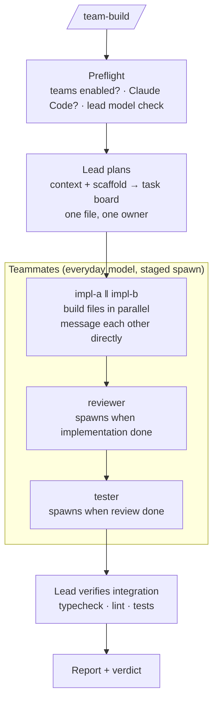
```mermaid
flowchart TD
    A[/team-build/] --> B["Preflight\nteams enabled? · Claude Code? · lead model check"]
    B --> C["Lead plans\ncontext + scaffold → task board\none file, one owner"]
    C --> D
    subgraph team ["Teammates (everyday model, staged spawn)"]
        D["impl-a ‖ impl-b\nbuild files in parallel\nmessage each other directly"] --> E["reviewer\nspawns when implementation done"]
        E --> F["tester\nspawns when review done"]
    end
    F --> G["Lead verifies integration\ntypecheck · lint · tests"]
    G --> H[Report + verdict]
```

Works on all three platforms — React Native/web (EVPMR), Android (MVP), iOS (MVVM-C) — the task board adapts to each architecture's file layout.

**Know before you run it:**

- **Claude Code only.** Teams are a harness runtime feature, not a model capability — on Cursor, Gemini CLI, or Codex CLI the command's preflight falls back to `/parallel-build` or `/build`.
- **~5× the tokens** of a solo build — reserve it for features big enough to justify the overhead.
- **Teammates don't survive `/resume`** — an interrupted build restarts coordination from the task board, not the conversation.

Full workflow: [`commands/team-build.md`](commands/team-build.md).

---

### Fix, tests, and PR message

```
"something is broken" / "fix this bug" / "this crashes"
  /fix  →  fe-context → reproduce → isolate → fix → regression test

"write tests" / "add tests" / "coverage is low"     → resolves platform first
  /fe-test       →  RN/web: write tests for all changed paths, enforce ≥93% coverage
  /android-test  →  JUnit + MockK Presenter tests (no fixed coverage bar)
  /ios-test      →  Quick + Nimble ViewModel specs (no fixed coverage bar)

"generate PR message" / "draft a PR" / "what should my PR say"
  /pr-message  →  read diff → write title + summary + goal + changes + coverage → humanize (if installed) → copy to clipboard
```

---

### Grill, research, and handoff

Three general-purpose skills adapted from [mattpocock/skills](https://github.com/mattpocock/skills) (MIT). All natural-language routed; none auto-run.

```
"poke holes in my plan" / "grill this" / "stress-test my design"   → needs an EXISTING plan
  /grill  →  map plan as design tree → ask whole frontier per round (each ❓ with ➡️ recommended
             answer) → sub-agents fetch facts, you only decide → done when frontier empty.
             Side effects: resolved terms → docs/glossary.md · hard-to-reverse decisions → offers /adr

"research X for me" / "find out how the Y API works" / "dig into the docs"
  /research  →  background agent reads PRIMARY sources only (official docs, source code, specs)
                → cited Markdown note in the repo → you keep working meanwhile

"hand this off" / "summarize this session for the next agent" / "wrapping up for today"
  /handoff  →  handoff doc in OS temp dir: goal, verified state, decisions + why, ordered next
               steps, suggested skills. Links existing artifacts by path, never duplicates. Secrets redacted.
```

Picking the right interrogator:

| You have | You want | Use |
|----------|----------|-----|
| A fuzzy new ask, no plan | Requirements extracted | `/interview` (one question at a time) |
| An existing plan/decision | It challenged, interactively | `/grill` (frontier rounds) |
| A finished plan doc | A cold second opinion, one shot | `plan-roaster` agent |

---

## Skills reference

### Always-active rules

Loaded automatically on every session. Never invoke these — they're always present.

| Rule | Enforces |
|------|---------|
| [`fe-rules`](rules/fe-rules.md) | EVPMR layer constraints, TypeScript strict, module-over-barrel imports, styling tokens, React correctness, tracking |
| [`karpathy-guidelines`](rules/karpathy-guidelines.md) | Think before coding, simplicity, surgical changes, goal-driven, read before write, tests verify intent, checkpoint after steps |
| [`using-agent-skills`](rules/using-agent-skills.md) | Skill routing (mandatory gate — classify before every response, announce match or "No skill matched."), model selection, severity labels, parallel classifier, model for judgment only, surface conflicts |

### Frontend skills — on demand

Use when a task is narrower than a full workflow.

| Skill | When to use | Escalate if |
|-------|-------------|-------------|
| [`fe-context`](skills/fe-context/SKILL.md) | Generate `docs/context.md` from branch diff | Diff spans > 10 interdependent files |
| [`fe-scaffold`](skills/fe-scaffold/SKILL.md) | Create a new 5-file EVPMR module | Novel architecture outside EVPMR |
| [`fe-review`](skills/fe-review/SKILL.md) | EVPMR pattern review only | Architectural conflicts with non-obvious resolution |
| [`fe-patterns`](skills/fe-patterns/SKILL.md) | Composition patterns, hooks discipline, state location | Novel state architecture |
| [`fe-performance`](skills/fe-performance/SKILL.md) | Waterfall elimination, bundle size, re-renders | Lighthouse regressions with non-obvious root cause |
| [`fe-a11y`](skills/fe-a11y/SKILL.md) | Labels, roles, focus management, reduced motion — RN & Next.js | Complex focus flows spanning multiple routes |
| [`fe-test`](skills/fe-test/SKILL.md) | Write/improve tests — enforces ≥93% coverage. **RN/web only** — native goes to `/android-test` / `/ios-test` | Can't reach 93%, root cause unclear |

### Native mobile skills — on demand

Sanitized, architecture-agnostic references. Native mobile does **not** use EVPMR or `docs/context.md` for single-screen work — read a real sibling screen first. For an internal codebase with concrete module names, drop a project-scoped override at `<repo>/.claude/skills/<name>/` (same skill name shadows the global one inside that repo).

The `*-review`, `*-a11y`, and `*-performance` skills below double as the source for the matching cold agents — the parallel workflows spawn those, with each skill's checklist injected live via `craftkitInject`. Edit the skill; the agent follows on the next sync.

**Android** — MVP + Core framework, Dagger, Gradle Dynamic Feature Modules:

| Skill | When to use | Escalate if |
|-------|-------------|-------------|
| [`android-patterns`](skills/android-patterns/SKILL.md) | Architecture reference — MVP layers, DI, module split, navigation | Novel state/effect orchestration |
| [`android-scaffold`](skills/android-scaffold/SKILL.md) | Scaffold a new screen (View/Presenter/ViewModel + Dagger wiring) | Outside the Core MVP contract |
| [`android-review`](skills/android-review/SKILL.md) | Review a diff against the MVP contract | Architectural conflict, non-obvious resolution |
| [`android-a11y`](skills/android-a11y/SKILL.md) | TalkBack labels/state, touch targets, Compose semantics | Complex focus flows across screens |
| [`android-performance`](skills/android-performance/SKILL.md) | Main-thread/coroutine, RecyclerView, recomposition, leaks | Jank/leak with non-obvious root cause |
| [`android-test`](skills/android-test/SKILL.md) | JUnit + MockK Presenter tests (Turbine for Flow) | Path unreachable without production refactor |
| [`android-context`](skills/android-context/SKILL.md) | Branch-scoping doc for multi-screen work | Multi-module cross-feature `-api` changes |

**iOS** — MVVM-C, Bazel + CocoaPods, Quick + Nimble:

| Skill | When to use | Escalate if |
|-------|-------------|-------------|
| [`ios-patterns`](skills/ios-patterns/SKILL.md) | Architecture reference — MVVM-C, Fetcher, Coordinator, Dependency-struct DI | Novel state/effect orchestration |
| [`ios-scaffold`](skills/ios-scaffold/SKILL.md) | Scaffold a new screen (Contract/VC/View/ViewModel/Factory/Fetcher) | Outside the MVVM-C contract |
| [`ios-review`](skills/ios-review/SKILL.md) | Review a diff against the MVVM-C contract | Architectural conflict, non-obvious resolution |
| [`ios-a11y`](skills/ios-a11y/SKILL.md) | VoiceOver labels/traits, focus, Dynamic Type, reduce motion | Complex focus flows across screens |
| [`ios-performance`](skills/ios-performance/SKILL.md) | Main-thread, cell reuse, image downsampling, retain-cycle leaks | Jank/leak with non-obvious root cause |
| [`ios-test`](skills/ios-test/SKILL.md) | Quick + Nimble ViewModel specs, mock via Dependency struct | Path unreachable without production refactor |
| [`ios-context`](skills/ios-context/SKILL.md) | Branch-scoping doc for multi-screen work | Multi-module cross-module coordinator changes |

### General skills — on demand

| Skill | When to use | Escalate if |
|-------|-------------|-------------|
| [`code-quality`](skills/code-quality/SKILL.md) | Review (5-axis) or simplify complex code | Security-sensitive review, or refactor > 500 lines |
| [`debug`](skills/debug/SKILL.md) | Structured reproduce → isolate → fix | No hypothesis after 2 isolation attempts |
| [`ideate`](skills/ideate/SKILL.md) | Divergent ideation — N framed generators → critic scores/clusters. Open-ended design, naming, fuzzy debug | High-stakes — escalate the critic/deepen pass to opus |
| [`think`](skills/think/SKILL.md) | Systems/strategy reasoning router — cynefin, systems, feedback loops, constraints, leverage, second-order. Architecture + complex-system decisions | Architecture call with non-obvious tradeoffs — escalate analysis to opus |
| [`research`](skills/research/SKILL.md) | Background agent researches a question against primary sources only, writes a cited note into the repo | — |
| [`handoff`](skills/handoff/SKILL.md) | Compact the session into a handoff doc for a fresh agent — state, decisions, next steps, suggested skills | — |
| [`ponytail-review`](skills/ponytail-review/SKILL.md) | Over-engineering audit on a diff or file — what to delete/shrink | Correctness or security concerns → use `code-quality` |
| [`ponytail-audit`](skills/ponytail-audit/SKILL.md) | Whole-repo bloat scan — ranked list of removals | — |
| [`ponytail-debt`](skills/ponytail-debt/SKILL.md) | Ledger of all `ponytail:` shortcuts — surfaces deferred simplifications | — |

### Planning & docs skills — on demand

The **Define → Plan → Document** layer. All opt-in — never auto-run from `/parallel-build`. `/spec` `/plan` `/adr` write a forward-planning block into `docs/context.md`, so downstream execution skills run with intent instead of guesses. `/define` chains the pre-build phases checkpoint-gated (`/interview → /spec → /plan`); `/adr` + `/docs` are offered post-build as a tail of `/parallel-ship`. Full arc: `/define` → `/parallel-build` → `/parallel-ship` (→ `/adr` + `/docs`). See [Planning pipeline](#planning-pipeline-define--before-you-build).

| Skill | When to use | Escalate if |
|-------|-------------|-------------|
| [`interview`](skills/interview/SKILL.md) | De-fuzz an underspecified ask — one question at a time to ~95% confidence, then hand to `/spec` | — |
| [`spec`](skills/spec/SKILL.md) | Write a PRD before coding — objective, scope, boundaries, acceptance criteria | Hard-to-reverse (schema, public API, payment/auth) — escalate to opus |
| [`plan`](skills/plan/SKILL.md) | Break a spec into ordered, verifiable tasks + deps + executing skill; offers `plan-roaster` | Large dependency graph or > 5 interdependent files |
| [`adr`](skills/adr/SKILL.md) | Record one architectural decision — context, options, decision, consequences (the *why*) | — |
| [`grill`](skills/grill/SKILL.md) | Stress-test an existing plan/decision — frontier-round interview until nothing is silently assumed; captures `docs/glossary.md` terms + offers `/adr` | — |
| [`docs`](skills/docs/SKILL.md) | Dual-audience docs — technical (engineers) + non-technical (stakeholders), Confluence-paste-ready markdown, run through `/humanizer` | Accuracy depends on subtle system behavior — escalate to everyday |

---

## Agents reference

Cold sub-agents spawned by parallel workflows. Each has a fixed system prompt (role + checklist), enforced tool restrictions (`Read, Grep, Glob` — no writes), and a set model. Orchestrators pass content (diff or files) as the user message when spawning.

Auto-synced to `~/.claude/agents/` on `git pull` (Claude Code only).

The parallel workflows detect the platform first, then spawn that platform's review/a11y/performance agents. `code-quality`, `ponytail-review`, and `adversarial` are platform-agnostic and run on all three.

| Agent | Platform | Role | Spawned by | Model |
|-------|----------|------|-----------|-------|
| [`code-quality`](agents/code-quality.md) | all | 5-axis review: correctness, readability, arch, security, performance | `parallel-review`, `parallel-ship` | sonnet |
| [`ponytail-review`](agents/ponytail-review.md) | all | Over-engineering: reinvented stdlib, speculative abstraction, dead flexibility (complexity only) | `parallel-build`, `parallel-ship` | sonnet |
| [`adversarial`](agents/adversarial.md) | all | Devil's advocate — strongest case against merging/shipping | `parallel-review`, `parallel-build`, `parallel-ship` | sonnet |
| [`fe-review`](agents/fe-review.md) | RN / web | EVPMR layer violations, TypeScript, styling, React correctness, tracking | `parallel-review`, `parallel-build`, `parallel-ship` | sonnet |
| [`fe-a11y`](agents/fe-a11y.md) | RN / web | Accessibility: labels, roles, focus, announcements, reduced motion | `parallel-review`, `parallel-build`, `parallel-ship` | sonnet |
| [`fe-patterns`](agents/fe-patterns.md) | RN / web | Composition patterns, hooks discipline, state location | `parallel-build` | sonnet |
| [`fe-performance`](agents/fe-performance.md) | RN / web | Waterfalls, bundle size, re-renders, server-side, RN patterns | `parallel-build`, `parallel-ship` | sonnet |
| [`android-review`](agents/android-review.md) | Android | MVP layer violations, Dagger DI, NavigatorService nav, string resources, coroutine correctness | `parallel-review`, `parallel-build`, `parallel-ship` | sonnet |
| [`android-a11y`](agents/android-a11y.md) | Android | TalkBack labels, roles/state, touch targets, focus order, text scaling | `parallel-review`, `parallel-build`, `parallel-ship` | sonnet |
| [`android-performance`](agents/android-performance.md) | Android | Main-thread discipline, RecyclerView/DiffUtil, recomposition stability, image loading, leaks | `parallel-build`, `parallel-ship` | sonnet |
| [`ios-review`](agents/ios-review.md) | iOS | MVVM-C layer violations, Dependency-struct DI, Coordinator-only nav, NSLocalizedString, retain cycles | `parallel-review`, `parallel-build`, `parallel-ship` | sonnet |
| [`ios-a11y`](agents/ios-a11y.md) | iOS | VoiceOver labels/traits/hints, focus & announcements, Dynamic Type, reduce motion | `parallel-review`, `parallel-build`, `parallel-ship` | sonnet |
| [`ios-performance`](agents/ios-performance.md) | iOS | Main-thread discipline, cell reuse & prefetch, image downsampling, layout cost, retain cycles | `parallel-build`, `parallel-ship` | sonnet |
| [`plan-roaster`](agents/plan-roaster.md) | all | Stress-test a plan before implementation — weakest assumption + failure modes | On demand | sonnet |

### Skill vs agent — when to add which

| Question | Answer → add |
|----------|-------------|
| Will you invoke it yourself (`/name`)? | **skill** |
| Does it need conversation history or prior context? | **skill** |
| Will it ever run in parallel with another instance? | **agent** |
| Is it purely internal — only spawned by a command, never invoked by you? | **agent only** (no skill needed) |
| Needs to work both ways? | **both** — skill for manual invocation, agent for parallel spawn |

`fe-review` is an example of both: `/fe-review` for manual use, `fe-review` agent for parallel workflows. `adversarial` is agent-only — you'd never invoke it directly.

> **Agent system prompts are cold copies.** Agents don't inherit rules, skills, or session context — anything the agent needs must be in `agents/<name>.md`.
>
> **`craftkitInject` avoids the hand-maintained duplicate.** Add `craftkitInject: <name>` to an agent's frontmatter and the sync splices that body in as a managed block at install time, regenerated on every pull. Each name resolves `rules/<name>.md` first, then `skills/<name>/SKILL.md` — so an agent can carry a live rule (`fe-review` ← `fe-rules`) or a live skill checklist (`android-review` ← `skills/android-review`). Prefer it over copying text into the agent; a copy silently rots when the source changes. Claude Code only.

### Add an agent

```bash
# create agents/<name>.md with frontmatter: name, description, tools, model, color
git add agents/<name>.md && git commit -m "feat: add <name> agent" && git push
# users: git pull → auto-installed to ~/.claude/agents/
```

### Use an agent in a command

```
Agent({ subagent_type: "<name>", prompt: "<content to review>" })
```

The harness loads the agent definition automatically — no inline prompt needed.

---

## Architecture (EVPMR)

All frontend features follow a strict 5-file module structure. Rules are enforced by `fe-rules` at all times — no invocation needed.

```
feature-name/
├── EntryFeatureName.tsx      ← ErrorBoundary + context providers
├── ViewFeatureName.tsx       ← Pure render — calls usePresenter*, no state/effects
├── PresenterFeatureName.ts   ← All hooks, state, React Query — returns plain object
├── ModelFeatureName.ts       ← TypeScript types + pure functions only
└── ResourceFeatureName.ts    ← All display strings
```

```
View       NEVER  useState / useEffect / API calls
Presenter  NEVER  return JSX
Model      NEVER  import React or cause side effects
Entry      ALWAYS wrap in <ErrorBoundary>
Resource   ALWAYS own display strings — never hardcode in View
Styles     ALWAYS StyleSheet.create() + Token.spacing.* / Token.color.*
```

Async data always as discriminated unions:
```ts
type AsyncData<T> =
  | { type: 'NOT_ASKED' }
  | { type: 'LOADING' }
  | { type: 'DATA_READY'; payload: T }
  | { type: 'ERROR'; error: string }
```

### How context flows between skills

`/fe-context` writes `docs/context.md` (≤ 600 lines). Every skill reads it instead of re-scanning the project — one diff scan, many skills benefit.

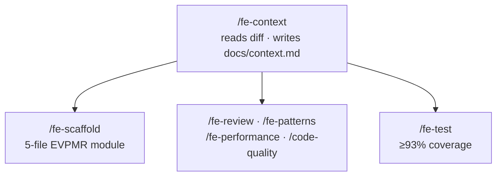
```mermaid
flowchart TD
    A["/fe-context\nreads diff · writes docs/context.md"]
    A --> B["/fe-scaffold\n5-file EVPMR module"]
    A --> C["/fe-review · /fe-patterns\n/fe-performance · /code-quality"]
    A --> D["/fe-test\n≥93% coverage"]
```

| Level | Source | What |
|-------|--------|------|
| L1 — Rules | Always-active skill files | EVPMR, tokens, Karpathy guidelines |
| L2 — Spec | `docs/context.md` | What's being built, constraints, decisions |
| L3 — Source | Diff output | Files touched by this branch |
| L4 — Errors | On demand | Failing tests, lint, TypeScript errors |
| L5 — History | Session | Conversation context |

---

## Model routing

Each skill runs on the everyday model. Escalation is inline — the AI consults the higher model for a specific question and continues without interrupting you.

**Claude Code is plan-aware.** `hooks/craftkit-routing.js` reads the logged-in account from `~/.claude.json` on every prompt and injects the detected tier as context: Gmail-domain login → personal, `organizationType` containing "enterprise" → enterprise, anything unreadable → personal (safe default).

| AI | Plan | Everyday | Escalate | Fusion panel |
|----|------|----------|----------|-------------|
| Claude Code | personal (Pro, Gmail login) | `claude-sonnet-5` | `claude-opus-4-8` | 2× opus → opus judge |
| Claude Code | enterprise | `claude-opus-4-8` | `claude-fable-5` | 2× fable → fable judge |
| Gemini CLI | — | `gemini-2.5-flash` | `gemini-2.5-pro` | — |
| Cursor | — | claude-sonnet / gpt-4o | claude-opus / o1 | — |
| Codex CLI | — | `codex-mini-latest` | `o3` | — |

Escalation triggers: architecture decisions with non-obvious tradeoffs, security-sensitive code, debugging with no hypothesis after 2 attempts.

Fusion panel triggers: irreversible production changes, security architecture with meaningful attack surface, decisions where a single-model opinion may miss divergent reasoning paths. Runs 2 independent passes on the tier's escalate model → same model synthesizes using Track A (artifact: run+merge) or Track B (analysis: consensus/contradictions/unique/blind spots).

---

## Managing skills

**Never edit installed files directly** in `~/.claude/`, `~/.cursor/`, `~/GEMINI.md`, or `~/.codex/` — `sync.sh` owns them and will overwrite on next pull. Always edit source files in this repo.

### Add a rule (always-on)

```bash
# 1. create the file
echo '---\nname: my-rule\ndescription: What it enforces\n---\n\n...' > rules/my-rule.md

# 2. ship it
git add rules/my-rule.md && git commit -m "feat: add my-rule" && git push
# users: git pull → auto-installed
```

### Add a skill (on-demand)

> Not sure whether to add a skill or an agent? See [Skill vs agent](#skill-vs-agent--when-to-add-which).

```bash
mkdir -p skills/my-skill
# create skills/my-skill/SKILL.md with frontmatter: name, description, alwaysApply: false
git add skills/my-skill && git commit -m "feat: add my-skill" && git push
```

### Add a command (orchestrator)

```bash
# create commands/my-command.md with frontmatter: name, description
git add commands/my-command.md && git commit -m "feat: add my-command" && git push
```

### Add an agent (cold sub-agent for Claude Code)

```bash
# create agents/my-agent.md with frontmatter: name, description, tools, model, color
git add agents/my-agent.md && git commit -m "feat: add my-agent agent" && git push
# users: git pull → auto-installed to ~/.claude/agents/
```

### Remove a skill, command, or agent

```bash
git rm -r skills/<name>/       # skill
git rm commands/<name>.md      # command
git rm agents/<name>.md        # agent → also remove from subagent_type references in commands/
git commit -m "remove: <name>" && git push
# users: git pull → auto-uninstalled from all AI tools
```

---

## Tooling

External tools and inspirations bundled or adopted into this repo.

| Tool | Source | Purpose | How it's used |
|------|--------|---------|---------------|
| **RTK** | [github.com/rtk-ai/rtk](https://github.com/rtk-ai/rtk) | Filters shell output before it reaches the AI — 60–90% input token savings | Auto-installed on `bash install.sh`. All commands prefixed with `rtk` |
| **Caveman** | [github.com/JuliusBrussee/caveman](https://github.com/JuliusBrussee/caveman) | Strips AI output verbosity — 40–60% response token savings | Delivered by the caveman plugin's hooks (level tracking, stats). lite / full / ultra modes |
| **Ponytail** | [github.com/DietrichGebert/ponytail](https://github.com/DietrichGebert/ponytail) | YAGNI-first decision ladder + over-engineering audit — 80–94% code reduction | Decision ladder in `karpathy-guidelines`, `ponytail:` comment convention, 3 skills: `/ponytail-review`, `/ponytail-audit`, `/ponytail-debt` |
| **Karpathy Guidelines** | [karpathy.ai](https://karpathy.ai) — adapted | Behavioral rules to prevent LLM coding pitfalls: think before coding, surgical changes, goal-driven execution | Always-active via `rules/karpathy-guidelines.md` |

---

## Changelog

Moved to **[CHANGELOG.md](CHANGELOG.md)** — one `## vX.Y.Z` section per release, newest first.
It was 48% of this file and nobody reads a changelog top to bottom.

`.github/workflows/release.yml` reads the version from this README's header and the matching
`## <version>` section of `CHANGELOG.md` for the release notes, so a release needs both updated.
