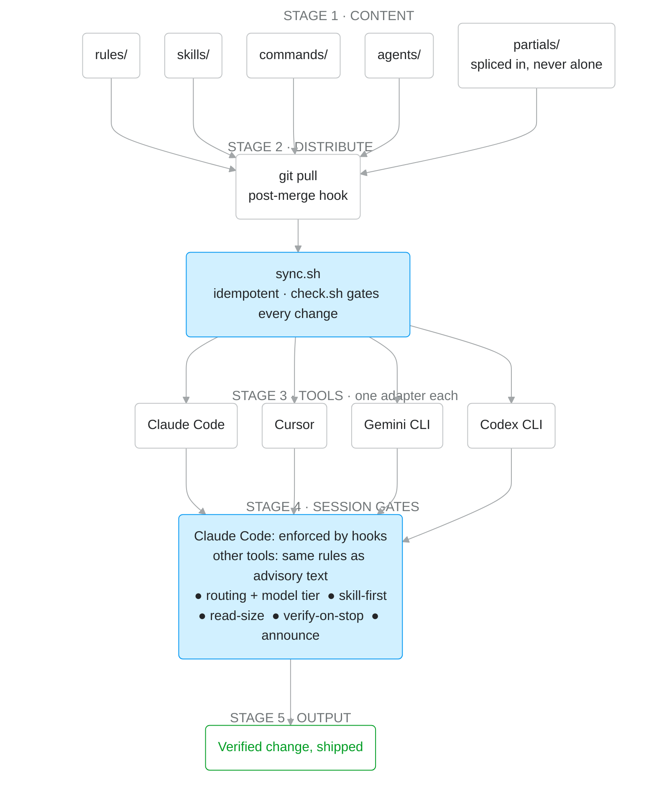
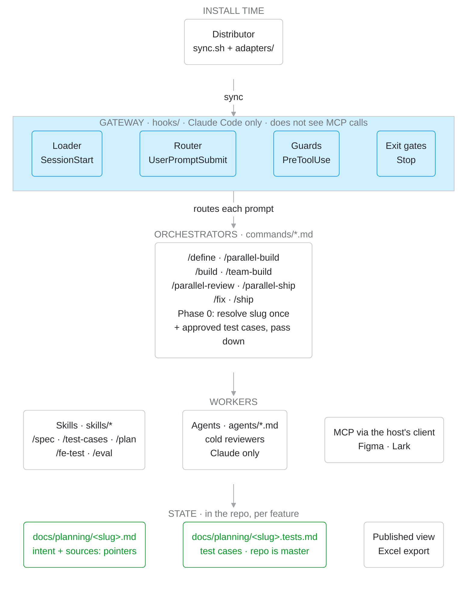
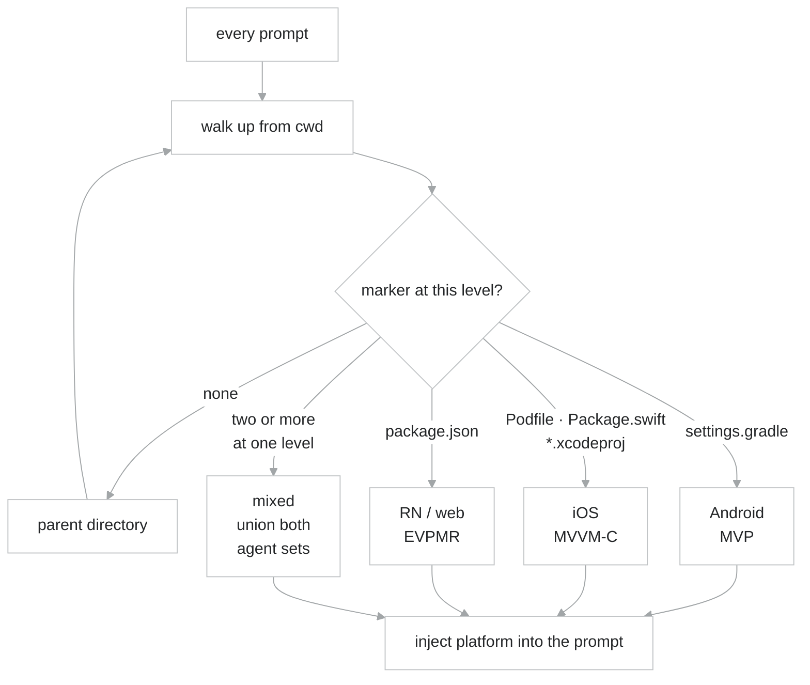
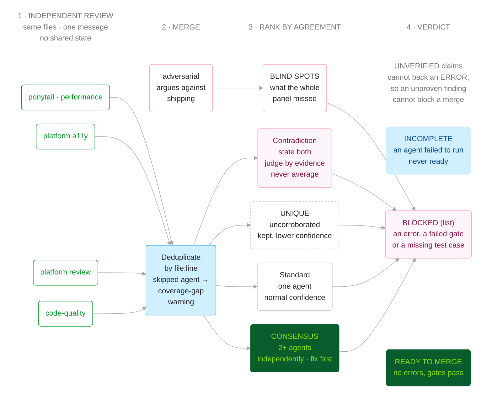
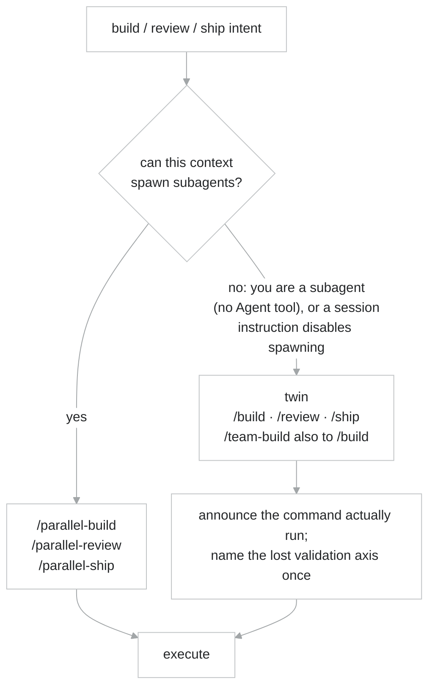
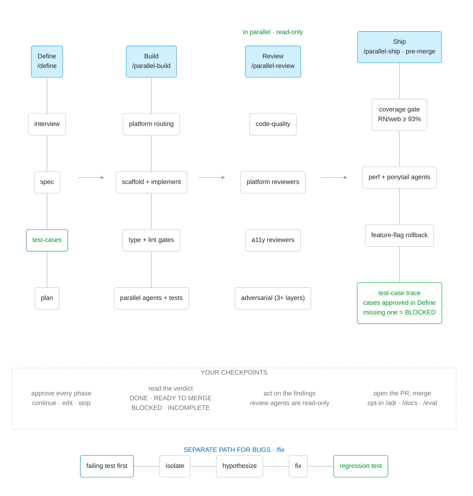
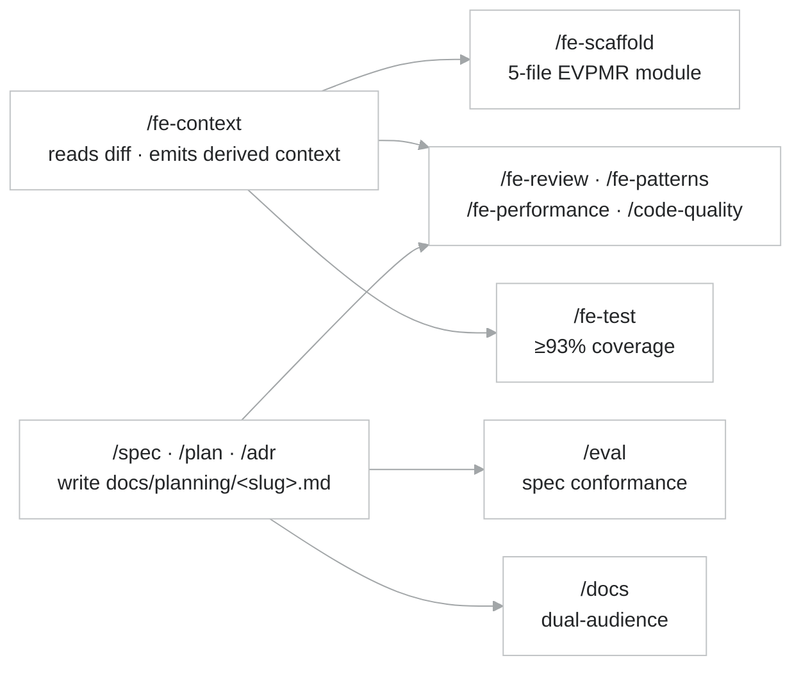
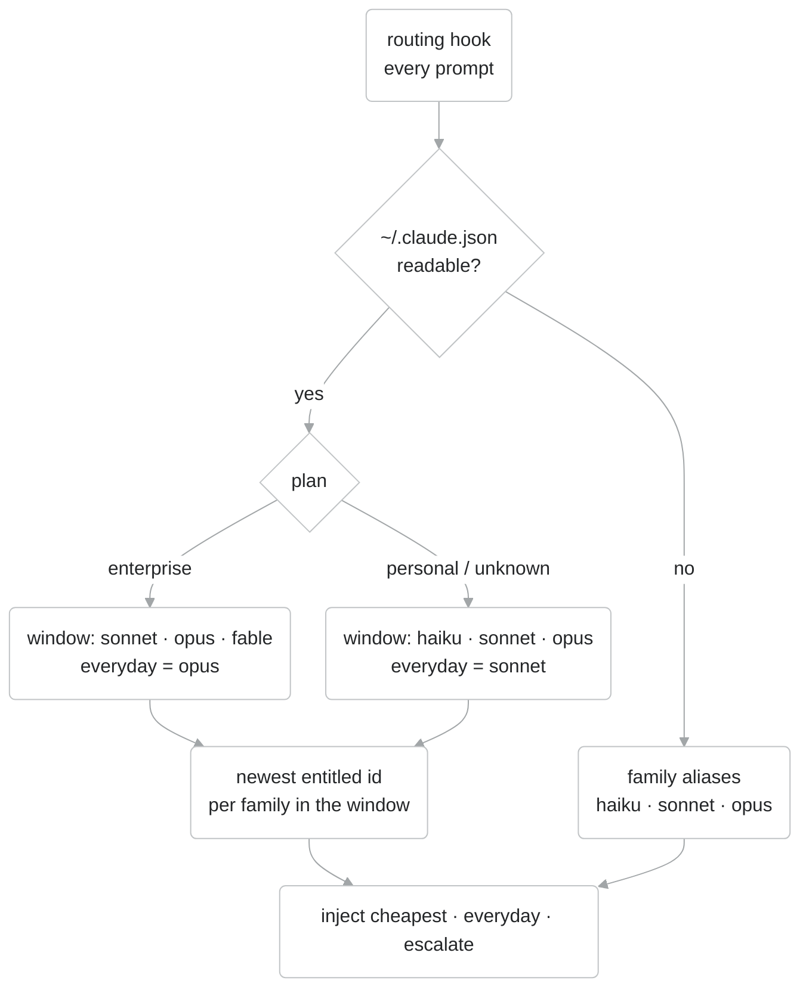

# craftkit `v1.46.1`

One repo of AI coding skills that auto-syncs across **Claude Code**, **Cursor**, **Gemini CLI**, and **Codex CLI**. Pull once and every AI tool gets the same workflows, rules, and commands.

---

## Table of contents

- [Why bother?](#why-bother) · token savings with RTK + Caveman + Ponytail
- [Install](#install)
- [How it works](#how-it-works)
- [Using the workflows](#using-the-workflows)
  - [Just say what you want](#just-say-what-you-want)
  - [Enforcement gates](#enforcement-gates-hooks-that-refuse) · the hooks that stop an unrouted edit
  - [Dynamic workflows](#dynamic-workflows-default) · `/parallel-review`, `/parallel-ship`, `/parallel-build`
  - [How the classifier picks agents](#how-the-classifier-picks-agents)
  - [Sequential fallback](#sequential-fallback) · `/review`, `/ship`, `/build`
  - [Planning pipeline: /define](#planning-pipeline-define-before-you-build) · `/interview` → `/spec` → `/test-cases` → `/plan`
  - [Experimental: /team-build](#experimental-team-build-agent-teams) · agent-teams build
  - [Fix, tests, and PR message](#fix-tests-and-pr-message)
  - [Grill, research, and handoff](#grill-research-and-handoff) · stress-test plans, delegate reading, hand off sessions
  - [Scoring a run: /eval](#scoring-a-run-eval) · weighted correctness %, judged and ledgered
- [Skills reference](#skills-reference)
- [Agents reference](#agents-reference)
- [Architecture (EVPMR)](#architecture-evpmr)
- [Model routing](#model-routing)
- [Managing skills](#managing-skills)
- [Tooling](#tooling) · RTK, Caveman, Ponytail, Karpathy Guidelines
- [Design notes](docs/design-notes.md) · why things work the way they do
- [Changelog](CHANGELOG.md)

---

## Why bother?

AI coding sessions are expensive. Two things drain tokens fast: **verbose shell output** the AI has to read, and **verbose AI responses** you have to read. This repo ships two compression layers that cut both.

### RTK: compresses what the AI reads (shell output)

Shell commands like `git diff` and `jest` dump noise before the signal. RTK filters it out before it reaches the AI.

```
── WITHOUT RTK (38 tokens) ──────────────────────────────────────────
On branch feature/checkout-flow
Your branch is ahead of 'origin/feature/checkout-flow' by 3 commits.
  (use "git push" to publish your local commits)

Changes not staged for commit:
  (use "git add <file>..." to update staging area)

        modified:   src/checkout/ViewCheckout.tsx
        modified:   src/checkout/PresenterCheckout.ts

Untracked files:
        src/checkout/__tests__/ViewCheckout.test.tsx

── WITH RTK (6 tokens) ──────────────────────────────────────────────
M src/checkout/ViewCheckout.tsx
M src/checkout/PresenterCheckout.ts
? src/checkout/__tests__/ViewCheckout.test.tsx
```

**~84% reduction** on a single call. Across a full session (`git diff`, `tsc`, `jest`, `lint`) it compounds to **60-90% savings on AI input tokens**.

### Caveman: compresses what you read (AI output)

The caveman plugin strips filler, hedging, and pleasantries from every response. Same findings, fewer words.

```
── WITHOUT CAVEMAN (~65 tokens) ─────────────────────────────────────
Sure! After carefully reviewing the code, I can see that there's
actually an issue in the ViewCheckout component. It looks like
there's a useState hook being used directly in the View layer,
which basically violates the EVPMR architecture pattern. You'll
want to move that state logic into the Presenter layer instead.

── WITH CAVEMAN (~18 tokens) ────────────────────────────────────────
[ERROR] ViewCheckout.tsx:14: useState in View layer.
  Why: violates EVPMR.
  Fix: move to PresenterCheckout.ts.
```

**~72% reduction** per response. Full review sessions with reasoning and multi-step output: **40-60% output savings**.

### Ponytail: compresses what the AI generates (code output)

The `ponytail` decision ladder enforces YAGNI before any code is written. Before generating code, the AI stops at the first rung that holds: does this need to exist? is it in stdlib? is it a native feature? is an installed dep enough? can it be one line? Only then: minimal code. Deliberate shortcuts are marked with `ponytail:` comments naming their ceiling and upgrade path.

```
── WITHOUT PONYTAIL ─────────────────────────────────────────────────
// custom retry logic with exponential backoff + jitter
class RetryManager {
  private attempts = 0;
  async execute<T>(fn: () => Promise<T>, maxRetries = 3): Promise<T> { ... }
  private calcDelay(attempt: number): number { ... }
}

── WITH PONYTAIL ────────────────────────────────────────────────────
// ponytail: no retry lib, inline for now. ceiling: >3 callers → extract.
const withRetry = (fn, n = 3) => fn().catch(e => n > 0 ? withRetry(fn, n-1) : Promise.reject(e));
```

The six-tag **ponytail rubric** (`delete:` `stdlib:` `native:` `yagni:` `shrink:` `narrate:`) lives in `karpathy-guidelines`, so code is written against the same list review scores it by. Every code-writing turn checks its own diff before reporting done, and findings are applied as deletions at the named `file:line`, never as rewrites.

**80-94% code reduction** on over-engineered solutions. Pairs with `/ponytail-review` (a diff), `/ponytail-audit` (the whole repo) and `/ponytail-debt` (deferred shortcuts and removable flags).

`flag-safety` applies the same marker idea to feature flags: with the flag OFF, behavior must match the pre-change code across code paths, persisted state, API contracts and analytics. Each flag branch carries a `flag:` comment with the key, the OFF behavior and when to remove it. `/build` and `/parallel-build` check it while writing; the review agents and `/parallel-ship` check it again.

### Combined impact

| Layer | Compresses | Typical savings |
|-------|------------|-----------------|
| RTK | Shell output → AI input | 60-90% on dev operations |
| Caveman | AI output → your reading | 40-60% on prose responses |
| Ponytail | Code generated | 80-94% on over-engineered solutions |
| **Together** | All directions | **50-80% total session cost** |

Typical feature review session without compression: ~40,000 tokens. With RTK + Caveman + Ponytail: ~8,000-20,000 tokens.

---

## Install

**Option A, npm** (version pinning + rollback):
```bash
npm install -g @raditia/craftkit
```

Pin a version or roll back:
```bash
npm install -g @raditia/craftkit@1.5.0
```

**Option B, git** (auto-update on `git pull`):
```bash
git clone git@github.com:raditia/craftkit.git ~/craftkit
cd ~/craftkit
bash install.sh
```

`install.sh` wires up the post-merge hook and runs the first sync. After that, `git pull` keeps every AI tool up to date automatically.

**Requirements:** bash 3.2+, curl. macOS ships bash 3.2 by default.

**Upgrading from ≤ v1.23.0:** the next sync uninstalls the retired Copilot and Crush integrations automatically. Copilot `@` agents it wrote into your other repos may be committed there, so sync prints those paths and leaves them for you.

**Contributing to craftkit itself:** see **[CONTRIBUTING.md](CONTRIBUTING.md)**. Short version:
there is no build or test suite (the product is markdown), so `check.sh` is the gate and a second
consecutive `sync.sh` must report no work.
```bash
bash check.sh   # content integrity, exit 0 required before commit
bash sync.sh    # distribute; a second consecutive run must report no work
```

---

## How it works

Every `git pull` triggers a sync that installs rules, skills, commands, and agents into each AI tool:


```mermaid
---
config:
  theme: base
  look: classic
  fontFamily: "-apple-system, BlinkMacSystemFont, Segoe UI, Helvetica, Arial, sans-serif"
  themeVariables:
    fontFamily: "-apple-system, BlinkMacSystemFont, Segoe UI, Helvetica, Arial, sans-serif"
    fontSize: 16px
    primaryColor: "#FFFFFF"
    primaryBorderColor: "#C1C4C6"
    primaryTextColor: "#242628"
    lineColor: "#A2A6A8"
    clusterBkg: "#F5FBFF"
    clusterBorder: "#F0F1F2"
    titleColor: "#707577"
    edgeLabelBackground: "#FFFFFF"
  flowchart:
    curve: basis
    wrappingWidth: 240
    nodeSpacing: 30
    rankSpacing: 40
---
flowchart TB
    subgraph S1["STAGE 1 · CONTENT"]
        c1("rules/")
        c2("skills/")
        c3("commands/")
        c4("agents/")
        c5("partials/<br/>spliced in, never alone")
    end
    subgraph S2["STAGE 2 · DISTRIBUTE"]
        pull("git pull<br/>post-merge hook") --> sync("sync.sh<br/>idempotent · check.sh gates every change")
    end
    subgraph S3["STAGE 3 · TOOLS · one adapter each"]
        t1("Claude Code")
        t2("Cursor")
        t3("Gemini CLI")
        t4("Codex CLI")
    end
    subgraph S4["STAGE 4 · SESSION GATES"]
        gates("Claude Code: enforced by hooks<br/>other tools: same rules as advisory text<br/>● routing + model tier  ● skill-first<br/>● read-size  ● verify-on-stop  ● announce")
    end
    subgraph S5["STAGE 5 · OUTPUT"]
        out("Verified change, shipped")
    end
    c1 & c2 & c3 & c4 & c5 --> pull
    sync --> t1 & t2 & t3 & t4
    t1 & t2 & t3 & t4 --> gates
    gates --> out

    classDef n fill:#FFFFFF,stroke:#C1C4C6,color:#242628
    classDef key fill:#D1F0FF,stroke:#0A9AF2,color:#242628
    classDef ok fill:#FFFFFF,stroke:#029D24,color:#029D24
    class c1,c2,c3,c4,c5,pull,t1,t2,t3,t4 n
    class sync,gates key
    class out ok
    style S1 fill:transparent,stroke:transparent
    style S2 fill:transparent,stroke:transparent
    style S3 fill:transparent,stroke:transparent
    style S4 fill:transparent,stroke:transparent
    style S5 fill:transparent,stroke:transparent
```

Five namespaces, one source of truth:

| Directory | Loaded | Invoked |
|-----------|--------|---------|
| `rules/` | Every session, automatically | Never, since they are always present |
| `skills/` | On demand | Slash command or natural language |
| `commands/` | On demand | Slash command or natural language |
| `agents/` | Spawned by an orchestrator | `subagent_type:`, never directly (Claude only) |
| `partials/` | Only as a splice into a skill, command or agent | Never, since it ships inside its host file (every tool for a skill or command, Claude only for an agent) |

### At runtime: Gateway, Orchestrators, state

`sync.sh` is the **Distributor**: it runs at install time and never while you work. At runtime three
layers act inside each AI tool:

| Role | What | Where |
|------|------|-------|
| **CraftKit Gateway** | Every prompt and tool call passes through it ([full table](#enforcement-gates-hooks-that-refuse)): **Router** (`craftkit-routing.js`, UserPromptSubmit), **Loader** (`craftkit-platform-rules.js`, SessionStart), **Guards** (`gate-skill-first`, `gate-read-size`, `craftkit-read-cap`, PreToolUse), **Exit gates** (`gate-verify-on-stop`, `gate-announce-honored`, Stop) | `hooks/`, Claude Code only. Cursor, Gemini and Codex get the routing rule as text: advisory, not enforced |
| **Orchestrators** | Run a workflow: resolve the feature once in Phase 0, pass the slug down, spawn skills and agents | `commands/*.md` |
| **Skills and agents** | Do one job; skills reach Figma and Lark through the host's MCP client | `skills/`, `agents/` (Claude only) |

The Gateway does not see MCP calls. Per-feature state lives in the repo, never in a tool:


```mermaid
---
config:
  theme: base
  look: classic
  fontFamily: "-apple-system, BlinkMacSystemFont, Segoe UI, Helvetica, Arial, sans-serif"
  themeVariables:
    fontFamily: "-apple-system, BlinkMacSystemFont, Segoe UI, Helvetica, Arial, sans-serif"
    fontSize: 16px
    primaryColor: "#FFFFFF"
    primaryBorderColor: "#C1C4C6"
    primaryTextColor: "#242628"
    lineColor: "#A2A6A8"
    clusterBkg: "#F5FBFF"
    clusterBorder: "#F0F1F2"
    titleColor: "#707577"
    edgeLabelBackground: "#FFFFFF"
  flowchart:
    curve: basis
    wrappingWidth: 240
    nodeSpacing: 30
    rankSpacing: 40
---
flowchart TB
    subgraph R1["INSTALL TIME"]
        D("Distributor<br/>sync.sh + adapters/")
    end
    subgraph GW["GATEWAY · hooks/ · Claude Code only · does not see MCP calls"]
        direction LR
        L("Loader<br/>SessionStart") ~~~ R("Router<br/>UserPromptSubmit") ~~~ G("Guards<br/>PreToolUse") ~~~ X("Exit gates<br/>Stop")
    end
    subgraph R3["ORCHESTRATORS · commands/*.md"]
        O("/define · /parallel-build<br/>/build · /team-build<br/>/parallel-review · /parallel-ship<br/>/fix · /ship<br/>Phase 0: resolve slug once<br/>+ approved test cases, pass down")
    end
    subgraph R4["WORKERS"]
        direction LR
        S("Skills · skills/*<br/>/spec · /test-cases · /plan<br/>/fe-test · /eval") ~~~ A("Agents · agents/*.md<br/>cold reviewers<br/>Claude only") ~~~ M("MCP via the host's client<br/>Figma · Lark")
    end
    subgraph R5["STATE · in the repo, per feature"]
        direction LR
        ST1("docs/planning/&lt;slug&gt;.md<br/>intent + sources: pointers") ~~~ ST2("docs/planning/&lt;slug&gt;.tests.md<br/>test cases · repo is master") ~~~ V("Published view<br/>Excel export")
    end
    R1 -->|sync| GW
    GW -->|routes each prompt| R3
    R3 --> R4
    R4 --> R5

    classDef n fill:#FFFFFF,stroke:#C1C4C6,color:#242628
    classDef key fill:#D1F0FF,stroke:#0A9AF2,color:#242628
    classDef ok fill:#FFFFFF,stroke:#029D24,color:#029D24
    class D,O,S,A,M,V n
    class R,L,G,X key
    class ST1,ST2 ok
    style R1 fill:transparent,stroke:transparent
    style GW fill:#D1F0FF,stroke:#C1C4C6
    style R3 fill:transparent,stroke:transparent
    style R4 fill:transparent,stroke:transparent
    style R5 fill:transparent,stroke:transparent
```

### Where files land per AI tool

| Tool | Always-on (`rules/`) | On-demand (`skills/` + `commands/`) | Agents (`agents/`) |
|------|----------------------|--------------------------------------|--------------------|
| Claude Code | `~/.claude/CLAUDE.md` (managed block) | `~/.claude/commands/<name>.md` → `/<name>` | `~/.claude/agents/<name>.md` |
| Cursor | `~/.cursor/rules/*.mdc` (alwaysApply) | `~/.cursor/rules/*.mdc` (alwaysApply:false) | n/a |
| Gemini CLI | `~/GEMINI.md` (managed block) | `~/GEMINI.md` (managed block) | n/a |
| Codex CLI | `~/.codex/AGENTS.md` (managed block) | `~/.codex/AGENTS.md` (managed block) | n/a |

Agents are Claude-only, since the other three tools have no cold sub-agent concept, so `sync.sh` skips the agent pass for them.

**Retired:** GitHub Copilot and Crush (supported through v1.23.0). Neither has a headless entry point, so neither can join cross-tool agent fan-out ([more](docs/design-notes.md#retired-tools)).

---

## Using the workflows

### Just say what you want

Natural language routes to the right command automatically. No slash commands required.

```
"plan this feature"     →  /define   (interview → spec → test-cases → plan, checkpoint-gated)
"review this"           →  /parallel-review
"build this feature"    →  /parallel-build
"ship this"             →  /parallel-ship
"fix this bug"          →  /fix
"write tests for this"  →  /fe-test · /android-test · /ios-test  (by platform)
"generate PR message"   →  /pr-message
"poke holes in my plan" →  /grill     (also: "grill this", "stress-test my design")
"research X for me"     →  /research  (background agent, primary sources)
"hand this session off" →  /handoff   (also: "summarize for the next agent")
```

Platform is not inferred. On every prompt `hooks/craftkit-routing.js` resolves it from `cwd` and injects the answer:


```mermaid
---
config:
  theme: base
  look: classic
  fontFamily: "-apple-system, BlinkMacSystemFont, Segoe UI, Helvetica, Arial, sans-serif"
  themeVariables:
    fontFamily: "-apple-system, BlinkMacSystemFont, Segoe UI, Helvetica, Arial, sans-serif"
    fontSize: 16px
    primaryColor: "#FFFFFF"
    primaryBorderColor: "#C1C4C6"
    primaryTextColor: "#242628"
    lineColor: "#A2A6A8"
    clusterBkg: "#F5FBFF"
    clusterBorder: "#F0F1F2"
    titleColor: "#707577"
    edgeLabelBackground: "#FFFFFF"
  flowchart:
    curve: basis
    wrappingWidth: 240
    nodeSpacing: 30
    rankSpacing: 40
---
flowchart TD
    S["every prompt"] --> W["walk up from cwd"]
    W --> C{"marker at this level?"}
    C -->|"none"| U["parent directory"]
    U --> W
    C -->|"settings.gradle"| A["Android<br/>MVP"]
    C -->|"Podfile · Package.swift<br/>*.xcodeproj"| I["iOS<br/>MVVM-C"]
    C -->|"package.json"| R["RN / web<br/>EVPMR"]
    C -->|"two or more<br/>at one level"| M["mixed<br/>union both<br/>agent sets"]
    A --> INJ["inject platform into the prompt"]
    I --> INJ
    R --> INJ
    M --> INJ
```

Nearest ancestor wins, so `"write tests for this"` in an Android repo resolves to `/android-test`, never `/fe-test`.

---

### Enforcement gates: hooks that refuse

Routing context is only text: an agent can read it, announce the right skill, and hand-roll the work anyway. These hooks close that gap. The four gates can stop a call; the other two only inject context.

| Hook | Event | What it does |
|------|-------|--------------|
| [`craftkit-routing.js`](hooks/craftkit-routing.js) | `UserPromptSubmit` | Injects the routing table, platform, model tiers, and any locally installed skills. Advisory |
| [`gate-skill-first.js`](hooks/gate-skill-first.js) | `PreToolUse` on `Edit\|Write\|MultiEdit\|NotebookEdit` | Asks before a source edit in a session that never invoked a skill, naming the skills that fit the file. Once per turn |
| [`gate-verify-on-stop.js`](hooks/gate-verify-on-stop.js) | `Stop` | Blocks a turn that edited source but ran no verification command, and names the command (`check.sh` if present, else typecheck + lint) |
| [`gate-announce-honored.js`](hooks/gate-announce-honored.js) | `Stop` | Blocks a reply that says `Running /<skill>` with no `Skill` call, or carries no routing declaration at all |
| [`gate-read-size.js`](hooks/gate-read-size.js) | `PreToolUse` on `Read` | Refuses a whole-file read over 800 lines and points to the `bulk-read` agent or an `offset`/`limit` read. Denies rather than asks |
| [`craftkit-platform-rules.js`](hooks/craftkit-platform-rules.js) | `SessionStart` | Loads `platform:`-scoped rules only where the cwd matches, so EVPMR laws stay out of Kotlin and Swift sessions |
| [`craftkit-read-cap.js`](hooks/craftkit-read-cap.js) | `PreToolUse` on `Bash` | Rewrites a bare `cat F` / `rtk read F` over 800 lines to `rtk read -m 800`. Leaves piped commands alone |

Shared helpers (not registered as hooks): [`craftkit-transcript.js`](hooks/craftkit-transcript.js) finds the current turn for every gate, [`craftkit-platform.js`](hooks/craftkit-platform.js) detects the platform, [`craftkit-filesize.js`](hooks/craftkit-filesize.js) holds the 800-line threshold, and [`craftkit-drift.js`](hooks/craftkit-drift.js) answers "has this changed since baseline" as clean, drifted, or cannot-verify.

How the gates behave:

- **Fail open.** Unreadable transcript, bad stdin, or no gate command in the project: the call passes.
- **`ask`, not `deny`,** so you keep the override. The Read gate is the exception, because an `ask` is silently approved under auto-accept.
- **Subagents are checked at the parent.** Their edits pass inside the agent; the parent's Stop gate picks them up from `git status`, the same way it catches edits made with `sed -i` or a heredoc.
- **Skill gate is per session, Stop gates are per turn.** A turn continuing already-routed work ("apply the fixes") isn't asked again.
- **A downgrade refuses to sync.** `sync.sh` won't run from a checkout older than the installed version.
- **Plugin skills** (`<plugin>:<name>`) aren't enumerated by the announce gate and pass.

| Escape hatch | Turns off |
|--------------|-----------|
| `CRAFTKIT_GATE=off` | The three edit/Stop gates and platform-rules injection |
| `CRAFTKIT_READ_GATE=off` | `gate-read-size.js` |
| `CRAFTKIT_READ_CAP=off` | `craftkit-read-cap.js` |
| `CRAFTKIT_ALLOW_DOWNGRADE=1` | The sync downgrade guard |

Removing a hook from `_CRAFTKIT_HOOKS` uninstalls it on the next sync. The reasoning behind each behavior above, with the measurements: [design notes](docs/design-notes.md#enforcement-gates).

---

### Dynamic workflows (default)

Build, review, and ship use **dynamic parallel execution**: a classifier detects the platform (RN/web, Android, iOS), reads your actual diff, selects only the agents that matter, and runs them concurrently. Test-only diffs skip deep review entirely. Every command below works on all three platforms; only the gates and the agent set change.

Each workflow is drawn in five lanes (You, Hooks, Main agent, Sub-agents, Result). Box styles:


```mermaid
---
config:
  theme: base
  look: classic
  fontFamily: "-apple-system, BlinkMacSystemFont, Segoe UI, Helvetica, Arial, sans-serif"
  themeVariables:
    fontFamily: "-apple-system, BlinkMacSystemFont, Segoe UI, Helvetica, Arial, sans-serif"
    fontSize: 16px
    primaryColor: "#FFFFFF"
    primaryBorderColor: "#C1C4C6"
    primaryTextColor: "#242628"
    lineColor: "#A2A6A8"
    clusterBkg: "#F5FBFF"
    clusterBorder: "#F0F1F2"
    titleColor: "#707577"
    edgeLabelBackground: "#FFFFFF"
  flowchart:
    curve: basis
    wrappingWidth: 240
    nodeSpacing: 30
    rankSpacing: 40
---
flowchart LR
    y("You<br/>your prompt") ~~~ h("Hook<br/>runs automatically") ~~~ m("Skill<br/>on the main agent") ~~~ a("Sub-agent<br/>read-only, parallel") ~~~ v("Verdict")

    classDef you fill:#FFFFFF,stroke:#707577,color:#242628
    classDef hook fill:#D1F0FF,stroke:#0A9AF2,color:#242628,stroke-dasharray:4 3
    classDef main fill:#FFFFFF,stroke:#0A9AF2,color:#242628
    classDef sub fill:#FFFFFF,stroke:#029D24,color:#242628
    classDef verdict fill:#0A5C2C,stroke:#0A5C2C,color:#8BE200
    class y you
    class h hook
    class m main
    class a sub
    class v verdict
```

#### /parallel-review

> Triggered by: `"review this"` / `"help me review"` / `"code review"` / `"LGTM check"`

```mermaid
---
config:
  theme: base
  look: classic
  fontFamily: "-apple-system, BlinkMacSystemFont, Segoe UI, Helvetica, Arial, sans-serif"
  themeVariables:
    fontFamily: "-apple-system, BlinkMacSystemFont, Segoe UI, Helvetica, Arial, sans-serif"
    fontSize: 18px
    primaryColor: "#FFFFFF"
    primaryBorderColor: "#C1C4C6"
    primaryTextColor: "#242628"
    lineColor: "#A2A6A8"
    clusterBkg: "#F5FBFF"
    clusterBorder: "#F0F1F2"
    titleColor: "#707577"
    edgeLabelBackground: "#FFFFFF"
  flowchart:
    wrappingWidth: 260
---
swimlane-beta LR
    subgraph you["YOU"]
        ask("review my changes")
    end
    subgraph hooks["HOOKS"]
        route("routing hook<br/>platform detected")
    end
    subgraph main["MAIN AGENT"]
        gates("fast gates<br/>classify diff")
        tst("tests<br/>in background")
        syn("synthesis<br/>dedupe · rank")
    end
    subgraph subs["SUB-AGENTS"]
        rev("reviewers in parallel<br/>read-only")
    end
    subgraph result["RESULT"]
        v("READY TO MERGE<br/>BLOCKED · INCOMPLETE")
    end
    ask --> route --> gates
    gates --> rev
    gates --> tst
    rev --> syn
    tst --> syn
    syn --> v
    gates -.->|gate fails| v

    classDef you fill:#FFFFFF,stroke:#707577,color:#242628
    classDef hook fill:#D1F0FF,stroke:#0A9AF2,color:#242628,stroke-dasharray:4 3
    classDef main fill:#FFFFFF,stroke:#0A9AF2,color:#242628
    classDef sub fill:#FFFFFF,stroke:#029D24,color:#242628
    classDef verdict fill:#0A5C2C,stroke:#0A5C2C,color:#8BE200
    class ask you
    class route hook
    class gates,tst,syn main
    class rev sub
    class v verdict
```

#### /parallel-ship

> Triggered by: `"ship this"` / `"prepare for PR"` / `"is this ready?"` / `"get this ready to merge"`

```mermaid
---
config:
  theme: base
  look: classic
  fontFamily: "-apple-system, BlinkMacSystemFont, Segoe UI, Helvetica, Arial, sans-serif"
  themeVariables:
    fontFamily: "-apple-system, BlinkMacSystemFont, Segoe UI, Helvetica, Arial, sans-serif"
    fontSize: 18px
    primaryColor: "#FFFFFF"
    primaryBorderColor: "#C1C4C6"
    primaryTextColor: "#242628"
    lineColor: "#A2A6A8"
    clusterBkg: "#F5FBFF"
    clusterBorder: "#F0F1F2"
    titleColor: "#707577"
    edgeLabelBackground: "#FFFFFF"
  flowchart:
    wrappingWidth: 260
---
swimlane-beta LR
    subgraph you["YOU"]
        ask("ship this")
    end
    subgraph hooks["HOOKS"]
        route("routing hook<br/>platform detected")
    end
    subgraph main["MAIN AGENT"]
        gates("fast gates<br/>classify diff")
        tst("tests + coverage<br/>RN/web ≥ 93%")
        syn("synthesis<br/>test-case trace")
    end
    subgraph subs["SUB-AGENTS"]
        rev("reviewers + ponytail<br/>perf · a11y · adversarial")
    end
    subgraph result["RESULT"]
        v("READY TO MERGE<br/>BLOCKED · INCOMPLETE")
    end
    ask --> route --> gates
    gates --> rev
    gates --> tst
    rev --> syn
    tst --> syn
    syn --> v
    gates -.->|gate fails| v

    classDef you fill:#FFFFFF,stroke:#707577,color:#242628
    classDef hook fill:#D1F0FF,stroke:#0A9AF2,color:#242628,stroke-dasharray:4 3
    classDef main fill:#FFFFFF,stroke:#0A9AF2,color:#242628
    classDef sub fill:#FFFFFF,stroke:#029D24,color:#242628
    classDef verdict fill:#0A5C2C,stroke:#0A5C2C,color:#8BE200
    class ask you
    class route hook
    class gates,tst,syn main
    class rev sub
    class v verdict
```

#### /parallel-build

> Triggered by: `"build feature X"` / `"implement X"` / `"create a new screen"`

```mermaid
---
config:
  theme: base
  look: classic
  fontFamily: "-apple-system, BlinkMacSystemFont, Segoe UI, Helvetica, Arial, sans-serif"
  themeVariables:
    fontFamily: "-apple-system, BlinkMacSystemFont, Segoe UI, Helvetica, Arial, sans-serif"
    fontSize: 18px
    primaryColor: "#FFFFFF"
    primaryBorderColor: "#C1C4C6"
    primaryTextColor: "#242628"
    lineColor: "#A2A6A8"
    clusterBkg: "#F5FBFF"
    clusterBorder: "#F0F1F2"
    titleColor: "#707577"
    edgeLabelBackground: "#FFFFFF"
  flowchart:
    wrappingWidth: 260
---
swimlane-beta LR
    subgraph you["YOU"]
        ask("build feature X")
    end
    subgraph hooks["HOOKS"]
        route("routing hook<br/>platform detected")
    end
    subgraph main["MAIN AGENT"]
        impl("context · scaffold<br/>implement · gates")
        tst("write tests<br/>while agents run")
        syn("synthesis<br/>consensus · unique")
    end
    subgraph subs["SUB-AGENTS"]
        rev("reviewers in parallel<br/>picked by classifier")
    end
    subgraph result["RESULT"]
        done("DONE · BLOCKED<br/>INCOMPLETE")
    end
    ask --> route --> impl
    impl --> rev
    impl --> tst
    rev --> syn
    tst --> syn
    syn --> done
    impl -.->|gate fails| done

    classDef you fill:#FFFFFF,stroke:#707577,color:#242628
    classDef hook fill:#D1F0FF,stroke:#0A9AF2,color:#242628,stroke-dasharray:4 3
    classDef main fill:#FFFFFF,stroke:#0A9AF2,color:#242628
    classDef sub fill:#FFFFFF,stroke:#029D24,color:#242628
    classDef verdict fill:#0A5C2C,stroke:#0A5C2C,color:#8BE200
    class ask you
    class route hook
    class impl,tst,syn main
    class rev sub
    class done verdict
```

#### How findings become one verdict

Every review agent reads the same files in the same message and shares nothing, so agreement between them is evidence:


```mermaid
---
config:
  theme: base
  look: classic
  fontFamily: "-apple-system, BlinkMacSystemFont, Segoe UI, Helvetica, Arial, sans-serif"
  themeVariables:
    fontFamily: "-apple-system, BlinkMacSystemFont, Segoe UI, Helvetica, Arial, sans-serif"
    fontSize: 16px
    primaryColor: "#FFFFFF"
    primaryBorderColor: "#C1C4C6"
    primaryTextColor: "#242628"
    lineColor: "#A2A6A8"
    clusterBkg: "#F5FBFF"
    clusterBorder: "#F0F1F2"
    titleColor: "#707577"
    edgeLabelBackground: "#FFFFFF"
  flowchart:
    curve: basis
    wrappingWidth: 240
    nodeSpacing: 30
    rankSpacing: 40
---
flowchart LR
    h1["1 · INDEPENDENT REVIEW<br/>same files · one message<br/>no shared state"] ~~~ h2["2 · MERGE"] ~~~ h3["3 · RANK BY AGREEMENT"] ~~~ h4["4 · VERDICT"]
        a1("code-quality")
        a2("platform review")
        a3("platform a11y")
        a4("ponytail · performance")
        adv("adversarial<br/>argues against<br/>shipping")
        dd("Deduplicate<br/>by file:line<br/>skipped agent →<br/>coverage-gap<br/>warning")
        k1("CONSENSUS<br/>2+ agents<br/>independently · fix first")
        k2("Standard<br/>one agent<br/>normal confidence")
        k3("UNIQUE<br/>uncorroborated<br/>kept, lower confidence")
        k4("Contradiction<br/>state both<br/>judge by evidence<br/>never average")
        k5("BLIND SPOTS<br/>what the whole<br/>panel missed")
        v1("READY TO MERGE<br/>no errors, gates pass")
        v2("BLOCKED (list)<br/>an error, a failed gate<br/>or a missing test case")
        v3("INCOMPLETE<br/>an agent failed to run<br/>never ready")
        note["UNVERIFIED claims<br/>cannot back an ERROR,<br/>so an unproven finding<br/>cannot block a merge"]
    a1 & a2 & a3 & a4 --> dd
    dd --> k1 & k2 & k3 & k4
    adv -.-> k5
    k1 & k2 & k3 & k4 & k5 --> v2
    k1 ~~~ v1
    k4 ~~~ v3
    k5 ~~~ note

    classDef n fill:#FFFFFF,stroke:#C1C4C6,color:#242628
    classDef key fill:#D1F0FF,stroke:#0A9AF2,color:#242628
    classDef ok fill:#FFFFFF,stroke:#029D24,color:#029D24
    classDef done fill:#0A5C2C,stroke:#0A5C2C,color:#8BE200
    classDef warn fill:#FEF5FC,stroke:#FA9EB4,color:#8B1842
    classDef warnline fill:#FFFFFF,stroke:#FA9EB4,color:#242628
    classDef info fill:#D1F0FF,stroke:#D1F0FF,color:#024590
    classDef dash fill:#FFFFFF,stroke:#C1C4C6,color:#242628,stroke-dasharray:4 3
    classDef quiet fill:transparent,stroke:transparent,color:#707577
    class a1,a2,a3,a4 ok
    class adv,k5 warnline
    class dd key
    class k1,v1 done
    class k2 n
    class k3 dash
    class k4,v2 warn
    class v3 info
    class note,h1,h2,h3,h4 quiet
```

---

### How the classifier picks agents

The classifier reads your actual changed files, not just filenames, and selects only the agents that apply. Irrelevant agents are skipped entirely.

```
RN / web (EVPMR)                         agents selected:
──────────────────────────────────────────────────────────
View*.tsx                           →   code-quality + fe-review + fe-a11y
Presenter*.ts                       →   code-quality + fe-review
Model*.ts                           →   code-quality (type/correctness focus)
Entry*.tsx or Resource*.ts          →   fe-review
View or Presenter + /parallel-ship  →   + fe-performance

Android (MVP)
──────────────────────────────────────────────────────────
*Activity/Fragment/Widget.kt, layout →  code-quality + android-review + android-a11y
*Presenter.kt, *ViewModel.kt         →  code-quality + android-review
*Repository/Interactor/UseCase.kt    →  code-quality
Dagger *Module/*Component.kt         →  android-review
Presenter/VM/adapter + /parallel-ship → + android-performance

iOS (MVVM-C)
──────────────────────────────────────────────────────────
*ViewController/View/Cell.swift      →  code-quality + ios-review + ios-a11y
*ViewModel.swift                     →  code-quality + ios-review
*Fetcher.swift                       →  code-quality + ios-performance
*Contract/Factory/Coordinator.swift  →  ios-review

All platforms
──────────────────────────────────────────────────────────
any non-test src + build/ship       →   + ponytail-review (over-engineering)
3+ architecture layers changed      →   + adversarial (devil's advocate)
auth / payment / credential paths   →   code-quality (security emphasis)
intent file resolves under docs/planning/  →   code-quality (spec conformance: diff vs planned acceptance criteria)
test files only                     →   agents skipped, gates only
```

Five example diffs and what the classifier picks for `/parallel-review`:

| Example diff | Agents picked | Why |
|---|---|---|
| `ViewCheckout.tsx` + `PresenterCheckout.ts` | code-quality · fe-review · fe-a11y | a View changed, so a11y joins |
| `ModelCheckout.ts` only | code-quality (type-safety focus) | targeted findings, no EVPMR or a11y noise |
| `__tests__/ViewCheckout.test.tsx` only | none: gates only (tsc + lint + test) | tests only, so Phase 2 is skipped and costs no agents |
| Entry + View + Presenter + Model | code-quality · fe-review · fe-a11y · adversarial | 3+ layers changed, so adversarial argues against merging |
| `CheckoutFragment.kt` + `CheckoutPresenter.kt` (Android) | code-quality · android-review · android-a11y · android-performance | same command, native agents; gates are `gradlew lint` + `testGeneralDebugUnitTest` |

---

### Sequential fallback

When you want a lightweight, single-pass run, use the explicit slash command.

| Command | When to prefer |
|---------|---------------|
| [`/review`](commands/review.md) | Quick sanity check, small diff |
| [`/ship`](commands/ship.md) | Simple pre-merge gate, tests already passing |
| [`/build`](commands/build.md) | Scaffold-only, no parallel validation needed |

They are also the automatic substitute wherever subagents can't be spawned:


```mermaid
---
config:
  theme: base
  look: classic
  fontFamily: "-apple-system, BlinkMacSystemFont, Segoe UI, Helvetica, Arial, sans-serif"
  themeVariables:
    fontFamily: "-apple-system, BlinkMacSystemFont, Segoe UI, Helvetica, Arial, sans-serif"
    fontSize: 16px
    primaryColor: "#FFFFFF"
    primaryBorderColor: "#C1C4C6"
    primaryTextColor: "#242628"
    lineColor: "#A2A6A8"
    clusterBkg: "#F5FBFF"
    clusterBorder: "#F0F1F2"
    titleColor: "#707577"
    edgeLabelBackground: "#FFFFFF"
  flowchart:
    curve: basis
    wrappingWidth: 240
    nodeSpacing: 30
    rankSpacing: 40
---
flowchart TD
    N["build / review / ship intent"] --> Q{"can this context<br/>spawn subagents?"}
    Q -->|"yes"| P["/parallel-build<br/>/parallel-review<br/>/parallel-ship"]
    Q -->|"no: you are a subagent<br/>(no Agent tool), or a session<br/>instruction disables spawning"| T["twin<br/>/build · /review · /ship<br/>/team-build also to /build"]
    T --> S2["announce the command actually run;<br/>name the lost validation axis once"]
    P --> RUN["execute"]
    S2 --> RUN
```

`check.sh` verifies each twin exists and is mapped in both the rule and the routing hook.

---

### Planning pipeline: /define, before you build

`/define` runs `/interview` (de-fuzz the ask) → `/spec` (PRD) → `/test-cases` (QA cases from Figma/Lark, approved by you) → `/plan` (tasks), pausing for your approval after each, so a bad spec can't quietly turn into bad tasks. It offers `/ideate` when the approach is open and `plan-roaster` before build. The result goes into `docs/planning/<slug>.md`, which every execution skill reads.


```mermaid
---
config:
  theme: base
  look: classic
  fontFamily: "-apple-system, BlinkMacSystemFont, Segoe UI, Helvetica, Arial, sans-serif"
  themeVariables:
    fontFamily: "-apple-system, BlinkMacSystemFont, Segoe UI, Helvetica, Arial, sans-serif"
    fontSize: 16px
    primaryColor: "#FFFFFF"
    primaryBorderColor: "#C1C4C6"
    primaryTextColor: "#242628"
    lineColor: "#A2A6A8"
    clusterBkg: "#F5FBFF"
    clusterBorder: "#F0F1F2"
    titleColor: "#707577"
    edgeLabelBackground: "#FFFFFF"
  flowchart:
    curve: basis
    wrappingWidth: 240
    nodeSpacing: 30
    rankSpacing: 40
---
flowchart TB
    subgraph ROW[" "]
        direction LR
        subgraph DEF[" "]
            direction TB
            hd("Define<br/>/define") --- d1("interview") --- d2("spec") --- d3("test-cases") --- d4("plan")
        end
        subgraph BLD[" "]
            direction TB
            hb("Build<br/>/parallel-build") --- b1("platform routing") --- b2("scaffold + implement") --- b3("type + lint gates") --- b4("parallel agents + tests")
        end
        subgraph REV["in parallel · read-only"]
            direction TB
            hr("Review<br/>/parallel-review") ~~~ r1("code-quality") ~~~ r2("platform reviewers") ~~~ r3("a11y reviewers") ~~~ r4("adversarial (3+ layers)")
        end
        subgraph SHP[" "]
            direction TB
            hs("Ship<br/>/parallel-ship · pre-merge") --- s1("coverage gate<br/>RN/web ≥ 93%") --- s2("perf + ponytail agents") --- s3("feature-flag rollback") --- s4("test-case trace<br/>cases approved in Define<br/>missing one = BLOCKED")
        end
        DEF --> BLD --> REV --> SHP
    end
    subgraph CHK["YOUR CHECKPOINTS"]
        direction LR
        k1("approve every phase<br/>continue · edit · stop") ~~~ k2("read the verdict<br/>DONE · READY TO MERGE<br/>BLOCKED · INCOMPLETE") ~~~ k3("act on the findings<br/>review agents are read-only") ~~~ k4("open the PR, merge<br/>opt-in /adr · /docs · /eval")
    end
    subgraph FIX["SEPARATE PATH FOR BUGS · /fix"]
        direction LR
        f1("failing test first") --- f2("isolate") --- f3("hypothesize") --- f4("fix") --- f5("regression test")
    end
    ROW ~~~ CHK ~~~ FIX

    classDef n fill:#FFFFFF,stroke:#C1C4C6,color:#242628
    classDef key fill:#D1F0FF,stroke:#0A9AF2,color:#242628
    classDef ok fill:#FFFFFF,stroke:#029D24,color:#029D24
    classDef quiet fill:transparent,stroke:transparent,color:#707577
    class d1,d2,d4,b1,b2,b3,b4,r1,r2,r3,r4,s1,s2,s3,f2,f3,f4 n
    class hd,hb,hr,hs key
    class d3,s4,f5 ok
    class k1,k2,k3,k4 quiet
    style f1 fill:#FFFFFF,stroke:#0071CE,color:#242628
    style ROW fill:transparent,stroke:transparent
    style DEF fill:transparent,stroke:transparent
    style BLD fill:transparent,stroke:transparent
    style REV fill:transparent,stroke:transparent,color:#029D24
    style SHP fill:transparent,stroke:transparent
    style CHK fill:transparent,stroke:#C1C4C6,stroke-dasharray:3 3
    style FIX fill:transparent,stroke:transparent,color:#0071CE
```

It stops at a reviewed plan. `/adr` and `/docs` come later, offered at the end of `/parallel-ship` once the code is final. Each planning skill also runs on its own. To challenge a plan you already have, use `/grill` (interactive) or the `plan-roaster` agent (one shot).

---

### Experimental: /team-build, agent teams

> Built on Claude Code's experimental [agent teams](https://code.claude.com/docs/en/agent-teams). Requires `CLAUDE_CODE_EXPERIMENTAL_AGENT_TEAMS=1`. Explicit `/team-build` only, since saying "build feature X" still routes to `/parallel-build`.

Your session becomes a **team lead**: it plans the work, then spawns teammates that build different files at the same time and message each other directly, working off a shared task board.

| | `/parallel-build` (default) | `/team-build` (experimental) |
|---|---|---|
| Who writes the code | The main session, one file at a time | Two implementer teammates, in parallel |
| Helpers | One-shot reviewers that report back once | Persistent teammates that claim tasks and message each other |
| Coordination | None needed | Shared task board; finishing one task unblocks the next |
| Model split | One session model | Lead on escalated (`opus`), teammates on everyday (`sonnet`) |
| Token cost | ~1× | ~5× |
| Best for | Most features | Larger multi-file features where parallel implementation pays for the overhead |

- **One file, one owner** for the whole build, so nobody overwrites anyone. Teammates ask each other directly (the Presenter owner asks the Model owner about a type) instead of going through the lead.
- **Staged spawn.** The reviewer and tester start only once there is something to review or test.

```mermaid
---
config:
  theme: base
  look: classic
  fontFamily: "-apple-system, BlinkMacSystemFont, Segoe UI, Helvetica, Arial, sans-serif"
  themeVariables:
    fontFamily: "-apple-system, BlinkMacSystemFont, Segoe UI, Helvetica, Arial, sans-serif"
    fontSize: 18px
    primaryColor: "#FFFFFF"
    primaryBorderColor: "#C1C4C6"
    primaryTextColor: "#242628"
    lineColor: "#A2A6A8"
    clusterBkg: "#F5FBFF"
    clusterBorder: "#F0F1F2"
    titleColor: "#707577"
    edgeLabelBackground: "#FFFFFF"
  flowchart:
    wrappingWidth: 260
---
swimlane-beta LR
    subgraph you["YOU"]
        ask("/team-build<br/>explicit only")
    end
    subgraph lead["LEAD · escalated model"]
        pre("preflight<br/>teams on · lead model")
        plan("plan + scaffold<br/>one file, one owner")
        ver("verify integration<br/>typecheck · lint · tests")
    end
    subgraph team["TEAMMATES · everyday model"]
        impl("impl-a ‖ impl-b<br/>message each other")
        rt("reviewer, then tester<br/>staged spawn")
    end
    subgraph result["RESULT"]
        rep("report<br/>+ verdict")
    end
    ask --> pre --> plan --> impl --> rt --> ver --> rep

    classDef you fill:#FFFFFF,stroke:#707577,color:#242628
    classDef hook fill:#D1F0FF,stroke:#0A9AF2,color:#242628,stroke-dasharray:4 3
    classDef main fill:#FFFFFF,stroke:#0A9AF2,color:#242628
    classDef sub fill:#FFFFFF,stroke:#029D24,color:#242628
    classDef verdict fill:#0A5C2C,stroke:#0A5C2C,color:#8BE200
    class ask you
    class pre,plan,ver main
    class impl,rt sub
    class rep verdict
```

Works on RN/web, Android and iOS; the task board follows each platform's file layout.

- **Claude Code only.** Teams are a harness feature, so on other tools the preflight falls back to `/parallel-build` or `/build`.
- **~5× the tokens** of a solo build.
- **Teammates don't survive `/resume`.** An interrupted build restarts coordination from the task board.

Full workflow: [`commands/team-build.md`](commands/team-build.md).

---

### Fix, tests, and PR message

```
"something is broken" / "fix this bug" / "this crashes"
  /fix  →  fe-context → reproduce → isolate → fix → regression test

"write tests" / "add tests" / "coverage is low"     → resolves platform first
  /fe-test       →  RN/web: write tests for all changed paths, enforce ≥93% coverage
  /android-test  →  JUnit + MockK Presenter tests (no fixed coverage bar)
  /ios-test      →  Quick + Nimble ViewModel specs (no fixed coverage bar)

"generate PR message" / "draft a PR" / "what should my PR say"
  /pr-message  →  read diff → write title + summary + goal + changes + coverage → humanize (if installed) → copy to clipboard
```

---

### Grill, research, and handoff

Three general-purpose skills adapted from [mattpocock/skills](https://github.com/mattpocock/skills) (MIT). All natural-language routed; none auto-run.

```
"poke holes in my plan" / "grill this" / "stress-test my design"   → needs an EXISTING plan
  /grill  →  map plan as design tree → ask whole frontier per round (each ❓ with ➡️ recommended
             answer) → sub-agents fetch facts, you only decide → done when frontier empty.
             Side effects: resolved terms → docs/glossary.md · hard-to-reverse decisions → offers /adr

"research X for me" / "find out how the Y API works" / "dig into the docs"
  /research  →  background agent reads PRIMARY sources only (official docs, source code, specs)
                → cited Markdown note in the repo → you keep working meanwhile

"hand this off" / "summarize this session for the next agent" / "wrapping up for today"
  /handoff  →  handoff doc in OS temp dir: goal, verified state, decisions + why, ordered next
               steps, suggested skills. Links existing artifacts by path, never duplicates. Secrets redacted.
```

Picking the right interrogator:

| You have | You want | Use |
|----------|----------|-----|
| A fuzzy new ask, no plan | Requirements extracted | `/interview` (one question at a time) |
| An existing plan/decision | It challenged, interactively | `/grill` (frontier rounds) |
| A finished plan doc | A cold second opinion, one shot | `plan-roaster` agent |

---

### Scoring a run: /eval

Reviews say what is wrong. `/eval` says how much was right, as one number you can track across runs.

```
"score this run" / "how correct was that" / "what is our success rate"
  /eval  →  gathers diff + PLANNING acceptance criteria + gate results
         →  spawns eval-judge (cold) → five criteria, each 0-5, each weighted
         →  recomputes the weighted sum in awk (judgment is the model's, arithmetic is not)
         →  appends a row to docs/evals/ledger.md → derives the running success rate
```

| Criterion | Weight | Scored on |
|---|---:|---|
| Spec conformance | 35 | Every PLANNING acceptance criterion actually implemented |
| Correctness | 25 | Edge cases, error paths, no crash or data-loss path |
| Pattern adherence | 20 | EVPMR / MVP / MVVM-C contract holds |
| Verification | 15 | Tests cover changed paths and pass; type + lint clean |
| Simplicity | 5 | Ponytail rubric: nothing to delete |

`Correctness % = Σ (score / 5 × weight)`, so `5·4·4·3·5` is 85.0%. Bands: `≥90 PASS` · `75-89 PASS WITH GAPS` · `<75 BLOCKED`.

The scorer is built so a number can't hide a failure:

- **Floors beat the band.** Any criterion at 0, or Spec conformance / Correctness at 2 or below, is `BLOCKED` whatever the total. Otherwise "perfect except it doesn't do what was asked" still scores 85%.
- **Unscorable is a gap.** With no intent file, Spec conformance is `n/a` and the verdict is `INCOMPLETE`, reported out of the remaining 65 points instead of reweighted upward.
- **The success rate is computed from the ledger** each time, never stored.
- **Optional hard gate:** put a `**Threshold:**` line in the ledger header and `/eval` uses it instead of 90, which is the shape for CI. `/eval` itself only reports; it never blocks a merge or reverts.

---

## Skills reference

### Always-active rules

Loaded automatically on every session. Never invoke these; they're always present.

| Rule | Enforces |
|------|---------|
| [`fe-rules`](rules/fe-rules.md) | EVPMR layer constraints, TypeScript strict, module-over-barrel imports, styling tokens, React correctness, tracking |
| [`flag-safety`](rules/flag-safety.md) | Flag OFF stays behavior-identical: code paths, persisted state, API contracts, analytics. `flag:` marker, both states tested |
| [`grounding`](rules/grounding.md) | Claims that drive action carry provenance: `[verified: how]`, `[from context.md @sha]`, `[UNVERIFIED]`. An `[UNVERIFIED]` claim cannot back an `[ERROR]` finding or an edit. Cold agents review handed content only; staleness reports cannot-verify, never clean |
| [`karpathy-guidelines`](rules/karpathy-guidelines.md) | Think before coding, simplicity, surgical changes, goal-driven, read before write, tests verify intent, checkpoint after steps |
| [`using-agent-skills`](rules/using-agent-skills.md) | Skill routing (mandatory gate: classify before every response, announce match or "No skill matched."), model selection, severity labels, parallel classifier, model for judgment only, surface conflicts |

### Frontend skills, on demand

Use when a task is narrower than a full workflow.

| Skill | When to use | Escalate if |
|-------|-------------|-------------|
| [`fe-context`](skills/fe-context/SKILL.md) | Derive the branch's change context from the diff, emitted into the turn, no file written | Diff spans > 10 interdependent files |
| [`fe-scaffold`](skills/fe-scaffold/SKILL.md) | Create a new 5-file EVPMR module | Novel architecture outside EVPMR |
| [`fe-review`](skills/fe-review/SKILL.md) | EVPMR pattern review only | Architectural conflicts with non-obvious resolution |
| [`fe-patterns`](skills/fe-patterns/SKILL.md) | Props drilling, shared state placement (Context in Model, provider in Entry), composition patterns, hooks discipline | Novel state architecture |
| [`fe-performance`](skills/fe-performance/SKILL.md) | Waterfall elimination, bundle size, re-renders | Lighthouse regressions with non-obvious root cause |
| [`fe-a11y`](skills/fe-a11y/SKILL.md) | Labels, roles, focus management, reduced motion, for RN & Next.js | Complex focus flows spanning multiple routes |
| [`fe-design`](skills/fe-design/SKILL.md) | Visual design that reads as AI-generated: default gradients and glass, template layouts, decorative filler, invented dashboard numbers, responsive breaks. Adapted from [anti-slop](https://github.com/miqdadbadjuber/anti-slop) (MIT) | Whether a technique earns its place is contested |
| [`fe-test`](skills/fe-test/SKILL.md) | Write/improve tests, enforcing ≥93% coverage. **RN/web only**, since native goes to `/android-test` / `/ios-test` | Can't reach 93%, root cause unclear |

### Native mobile skills, on demand

Native mobile does **not** use EVPMR. For single-screen work, read a real sibling screen instead of deriving context. For concrete module names, add a project override at `<repo>/.claude/skills/<name>/`; the same name shadows the global skill inside that repo.

The `*-review`, `*-a11y` and `*-performance` skills are also the live source for the matching cold agents (via `craftkitInject`), so editing the skill updates the agent on the next sync.

**Android:** MVP + Core framework, Dagger, Gradle Dynamic Feature Modules:

| Skill | When to use | Escalate if |
|-------|-------------|-------------|
| [`android-patterns`](skills/android-patterns/SKILL.md) | Architecture reference: MVP layers, DI, module split, navigation | Novel state/effect orchestration |
| [`android-scaffold`](skills/android-scaffold/SKILL.md) | Scaffold a new screen (View/Presenter/ViewModel + Dagger wiring) | Outside the Core MVP contract |
| [`android-review`](skills/android-review/SKILL.md) | Review a diff against the MVP contract | Architectural conflict, non-obvious resolution |
| [`android-a11y`](skills/android-a11y/SKILL.md) | TalkBack labels/state, touch targets, Compose semantics | Complex focus flows across screens |
| [`android-performance`](skills/android-performance/SKILL.md) | Main-thread/coroutine, RecyclerView, recomposition, leaks | Jank/leak with non-obvious root cause |
| [`android-test`](skills/android-test/SKILL.md) | JUnit + MockK Presenter tests (Turbine for Flow) | Path unreachable without production refactor |
| [`android-context`](skills/android-context/SKILL.md) | Branch-scoping doc for multi-screen work | Multi-module cross-feature `-api` changes |

**iOS:** MVVM-C, Bazel + CocoaPods, Quick + Nimble:

| Skill | When to use | Escalate if |
|-------|-------------|-------------|
| [`ios-patterns`](skills/ios-patterns/SKILL.md) | Architecture reference: MVVM-C, Fetcher, Coordinator, Dependency-struct DI | Novel state/effect orchestration |
| [`ios-scaffold`](skills/ios-scaffold/SKILL.md) | Scaffold a new screen (Contract/VC/View/ViewModel/Factory/Fetcher) | Outside the MVVM-C contract |
| [`ios-review`](skills/ios-review/SKILL.md) | Review a diff against the MVVM-C contract | Architectural conflict, non-obvious resolution |
| [`ios-a11y`](skills/ios-a11y/SKILL.md) | VoiceOver labels/traits, focus, Dynamic Type, reduce motion | Complex focus flows across screens |
| [`ios-performance`](skills/ios-performance/SKILL.md) | Main-thread, cell reuse, image downsampling, retain-cycle leaks | Jank/leak with non-obvious root cause |
| [`ios-test`](skills/ios-test/SKILL.md) | Quick + Nimble ViewModel specs, mock via Dependency struct | Path unreachable without production refactor |
| [`ios-context`](skills/ios-context/SKILL.md) | Branch-scoping doc for multi-screen work | Multi-module cross-module coordinator changes |

### General skills, on demand

| Skill | When to use | Escalate if |
|-------|-------------|-------------|
| [`code-quality`](skills/code-quality/SKILL.md) | Review (5-axis) or simplify complex code | Security-sensitive review, or refactor > 500 lines |
| [`debug`](skills/debug/SKILL.md) | Structured reproduce → isolate → fix | No hypothesis after 2 isolation attempts |
| [`ideate`](skills/ideate/SKILL.md) | Divergent ideation: N framed generators → critic scores/clusters. Open-ended design, naming, fuzzy debug | High-stakes, so escalate the critic/deepen pass to opus |
| [`think`](skills/think/SKILL.md) | Systems/strategy reasoning router: cynefin, systems, feedback loops, constraints, leverage, second-order. Architecture + complex-system decisions | Architecture call with non-obvious tradeoffs, so escalate analysis to opus |
| [`research`](skills/research/SKILL.md) | Background agent researches a question against primary sources only, writes a cited note into the repo | n/a |
| [`handoff`](skills/handoff/SKILL.md) | Compact the session into a handoff doc for a fresh agent: state, decisions, next steps, suggested skills | n/a |
| [`eval`](skills/eval/SKILL.md) | Score a finished run into a weighted correctness %: spawns `eval-judge`, appends `docs/evals/ledger.md`, derives the success rate | Score gates a merge or release, so escalate the judge; irreversible gate, so run a fusion panel of two judges |
| [`ponytail-review`](skills/ponytail-review/SKILL.md) | Over-engineering audit on a diff or file: what to delete/shrink | Correctness or security concerns → use `code-quality` |
| [`ponytail-audit`](skills/ponytail-audit/SKILL.md) | Whole-repo bloat scan: ranked list of removals | n/a |
| [`ponytail-debt`](skills/ponytail-debt/SKILL.md) | Ledger of every `ponytail:` shortcut and `flag:` branch, surfacing deferred simplifications and removable flags | n/a |

### Planning & docs skills, on demand

All opt-in, never auto-run from `/parallel-build`. `/spec`, `/plan` and `/adr` write the feature's intent file at `docs/planning/<slug>.md`. How they chain: [Planning pipeline](#planning-pipeline-define-before-you-build).

| Skill | When to use | Escalate if |
|-------|-------------|-------------|
| [`interview`](skills/interview/SKILL.md) | De-fuzz an underspecified ask: one question at a time to ~95% confidence, then hand to `/spec` | n/a |
| [`spec`](skills/spec/SKILL.md) | Write a PRD before coding: objective, scope, boundaries, acceptance criteria | Hard-to-reverse (schema, public API, payment/auth), so escalate to opus |
| [`test-cases`](skills/test-cases/SKILL.md) | QA test-case documents (title, steps, expected) from the feature's Figma and Lark sources into `docs/planning/<slug>.tests.md`; you approve rows, it re-reviews on source drift and exports Excel. Test code stays with `/fe-test`, `/android-test`, `/ios-test` | Sources contradict each other, so escalate to opus |
| [`plan`](skills/plan/SKILL.md) | Break a spec into ordered, verifiable tasks + deps + executing skill; offers `plan-roaster` | Large dependency graph or > 5 interdependent files |
| [`adr`](skills/adr/SKILL.md) | Record one architectural decision: context, options, decision, consequences (the *why*) | n/a |
| [`grill`](skills/grill/SKILL.md) | Stress-test an existing plan/decision: frontier-round interview until nothing is silently assumed; parks ungrillable questions, captures `docs/glossary.md` terms, offers `/adr` | n/a |
| [`docs`](skills/docs/SKILL.md) | Dual-audience docs: technical (engineers) + non-technical (stakeholders), Confluence-paste-ready markdown, run through `/humanizer` | Accuracy depends on subtle system behavior, so escalate to everyday |

---

## Agents reference

Cold, read-only sub-agents (`Read, Grep, Glob`) with a fixed system prompt and model. Orchestrators spawn them and pass the diff or files as the message. They sync to `~/.claude/agents/` (Claude Code only). Platform agents are picked by the detected platform; `code-quality`, `ponytail-review` and `adversarial` run on all three.

| Agent | Platform | Role | Spawned by | Model |
|-------|----------|------|-----------|-------|
| [`code-quality`](agents/code-quality.md) | all | 5-axis review: correctness, readability, arch, security, performance | `parallel-review`, `parallel-ship` | sonnet |
| [`ponytail-review`](agents/ponytail-review.md) | all | Over-engineering: reinvented stdlib, speculative abstraction, dead flexibility (complexity only) | `parallel-build`, `parallel-ship` | sonnet |
| [`bulk-read`](agents/bulk-read.md) | all | Single-shot file reader: answers one question about large files as `file:line` bullets, so the file never enters the caller's context | `gate-read-size.js` (offered on an `ask`) | sonnet |
| [`adversarial`](agents/adversarial.md) | all | Devil's advocate: strongest case against merging/shipping | `parallel-review`, `parallel-build`, `parallel-ship` | sonnet |
| [`fe-review`](agents/fe-review.md) | RN / web | EVPMR layer violations, TypeScript, styling, React correctness, tracking | `parallel-review`, `parallel-build`, `parallel-ship` | sonnet |
| [`fe-a11y`](agents/fe-a11y.md) | RN / web | Accessibility: labels, roles, focus, announcements, reduced motion | `parallel-review`, `parallel-build`, `parallel-ship` | sonnet |
| [`fe-patterns`](agents/fe-patterns.md) | RN / web | Props drilling past 3 levels, state location, hooks discipline, composition patterns | `parallel-build` | sonnet |
| [`fe-performance`](agents/fe-performance.md) | RN / web | Waterfalls, bundle size, re-renders, server-side, RN patterns | `parallel-build`, `parallel-ship` | sonnet |
| [`android-review`](agents/android-review.md) | Android | MVP layer violations, Dagger DI, NavigatorService nav, string resources, coroutine correctness | `parallel-review`, `parallel-build`, `parallel-ship` | sonnet |
| [`android-a11y`](agents/android-a11y.md) | Android | TalkBack labels, roles/state, touch targets, focus order, text scaling | `parallel-review`, `parallel-build`, `parallel-ship` | sonnet |
| [`android-performance`](agents/android-performance.md) | Android | Main-thread discipline, RecyclerView/DiffUtil, recomposition stability, image loading, leaks | `parallel-build`, `parallel-ship` | sonnet |
| [`ios-review`](agents/ios-review.md) | iOS | MVVM-C layer violations, Dependency-struct DI, Coordinator-only nav, NSLocalizedString, retain cycles | `parallel-review`, `parallel-build`, `parallel-ship` | sonnet |
| [`ios-a11y`](agents/ios-a11y.md) | iOS | VoiceOver labels/traits/hints, focus & announcements, Dynamic Type, reduce motion | `parallel-review`, `parallel-build`, `parallel-ship` | sonnet |
| [`ios-performance`](agents/ios-performance.md) | iOS | Main-thread discipline, cell reuse & prefetch, image downsampling, layout cost, retain cycles | `parallel-build`, `parallel-ship` | sonnet |
| [`plan-roaster`](agents/plan-roaster.md) | all | Stress-test a plan before implementation: weakest assumption + failure modes | On demand | sonnet |
| [`eval-judge`](agents/eval-judge.md) | all | Weighted correctness scoring of a finished deliverable: five criteria at 0-5, floors, verdict | `/eval`, offered by `parallel-build` + `parallel-ship` | sonnet |

### Skill vs agent: when to add which

| Question | Answer → add |
|----------|-------------|
| Will you invoke it yourself (`/name`)? | **skill** |
| Does it need conversation history or prior context? | **skill** |
| Will it ever run in parallel with another instance? | **agent** |
| Is it purely internal, only spawned by a command, never invoked by you? | **agent only** (no skill needed) |
| Needs to work both ways? | **both**: skill for manual invocation, agent for parallel spawn |

`fe-review` is both: `/fe-review` for manual use, the `fe-review` agent for parallel workflows. `adversarial` is agent-only.

Things to know when writing agents:

- **Agents are cold copies.** They don't inherit rules, skills, or session context, so everything they need goes in `agents/<name>.md`.
- **Use `craftkitInject` instead of copying text.** Put `craftkitInject: <name>` in a skill's, agent's or command's frontmatter and sync splices in `partials/<name>.md`, `rules/<name>.md` or `skills/<name>/SKILL.md` (first match), fresh on every pull. Skills and commands render on all four tools; agents on Claude Code only.
- **`partials/` is shared text that loads nowhere by itself.** It only arrives spliced into a host, so a procedure several commands share costs nothing in sessions that don't run them.
- **CI runs `check.sh`** on every PR and push to `main`, on macOS (bash 3.2) and Ubuntu (bash 5).

Why rules and rubrics ship in two sizes, and the measured savings: [design notes](docs/design-notes.md#sharing-text-between-skills-agents-and-commands).

### Add an agent

```bash
# create agents/<name>.md with frontmatter: name, description, tools, model, color
git add agents/<name>.md && git commit -m "feat: add <name> agent" && git push
# users: git pull → auto-installed to ~/.claude/agents/
```

### Use an agent in a command

```
Agent({ subagent_type: "<name>", prompt: "<content to review>" })
```

The harness loads the agent definition automatically, with no inline prompt needed.

---

## Architecture (EVPMR)

All frontend features follow a strict 5-file module structure. Rules are enforced by `fe-rules` at all times, with no invocation needed.

```
feature-name/
├── EntryFeatureName.tsx      ← ErrorBoundary + context providers
├── ViewFeatureName.tsx       ← Pure render: calls usePresenter*, no state/effects
├── PresenterFeatureName.ts   ← All hooks, state, React Query; returns plain object
├── ModelFeatureName.ts       ← TypeScript types + pure functions only
└── ResourceFeatureName.ts    ← All display strings
```

```
View       NEVER  useState / useEffect / API calls
Presenter  NEVER  return JSX
Model      NEVER  import React or cause side effects
Entry      ALWAYS wrap in <ErrorBoundary>
Resource   ALWAYS own display strings, never hardcoded in View
Styles     ALWAYS StyleSheet.create() + Token.spacing.* / Token.color.*
```

Async data always as discriminated unions:
```ts
type AsyncData<T> =
  | { type: 'NOT_ASKED' }
  | { type: 'LOADING' }
  | { type: 'DATA_READY'; payload: T }
  | { type: 'ERROR'; error: string }
```

### How context flows between skills

Context comes in two halves (ADR-0001, ADR-0002):

| Half | What | Where it lives |
|------|------|----------------|
| **Derived** | What git knows: changed files, diff summary, patterns | Emitted into the turn by `/fe-context` (≤ 600 lines), never stored. A workflow derives it once and passes it down |
| **Intent** | What a human decided: spec, task plan, decisions | One file per feature at `docs/planning/<slug>.md`, with a human-owned `status:`. The active feature is found by globbing for `status: active`, so there is no index to go stale |


```mermaid
---
config:
  theme: base
  look: classic
  fontFamily: "-apple-system, BlinkMacSystemFont, Segoe UI, Helvetica, Arial, sans-serif"
  themeVariables:
    fontFamily: "-apple-system, BlinkMacSystemFont, Segoe UI, Helvetica, Arial, sans-serif"
    fontSize: 16px
    primaryColor: "#FFFFFF"
    primaryBorderColor: "#C1C4C6"
    primaryTextColor: "#242628"
    lineColor: "#A2A6A8"
    clusterBkg: "#F5FBFF"
    clusterBorder: "#F0F1F2"
    titleColor: "#707577"
    edgeLabelBackground: "#FFFFFF"
  flowchart:
    curve: basis
    wrappingWidth: 240
    nodeSpacing: 30
    rankSpacing: 40
---
flowchart LR
    A["/fe-context<br/>reads diff · emits derived context"]
    P["/spec · /plan · /adr<br/>write docs/planning/&lt;slug&gt;.md"]
    A --> B["/fe-scaffold<br/>5-file EVPMR module"]
    A --> C["/fe-review · /fe-patterns<br/>/fe-performance · /code-quality"]
    A --> D["/fe-test<br/>≥93% coverage"]
    P --> C
    P --> E["/eval<br/>spec conformance"]
    P --> F["/docs<br/>dual-audience"]
```

| Level | Source | What | Stale when |
|-------|--------|------|-----------|
| L1 Rules | Always-active rule files | EVPMR, tokens, Karpathy guidelines | Never; loaded fresh each session |
| L2 Intent | `docs/planning/<slug>.md` | What's being built, constraints, decisions | The author changes their mind, so `status:` is theirs to set |
| L3 Derived | derived into the turn | Files touched by this branch, as git reports | Cannot be stale; nothing is stored (ADR-0002) |
| L4 Errors | On demand | Failing tests, lint, TypeScript errors | n/a, always live |
| L5 History | Session | Conversation context | n/a |

Every skill that reads intent uses one resolver, `partials/planning-resolve.md` ([why](docs/design-notes.md#intent-resolution)). Test cases have one reader contract, `partials/test-cases-resolve.md` (approved rows only, never derived from the diff), and Figma/Lark sources one checker, `partials/external-sources.md` (markers, not content; `cannot-verify` when no MCP is reachable).

---

## Model routing

Skills run on the everyday model and consult the escalate model inline when a question needs it, without stopping you.

On Claude Code, `hooks/craftkit-routing.js` resolves the tiers on every prompt from `~/.claude.json`: **your plan picks the tier window, your entitlements pick the ids inside it.**


```mermaid
---
config:
  theme: base
  look: classic
  fontFamily: "-apple-system, BlinkMacSystemFont, Segoe UI, Helvetica, Arial, sans-serif"
  themeVariables:
    fontFamily: "-apple-system, BlinkMacSystemFont, Segoe UI, Helvetica, Arial, sans-serif"
    fontSize: 16px
    primaryColor: "#FFFFFF"
    primaryBorderColor: "#C1C4C6"
    primaryTextColor: "#242628"
    lineColor: "#A2A6A8"
    clusterBkg: "#F5FBFF"
    clusterBorder: "#F0F1F2"
    titleColor: "#707577"
    edgeLabelBackground: "#FFFFFF"
  flowchart:
    curve: basis
    wrappingWidth: 240
    nodeSpacing: 30
    rankSpacing: 40
---
flowchart TD
    A("routing hook<br/>every prompt") --> B{"~/.claude.json<br/>readable?"}
    B -->|no| Z("family aliases<br/>haiku · sonnet · opus")
    B -->|yes| PL{"plan"}
    PL -->|enterprise| W1("window: sonnet · opus · fable<br/>everyday = opus")
    PL -->|"personal / unknown"| W2("window: haiku · sonnet · opus<br/>everyday = sonnet")
    W1 --> E("newest entitled id<br/>per family in the window")
    W2 --> E
    E --> J("inject cheapest · everyday · escalate")
    Z --> J
```

A new model release needs no edit here: `opus-5` replaces `opus-4-8` as soon as the account is entitled to it. Only a brand-new family name touches the rank list. Personal plans are capped below the frontier family on purpose ([why](docs/design-notes.md#model-routing)).

Skills name a tier, never a model id. Agents spawn on the family alias (`haiku` / `sonnet` / `opus` / `fable`), which tracks the newest model in that family. `check.sh` check 17 fails the build on a versioned id from any vendor.

| AI | Everyday | Escalate | Fusion panel |
|----|----------|----------|-------------|
| Claude Code | injected per prompt | injected per prompt | 2× escalate → same-tier judge |
| Gemini CLI | `flash` | `pro` | n/a |
| Cursor | `auto` (picker/account-level, not repo-configurable) | `cursor-agent --model` | n/a |
| Codex CLI | omit `model`, effort `medium` | omit `model`, effort `high` | n/a |

| Route to | When |
|----------|------|
| Escalate model | Architecture call with non-obvious tradeoffs, security-sensitive code, no hypothesis after 2 debug attempts |
| Fusion panel (2 independent escalate runs, then a judge) | Irreversible production changes, security architecture with real attack surface, decisions where one model may miss a reasoning path |

---

## Managing skills

**Edit source here, never the installed copies** in `~/.claude/`, `~/.cursor/`, `~/GEMINI.md` or `~/.codex/`. `sync.sh` overwrites those on the next pull.

### Add a rule (always-on)

```bash
# 1. create the file
echo '---\nname: my-rule\ndescription: What it enforces\n---\n\n...' > rules/my-rule.md

# 2. ship it
git add rules/my-rule.md && git commit -m "feat: add my-rule" && git push
# users: git pull → auto-installed
```

### Add a skill (on-demand)

> Not sure whether to add a skill or an agent? See [Skill vs agent](#skill-vs-agent-when-to-add-which).

```bash
mkdir -p skills/my-skill
# create skills/my-skill/SKILL.md with frontmatter: name, description, alwaysApply: false
git add skills/my-skill && git commit -m "feat: add my-skill" && git push
```

### Add a command (orchestrator)

```bash
# create commands/my-command.md with frontmatter: name, description
git add commands/my-command.md && git commit -m "feat: add my-command" && git push
```

### Add an agent (cold sub-agent for Claude Code)

```bash
# create agents/my-agent.md with frontmatter: name, description, tools, model, color
git add agents/my-agent.md && git commit -m "feat: add my-agent agent" && git push
# users: git pull → auto-installed to ~/.claude/agents/
```

### Add a hook (Claude Code enforcement)

Drop the script in `hooks/`, add a `script%event%matcher%statusMessage` row to `_CRAFTKIT_HOOKS` in `adapters/claude.sh`, and document it in [Enforcement gates](#enforcement-gates-hooks-that-refuse). `check.sh` check 24 fails if any of the three is missing, in either direction. A gate must fail open and survive malformed stdin: check 23 asserts both, behaviorally.

### Remove a skill, command, or agent

```bash
git rm -r skills/<name>/       # skill
git rm commands/<name>.md      # command
git rm agents/<name>.md        # agent → also remove from subagent_type references in commands/
git commit -m "remove: <name>" && git push
# users: git pull → auto-uninstalled from all AI tools
```

---

## Tooling

External tools and inspirations bundled or adopted into this repo.

| Tool | Source | Purpose | How it's used |
|------|--------|---------|---------------|
| **RTK** | [github.com/rtk-ai/rtk](https://github.com/rtk-ai/rtk) | Filters shell output before it reaches the AI, for 60-90% input token savings | Auto-installed on `bash install.sh`. All commands prefixed with `rtk` |
| **Caveman** | [github.com/JuliusBrussee/caveman](https://github.com/JuliusBrussee/caveman) | Strips AI output verbosity, for 40-60% response token savings | Delivered by the caveman plugin's hooks (level tracking, stats). lite / full / ultra modes |
| **Ponytail** | [github.com/DietrichGebert/ponytail](https://github.com/DietrichGebert/ponytail) | YAGNI-first decision ladder + over-engineering audit, for 80-94% code reduction | Decision ladder in `karpathy-guidelines`, `ponytail:` comment convention, 3 skills: `/ponytail-review`, `/ponytail-audit`, `/ponytail-debt` |
| **graphify** | [github.com/Graphify-Labs/graphify](https://github.com/Graphify-Labs/graphify) | Turns the repo into a queryable knowledge graph (tree-sitter, local, no embeddings), so `/debug` and `/fe-performance` follow edges instead of grepping | Optional. Install **project-scoped only** (`graphify claude install`); global mode can eat the managed block ([why](docs/design-notes.md#graphify)) |
| **Karpathy Guidelines** | [karpathy.ai](https://karpathy.ai), adapted | Behavioral rules to prevent LLM coding pitfalls: think before coding, surgical changes, goal-driven execution | Always-active via `rules/karpathy-guidelines.md` |

---

## Changelog

See **[CHANGELOG.md](CHANGELOG.md)**, one `## vX.Y.Z` section per release, newest first.
`.github/workflows/release.yml` reads the version from this README's header and the matching
section of `CHANGELOG.md`, so a release updates both.
