# craftkit `v1.21.0`

One repo of AI coding skills that auto-syncs across **Claude Code**, **Cursor**, **GitHub Copilot**, **Gemini CLI**, **Codex CLI**, and **Crush**. Pull once — every AI tool gets the same workflows, rules, and commands.

---

## Table of contents

- [Why bother?](#why-bother) — token savings with RTK + Caveman + Ponytail
- [Install](#install)
- [How it works](#how-it-works)
- [Using the workflows](#using-the-workflows)
  - [Just say what you want](#just-say-what-you-want)
  - [Dynamic workflows](#dynamic-workflows-default) — `/parallel-review`, `/parallel-ship`, `/parallel-build`
  - [How the classifier picks agents](#how-the-classifier-picks-agents)
  - [Sequential fallback](#sequential-fallback) — `/review`, `/ship`, `/build`
  - [Planning pipeline: /define](#planning-pipeline-define--before-you-build) — `/interview` → `/spec` → `/plan`
  - [Experimental: /team-build](#experimental-team-build--agent-teams) — agent-teams build
  - [Fix, tests, and PR message](#fix-tests-and-pr-message)
- [Skills reference](#skills-reference)
- [Agents reference](#agents-reference)
- [Architecture (EVPMR)](#architecture-evpmr)
- [Model routing](#model-routing)
- [Managing skills](#managing-skills)
- [Tooling](#tooling) — RTK, Caveman, Ponytail, Karpathy Guidelines
- [Changelog](#changelog)

---

## Why bother?

AI coding sessions are expensive. Two things drain tokens fast: **verbose shell output** the AI has to read, and **verbose AI responses** you have to read. This repo ships two compression layers that cut both.

### RTK — compresses what the AI reads (shell output)

Shell commands like `git diff` and `jest` dump noise before the signal. RTK filters it out before it reaches the AI.

```
── WITHOUT RTK (38 tokens) ──────────────────────────────────────────
On branch feature/checkout-flow
Your branch is ahead of 'origin/feature/checkout-flow' by 3 commits.
  (use "git push" to publish your local commits)

Changes not staged for commit:
  (use "git add <file>..." to update staging area)

        modified:   src/checkout/ViewCheckout.tsx
        modified:   src/checkout/PresenterCheckout.ts

Untracked files:
        src/checkout/__tests__/ViewCheckout.test.tsx

── WITH RTK (6 tokens) ──────────────────────────────────────────────
M src/checkout/ViewCheckout.tsx
M src/checkout/PresenterCheckout.ts
? src/checkout/__tests__/ViewCheckout.test.tsx
```

**~84% reduction** on a single call. Across a full session — `git diff`, `tsc`, `jest`, `lint` — compounds to **60–90% savings on AI input tokens**.

### Caveman — compresses what you read (AI output)

The `caveman` rule strips filler, hedging, and pleasantries from every response. Same findings, fewer words.

```
── WITHOUT CAVEMAN (~65 tokens) ─────────────────────────────────────
Sure! After carefully reviewing the code, I can see that there's
actually an issue in the ViewCheckout component. It looks like
there's a useState hook being used directly in the View layer,
which basically violates the EVPMR architecture pattern. You'll
want to move that state logic into the Presenter layer instead.

── WITH CAVEMAN (~18 tokens) ────────────────────────────────────────
[ERROR] ViewCheckout.tsx:14 — useState in View layer.
  Why: violates EVPMR.
  Fix: move to PresenterCheckout.ts.
```

**~72% reduction** per response. Full review sessions with reasoning and multi-step output: **40–60% output savings**.

### Combined impact

### Ponytail — compresses what the AI generates (code output)

The `ponytail` decision ladder enforces YAGNI before any code is written. Before generating code, the AI stops at the first rung that holds: does this need to exist? is it in stdlib? is it a native feature? is an installed dep enough? can it be one line? Only then: minimal code. Deliberate shortcuts are marked with `ponytail:` comments naming their ceiling and upgrade path.

```
── WITHOUT PONYTAIL ─────────────────────────────────────────────────
// custom retry logic with exponential backoff + jitter
class RetryManager {
  private attempts = 0;
  async execute<T>(fn: () => Promise<T>, maxRetries = 3): Promise<T> { ... }
  private calcDelay(attempt: number): number { ... }
}

── WITH PONYTAIL ────────────────────────────────────────────────────
// ponytail: no retry lib — inline for now. ceiling: >3 callers → extract.
const withRetry = (fn, n = 3) => fn().catch(e => n > 0 ? withRetry(fn, n-1) : Promise.reject(e));
```

The **ponytail rubric** — six tags (`delete:` `stdlib:` `native:` `yagni:` `shrink:` `narrate:`) plus a protected list — lives in `karpathy-guidelines` (always active), so the writing side authors under the exact list the reviewing side scores by. Every turn that writes code runs a self-pass against it before reporting done, and findings are applied as deletion at the named `file:line`, never as a restructure. That is what keeps a later `/ponytail-review` from turning into a rewrite loop.

**80–94% code reduction** on over-engineered solutions. Pairs with `/ponytail-review` (audit a diff), `/ponytail-audit` (scan the whole repo), `/ponytail-debt` (track deferred shortcuts).

### Combined impact

| Layer | Compresses | Typical savings |
|-------|------------|-----------------|
| RTK | Shell output → AI input | 60–90% on dev operations |
| Caveman | AI output → your reading | 40–60% on prose responses |
| Ponytail | Code generated | 80–94% on over-engineered solutions |
| **Together** | All directions | **50–80% total session cost** |

Typical feature review session without compression: ~40,000 tokens. With RTK + Caveman + Ponytail: ~8,000–20,000 tokens.

---

## Install

**Option A — npm** (version pinning + rollback):
```bash
npm install -g @raditia/craftkit
```

Pin a version or roll back:
```bash
npm install -g @raditia/craftkit@1.5.0
```

**Option B — git** (auto-update on `git pull`):
```bash
git clone git@github.com:raditia/craftkit.git ~/craftkit
cd ~/craftkit
bash install.sh
```

`install.sh` wires up the post-merge hook and runs the first sync. After that, `git pull` keeps every AI tool up to date automatically.

**Requirements:** bash 3.2+, curl. macOS ships bash 3.2 by default.  
**Optional:** `jq` for Copilot VS Code settings integration.

**Per-project Copilot `@` agents** (run inside any project repo):
```bash
bash ~/craftkit/scripts/init-copilot-agents.sh
# commit .github/ to share with your team
```

**Contributing to craftkit itself** — there is no build or test suite (the product is markdown), so `check.sh` is the gate:
```bash
bash check.sh   # content integrity — exit 0 required before commit
bash sync.sh    # distribute; a second consecutive run must report no work
```
It catches what a reader can't hold in their head: dangling `subagent_type` references, skill/command install-dest collisions, nested skills that never sync, frontmatter/path name drift, unresolvable `craftkitInject` sources, a routing hook advertising a renamed command or no longer resolving a platform from `cwd`, an orchestrator that covers RN/web but not native, an always-active rule contradicting the native skills, undocumented agents or skills, and version drift across `package.json`/README/changelog. Every check exists because that exact bug shipped unnoticed — when you fix a new class, add a check and confirm it fails before making it pass.

---

## How it works

Every `git pull` triggers a sync that installs rules, skills, commands, and agents into each AI tool:

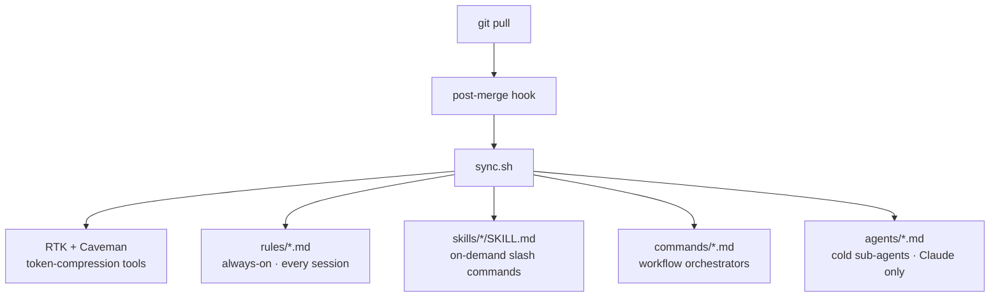
```mermaid
flowchart TD
    A[git pull] --> B[post-merge hook]
    B --> C[sync.sh]
    C --> T["RTK + Caveman\ntoken-compression tools"]
    C --> R["rules/*.md\nalways-on · every session"]
    C --> S["skills/*/SKILL.md\non-demand slash commands"]
    C --> M["commands/*.md\nworkflow orchestrators"]
    C --> G["agents/*.md\ncold sub-agents · Claude only"]
```

Four namespaces, one source of truth:

| Directory | Loaded | Invoked |
|-----------|--------|---------|
| `rules/` | Every session, automatically | Never — always present |
| `skills/` | On demand | Slash command or natural language |
| `commands/` | On demand | Slash command or natural language |
| `agents/` | Spawned by an orchestrator | `subagent_type:` — never directly (Claude only) |

### Where files land per AI tool

| Tool | Always-on (`rules/`) | On-demand (`skills/` + `commands/`) | Agents (`agents/`) |
|------|----------------------|--------------------------------------|--------------------|
| Claude Code | `~/.claude/CLAUDE.md` (managed block) | `~/.claude/commands/<name>.md` → `/<name>` | `~/.claude/agents/<name>.md` |
| Cursor | `~/.cursor/rules/*.mdc` (alwaysApply) | `~/.cursor/rules/*.mdc` (alwaysApply:false) | — |
| Copilot | `codeGeneration.instructions` | `codeGeneration.instructions` | — |
| Gemini CLI | `~/GEMINI.md` (managed block) | `~/GEMINI.md` (managed block) | — |
| Codex CLI | `~/.codex/AGENTS.md` (managed block) | `~/.codex/AGENTS.md` (managed block) | — |
| Crush | `~/.config/crush/CRUSH.md` (managed block) | `~/.config/crush/skills/<name>.md` → command | — |

Agents are Claude-only — the other five tools have no cold sub-agent concept, so `sync.sh` skips the agent pass for them.

---

## Using the workflows

### Just say what you want

Natural language routes to the right command automatically. No slash commands required.

```
"plan this feature"     →  /define   (interview → spec → plan, checkpoint-gated)
"review this"           →  /parallel-review
"build this feature"    →  /parallel-build
"ship this"             →  /parallel-ship
"fix this bug"          →  /fix
"write tests for this"  →  /fe-test · /android-test · /ios-test  (by platform)
"generate PR message"   →  /pr-message
```

Platform is not inferred. On every prompt `hooks/craftkit-routing.js` walks up from `cwd` for `settings.gradle` (Android), `Podfile` / `Package.swift` / `*.xcodeproj` (iOS), or `package.json` (RN/web) — nearest ancestor wins, several markers at one level report as mixed — and injects the answer. So `"write tests for this"` in an Android repo resolves to `/android-test`, never `/fe-test`.

---

### Dynamic workflows (default)

Build, review, and ship use **dynamic parallel execution** — a classifier detects the platform (RN/web, Android, iOS), reads your actual diff, selects only the agents that matter, and runs them concurrently. Test-only diffs skip deep review entirely. Every command below works on all three platforms; only the gates and the agent set change.

#### /parallel-review

> Triggered by: `"review this"` / `"help me review"` / `"code review"` / `"LGTM check"`

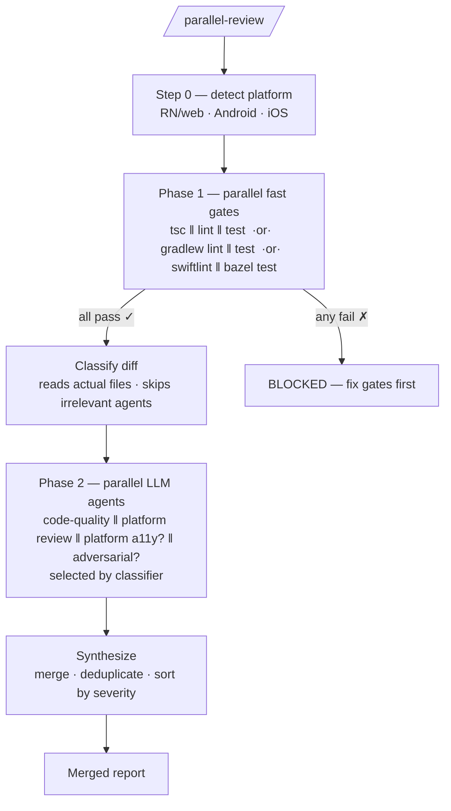
```mermaid
flowchart TD
    A[/parallel-review/] --> P["Step 0 — detect platform\nRN/web · Android · iOS"]
    P --> B["Phase 1 — parallel fast gates\ntsc ‖ lint ‖ test  ·or·  gradlew lint ‖ test  ·or·  swiftlint ‖ bazel test"]
    B -->|all pass ✓| C["Classify diff\nreads actual files · skips irrelevant agents"]
    C --> D["Phase 2 — parallel LLM agents\ncode-quality ‖ platform review ‖ platform a11y? ‖ adversarial?\nselected by classifier"]
    D --> E["Synthesize\nmerge · deduplicate · sort by severity"]
    E --> F[Merged report]
    B -->|any fail ✗| G[BLOCKED — fix gates first]
```

#### /parallel-ship

> Triggered by: `"ship this"` / `"prepare for PR"` / `"is this ready?"` / `"get this ready to merge"`

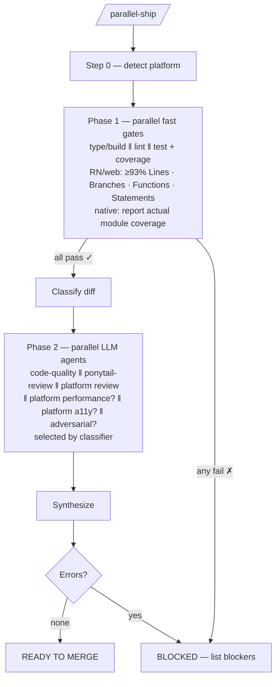
```mermaid
flowchart TD
    A[/parallel-ship/] --> P["Step 0 — detect platform"]
    P --> B["Phase 1 — parallel fast gates\ntype/build ‖ lint ‖ test + coverage\nRN/web: ≥93% Lines · Branches · Functions · Statements\nnative: report actual module coverage"]
    B -->|all pass ✓| C[Classify diff]
    C --> D["Phase 2 — parallel LLM agents\ncode-quality ‖ ponytail-review ‖ platform review\n‖ platform performance? ‖ platform a11y? ‖ adversarial?\nselected by classifier"]
    D --> E[Synthesize]
    E --> F{Errors?}
    F -->|none| G[READY TO MERGE]
    F -->|yes| H[BLOCKED — list blockers]
    B -->|any fail ✗| H
```

#### /parallel-build

> Triggered by: `"build feature X"` / `"implement X"` / `"create a new screen"`

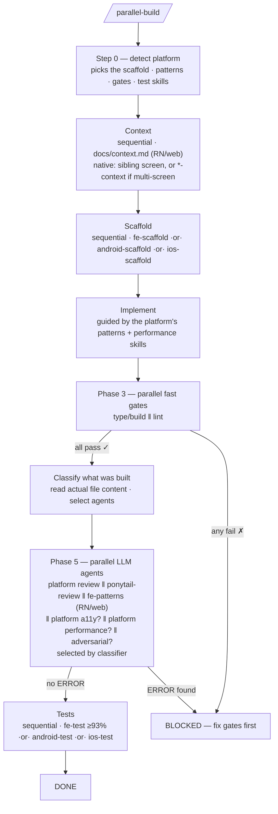
```mermaid
flowchart TD
    A[/parallel-build/] --> P["Step 0 — detect platform\npicks the scaffold · patterns · gates · test skills"]
    P --> B["Context\nsequential · docs/context.md (RN/web)\nnative: sibling screen, or *-context if multi-screen"]
    B --> C["Scaffold\nsequential · fe-scaffold ·or· android-scaffold ·or· ios-scaffold"]
    C --> D["Implement\nguided by the platform's patterns + performance skills"]
    D --> E["Phase 3 — parallel fast gates\ntype/build ‖ lint"]
    E -->|all pass ✓| F["Classify what was built\nread actual file content · select agents"]
    F --> G["Phase 5 — parallel LLM agents\nplatform review ‖ ponytail-review ‖ fe-patterns (RN/web)\n‖ platform a11y? ‖ platform performance? ‖ adversarial?\nselected by classifier"]
    G -->|no ERROR| H["Tests\nsequential · fe-test ≥93% ·or· android-test ·or· ios-test"]
    H --> I[DONE]
    E -->|any fail ✗| J[BLOCKED — fix gates first]
    G -->|ERROR found| J
```

---

### How the classifier picks agents

The classifier reads your actual changed files — not just filenames — and selects only the agents that apply. Irrelevant agents are skipped entirely.

```
RN / web (EVPMR)                         agents selected:
──────────────────────────────────────────────────────────
View*.tsx                           →   code-quality + fe-review + fe-a11y
Presenter*.ts                       →   code-quality + fe-review
Model*.ts                           →   code-quality (type/correctness focus)
Entry*.tsx or Resource*.ts          →   fe-review
View or Presenter + /parallel-ship  →   + fe-performance

Android (MVP)
──────────────────────────────────────────────────────────
*Activity/Fragment/Widget.kt, layout →  code-quality + android-review + android-a11y
*Presenter.kt, *ViewModel.kt         →  code-quality + android-review
*Repository/Interactor/UseCase.kt    →  code-quality
Dagger *Module/*Component.kt         →  android-review
Presenter/VM/adapter + /parallel-ship → + android-performance

iOS (MVVM-C)
──────────────────────────────────────────────────────────
*ViewController/View/Cell.swift      →  code-quality + ios-review + ios-a11y
*ViewModel.swift                     →  code-quality + ios-review
*Fetcher.swift                       →  code-quality + ios-performance
*Contract/Factory/Coordinator.swift  →  ios-review

All platforms
──────────────────────────────────────────────────────────
any non-test src + build/ship       →   + ponytail-review (over-engineering)
3+ architecture layers changed      →   + adversarial (devil's advocate)
auth / payment / credential paths   →   code-quality (security emphasis)
test files only                     →   Phase 2 SKIPPED entirely
```

**Example A — View + Presenter changed**

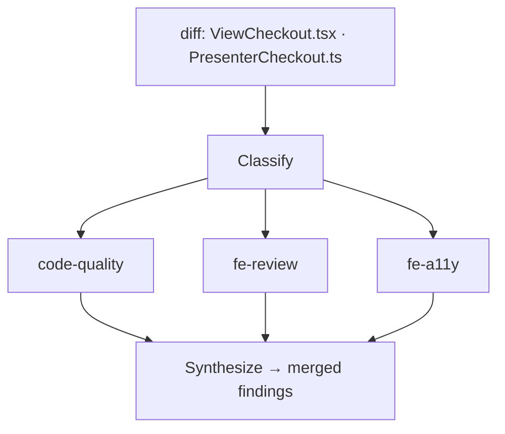
```mermaid
flowchart TD
    A["diff: ViewCheckout.tsx · PresenterCheckout.ts"] --> B[Classify]
    B --> C[code-quality]
    B --> D[fe-review]
    B --> E[fe-a11y]
    C & D & E --> F[Synthesize → merged findings]
```

**Example B — Model only**

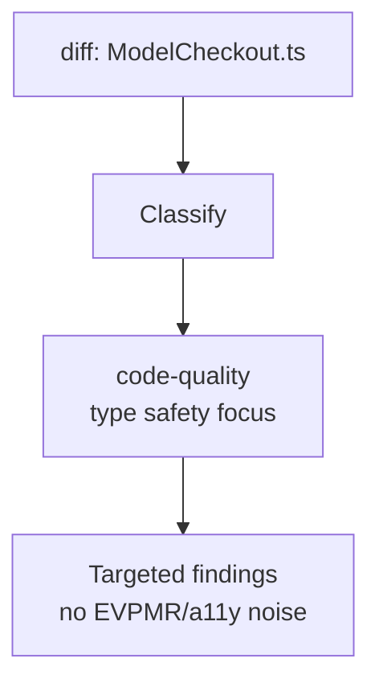
```mermaid
flowchart TD
    A["diff: ModelCheckout.ts"] --> B[Classify]
    B --> C["code-quality\ntype safety focus"]
    C --> D["Targeted findings\nno EVPMR/a11y noise"]
```

**Example C — Test files only**

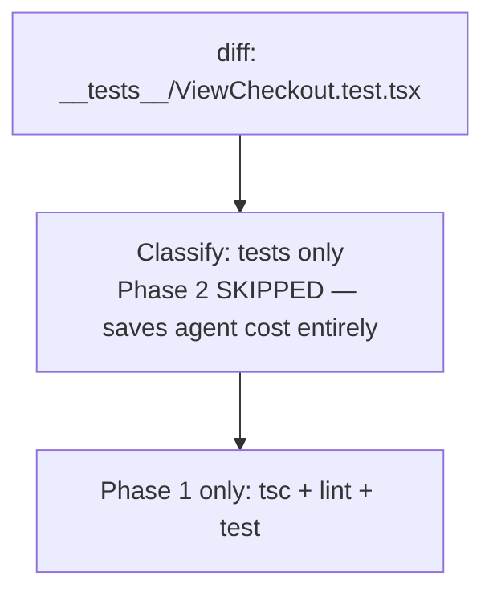
```mermaid
flowchart TD
    A["diff: __tests__/ViewCheckout.test.tsx"] --> B["Classify: tests only\nPhase 2 SKIPPED — saves agent cost entirely"]
    B --> C["Phase 1 only: tsc + lint + test"]
```

**Example D — 4 EVPMR layers → adversarial triggered**

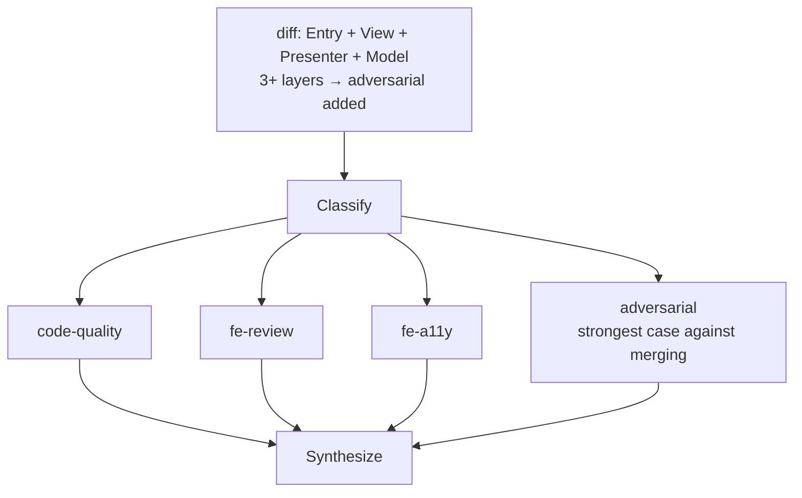
```mermaid
flowchart TD
    A["diff: Entry + View + Presenter + Model\n3+ layers → adversarial added"] --> B[Classify]
    B --> C[code-quality]
    B --> D[fe-review]
    B --> E[fe-a11y]
    B --> F["adversarial\nstrongest case against merging"]
    C & D & E & F --> G[Synthesize]
```

**Example E — Android screen (same command, native agents)**

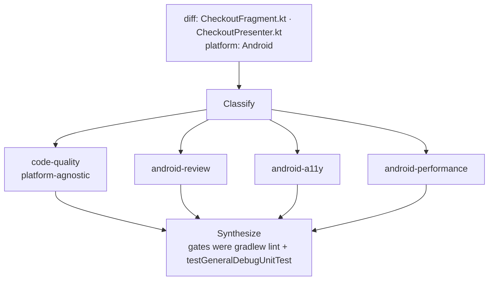
```mermaid
flowchart TD
    A["diff: CheckoutFragment.kt · CheckoutPresenter.kt\nplatform: Android"] --> B[Classify]
    B --> C["code-quality\nplatform-agnostic"]
    B --> D[android-review]
    B --> E[android-a11y]
    B --> F[android-performance]
    C & D & E & F --> G["Synthesize\ngates were gradlew lint + testGeneralDebugUnitTest"]
```

---

### Sequential fallback

When you want a lightweight, single-pass run — use the explicit slash command.

| Command | When to prefer |
|---------|---------------|
| [`/review`](commands/review.md) | Quick sanity check, small diff |
| [`/ship`](commands/ship.md) | Simple pre-merge gate, tests already passing |
| [`/build`](commands/build.md) | Scaffold-only, no parallel validation needed |

---

### Planning pipeline: /define — before you build

`/define` chains the Define→Plan phase **checkpoint-gated**: `/interview` (de-fuzz the ask) → `/spec` (PRD) → `/plan` (task breakdown), pausing for your approval between each so a bad spec never silently becomes bad tasks. It offers `/ideate` when the approach is open and `plan-roaster` before build. Output lands in the `docs/context.md` PLANNING block, which every execution skill reads — so `/parallel-build` runs with intent, not guesses.

```
/define ──► interview ─(gate)─► spec ─(gate)─► plan ─(gate)─► [ready] ──► /parallel-build ──► /parallel-ship
             de-fuzz           PRD            tasks                        build            └─► offers /adr + /docs
```

Pre-build only — it stops at a reviewed plan and hands off. The post-build docs (`/adr` for the *why*, `/docs` for dual-audience engineer + stakeholder pages) are offered as an opt-in tail of `/parallel-ship`, when the code is final. Every planning skill is also invocable alone (`/spec`, `/plan`, …) when you only want one phase.

---

### Experimental: /team-build — agent teams

> Built on Claude Code's experimental [agent teams](https://code.claude.com/docs/en/agent-teams). Requires `CLAUDE_CODE_EXPERIMENTAL_AGENT_TEAMS=1`. Explicit `/team-build` only — saying "build feature X" still routes to `/parallel-build`.

**The idea in one sentence:** instead of one AI building a feature file by file, your session becomes a **team lead** that plans the work, then spawns four AI teammates who build different files at the same time and talk to each other directly — a small dev team working off a shared task board.

How it differs from the default build:

| | `/parallel-build` (default) | `/team-build` (experimental) |
|---|---|---|
| Who writes the code | The main session, one file at a time | Two implementer teammates, in parallel |
| Helpers | One-shot reviewers that report back once | Persistent teammates that claim tasks and message each other |
| Coordination | None needed | Shared task board — finishing one task unblocks the next |
| Model split | One session model | Lead on escalated (`opus`), teammates on everyday (`sonnet`) |
| Token cost | ~1× | ~5× |
| Best for | Most features | Larger multi-file features where parallel implementation pays for the overhead |

Two rules make it safe and cheap:

- **One file, one owner.** Every file belongs to exactly one teammate for the whole build, so nobody overwrites anyone's work. Questions travel directly between teammates — the Presenter owner asks the Model owner about a type contract without round-tripping through the lead.
- **Staged spawn.** The reviewer and tester only spawn once there is something to review or test — nobody sits idle burning tokens.

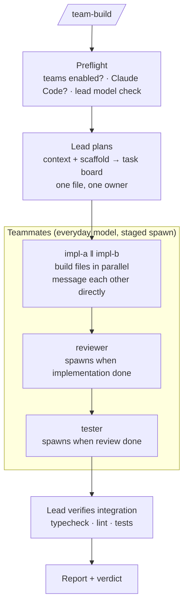
```mermaid
flowchart TD
    A[/team-build/] --> B["Preflight\nteams enabled? · Claude Code? · lead model check"]
    B --> C["Lead plans\ncontext + scaffold → task board\none file, one owner"]
    C --> D
    subgraph team ["Teammates (everyday model, staged spawn)"]
        D["impl-a ‖ impl-b\nbuild files in parallel\nmessage each other directly"] --> E["reviewer\nspawns when implementation done"]
        E --> F["tester\nspawns when review done"]
    end
    F --> G["Lead verifies integration\ntypecheck · lint · tests"]
    G --> H[Report + verdict]
```

Works on all three platforms — React Native/web (EVPMR), Android (MVP), iOS (MVVM-C) — the task board adapts to each architecture's file layout.

**Know before you run it:**

- **Claude Code only.** Teams are a harness runtime feature, not a model capability — on Cursor, Copilot, Gemini CLI, Codex CLI, or Crush the command's preflight falls back to `/parallel-build` or `/build`.
- **~5× the tokens** of a solo build — reserve it for features big enough to justify the overhead.
- **Teammates don't survive `/resume`** — an interrupted build restarts coordination from the task board, not the conversation.

Full workflow: [`commands/team-build.md`](commands/team-build.md).

---

### Fix, tests, and PR message

```
"something is broken" / "fix this bug" / "this crashes"
  /fix  →  fe-context → reproduce → isolate → fix → regression test

"write tests" / "add tests" / "coverage is low"     → resolves platform first
  /fe-test       →  RN/web: write tests for all changed paths, enforce ≥93% coverage
  /android-test  →  JUnit + MockK Presenter tests (no fixed coverage bar)
  /ios-test      →  Quick + Nimble ViewModel specs (no fixed coverage bar)

"generate PR message" / "draft a PR" / "what should my PR say"
  /pr-message  →  read diff → write title + summary + goal + changes + coverage → humanize (if installed) → copy to clipboard
```

---

## Skills reference

### Always-active rules

Loaded automatically on every session. Never invoke these — they're always present.

| Rule | Enforces |
|------|---------|
| [`caveman`](rules/caveman.md) | Terse responses — no filler, no hedging. lite / full / ultra modes |
| [`fe-rules`](rules/fe-rules.md) | EVPMR layer constraints, TypeScript strict, module-over-barrel imports, styling tokens, React correctness, tracking |
| [`karpathy-guidelines`](rules/karpathy-guidelines.md) | Think before coding, simplicity, surgical changes, goal-driven, read before write, tests verify intent, checkpoint after steps |
| [`using-agent-skills`](rules/using-agent-skills.md) | Skill routing (mandatory gate — classify before every response, announce match or "No skill matched."), model selection, severity labels, parallel classifier, model for judgment only, surface conflicts |

### Frontend skills — on demand

Use when a task is narrower than a full workflow.

| Skill | When to use | Escalate if |
|-------|-------------|-------------|
| [`fe-context`](skills/fe-context/SKILL.md) | Generate `docs/context.md` from branch diff | Diff spans > 10 interdependent files |
| [`fe-scaffold`](skills/fe-scaffold/SKILL.md) | Create a new 5-file EVPMR module | Novel architecture outside EVPMR |
| [`fe-review`](skills/fe-review/SKILL.md) | EVPMR pattern review only | Architectural conflicts with non-obvious resolution |
| [`fe-patterns`](skills/fe-patterns/SKILL.md) | Composition patterns, hooks discipline, state location | Novel state architecture |
| [`fe-performance`](skills/fe-performance/SKILL.md) | Waterfall elimination, bundle size, re-renders | Lighthouse regressions with non-obvious root cause |
| [`fe-a11y`](skills/fe-a11y/SKILL.md) | Labels, roles, focus management, reduced motion — RN & Next.js | Complex focus flows spanning multiple routes |
| [`fe-test`](skills/fe-test/SKILL.md) | Write/improve tests — enforces ≥93% coverage. **RN/web only** — native goes to `/android-test` / `/ios-test` | Can't reach 93%, root cause unclear |

### Native mobile skills — on demand

Sanitized, architecture-agnostic references. Native mobile does **not** use EVPMR or `docs/context.md` for single-screen work — read a real sibling screen first. For an internal codebase with concrete module names, drop a project-scoped override at `<repo>/.claude/skills/<name>/` (same skill name shadows the global one inside that repo).

The `*-review`, `*-a11y`, and `*-performance` skills below double as the source for the matching cold agents — the parallel workflows spawn those, with each skill's checklist injected live via `craftkitInject`. Edit the skill; the agent follows on the next sync.

**Android** — MVP + Core framework, Dagger, Gradle Dynamic Feature Modules:

| Skill | When to use | Escalate if |
|-------|-------------|-------------|
| [`android-patterns`](skills/android-patterns/SKILL.md) | Architecture reference — MVP layers, DI, module split, navigation | Novel state/effect orchestration |
| [`android-scaffold`](skills/android-scaffold/SKILL.md) | Scaffold a new screen (View/Presenter/ViewModel + Dagger wiring) | Outside the Core MVP contract |
| [`android-review`](skills/android-review/SKILL.md) | Review a diff against the MVP contract | Architectural conflict, non-obvious resolution |
| [`android-a11y`](skills/android-a11y/SKILL.md) | TalkBack labels/state, touch targets, Compose semantics | Complex focus flows across screens |
| [`android-performance`](skills/android-performance/SKILL.md) | Main-thread/coroutine, RecyclerView, recomposition, leaks | Jank/leak with non-obvious root cause |
| [`android-test`](skills/android-test/SKILL.md) | JUnit + MockK Presenter tests (Turbine for Flow) | Path unreachable without production refactor |
| [`android-context`](skills/android-context/SKILL.md) | Branch-scoping doc for multi-screen work | Multi-module cross-feature `-api` changes |

**iOS** — MVVM-C, Bazel + CocoaPods, Quick + Nimble:

| Skill | When to use | Escalate if |
|-------|-------------|-------------|
| [`ios-patterns`](skills/ios-patterns/SKILL.md) | Architecture reference — MVVM-C, Fetcher, Coordinator, Dependency-struct DI | Novel state/effect orchestration |
| [`ios-scaffold`](skills/ios-scaffold/SKILL.md) | Scaffold a new screen (Contract/VC/View/ViewModel/Factory/Fetcher) | Outside the MVVM-C contract |
| [`ios-review`](skills/ios-review/SKILL.md) | Review a diff against the MVVM-C contract | Architectural conflict, non-obvious resolution |
| [`ios-a11y`](skills/ios-a11y/SKILL.md) | VoiceOver labels/traits, focus, Dynamic Type, reduce motion | Complex focus flows across screens |
| [`ios-performance`](skills/ios-performance/SKILL.md) | Main-thread, cell reuse, image downsampling, retain-cycle leaks | Jank/leak with non-obvious root cause |
| [`ios-test`](skills/ios-test/SKILL.md) | Quick + Nimble ViewModel specs, mock via Dependency struct | Path unreachable without production refactor |
| [`ios-context`](skills/ios-context/SKILL.md) | Branch-scoping doc for multi-screen work | Multi-module cross-module coordinator changes |

### General skills — on demand

| Skill | When to use | Escalate if |
|-------|-------------|-------------|
| [`code-quality`](skills/code-quality/SKILL.md) | Review (5-axis) or simplify complex code | Security-sensitive review, or refactor > 500 lines |
| [`debug`](skills/debug/SKILL.md) | Structured reproduce → isolate → fix | No hypothesis after 2 isolation attempts |
| [`ideate`](skills/ideate/SKILL.md) | Divergent ideation — N framed generators → critic scores/clusters. Open-ended design, naming, fuzzy debug | High-stakes — escalate the critic/deepen pass to opus |
| [`think`](skills/think/SKILL.md) | Systems/strategy reasoning router — cynefin, systems, feedback loops, constraints, leverage, second-order. Architecture + complex-system decisions | Architecture call with non-obvious tradeoffs — escalate analysis to opus |
| [`ponytail-review`](skills/ponytail-review/SKILL.md) | Over-engineering audit on a diff or file — what to delete/shrink | Correctness or security concerns → use `code-quality` |
| [`ponytail-audit`](skills/ponytail-audit/SKILL.md) | Whole-repo bloat scan — ranked list of removals | — |
| [`ponytail-debt`](skills/ponytail-debt/SKILL.md) | Ledger of all `ponytail:` shortcuts — surfaces deferred simplifications | — |

### Planning & docs skills — on demand

The **Define → Plan → Document** layer. All opt-in — never auto-run from `/parallel-build`. `/spec` `/plan` `/adr` write a forward-planning block into `docs/context.md`, so downstream execution skills run with intent instead of guesses. `/define` chains the pre-build phases checkpoint-gated (`/interview → /spec → /plan`); `/adr` + `/docs` are offered post-build as a tail of `/parallel-ship`. Full arc: `/define` → `/parallel-build` → `/parallel-ship` (→ `/adr` + `/docs`). See [Planning pipeline](#planning-pipeline-define--before-you-build).

| Skill | When to use | Escalate if |
|-------|-------------|-------------|
| [`interview`](skills/interview/SKILL.md) | De-fuzz an underspecified ask — one question at a time to ~95% confidence, then hand to `/spec` | — |
| [`spec`](skills/spec/SKILL.md) | Write a PRD before coding — objective, scope, boundaries, acceptance criteria | Hard-to-reverse (schema, public API, payment/auth) — escalate to opus |
| [`plan`](skills/plan/SKILL.md) | Break a spec into ordered, verifiable tasks + deps + executing skill; offers `plan-roaster` | Large dependency graph or > 5 interdependent files |
| [`adr`](skills/adr/SKILL.md) | Record one architectural decision — context, options, decision, consequences (the *why*) | — |
| [`docs`](skills/docs/SKILL.md) | Dual-audience docs — technical (engineers) + non-technical (stakeholders), Confluence-paste-ready markdown, run through `/humanizer` | Accuracy depends on subtle system behavior — escalate to everyday |

---

## Agents reference

Cold sub-agents spawned by parallel workflows. Each has a fixed system prompt (role + checklist), enforced tool restrictions (`Read, Grep, Glob` — no writes), and a set model. Orchestrators pass content (diff or files) as the user message when spawning.

Auto-synced to `~/.claude/agents/` on `git pull` (Claude Code only).

The parallel workflows detect the platform first, then spawn that platform's review/a11y/performance agents. `code-quality`, `ponytail-review`, and `adversarial` are platform-agnostic and run on all three.

| Agent | Platform | Role | Spawned by | Model |
|-------|----------|------|-----------|-------|
| [`code-quality`](agents/code-quality.md) | all | 5-axis review: correctness, readability, arch, security, performance | `parallel-review`, `parallel-ship` | sonnet |
| [`ponytail-review`](agents/ponytail-review.md) | all | Over-engineering: reinvented stdlib, speculative abstraction, dead flexibility (complexity only) | `parallel-build`, `parallel-ship` | sonnet |
| [`adversarial`](agents/adversarial.md) | all | Devil's advocate — strongest case against merging/shipping | `parallel-review`, `parallel-build`, `parallel-ship` | sonnet |
| [`fe-review`](agents/fe-review.md) | RN / web | EVPMR layer violations, TypeScript, styling, React correctness, tracking | `parallel-review`, `parallel-build`, `parallel-ship` | sonnet |
| [`fe-a11y`](agents/fe-a11y.md) | RN / web | Accessibility: labels, roles, focus, announcements, reduced motion | `parallel-review`, `parallel-build`, `parallel-ship` | sonnet |
| [`fe-patterns`](agents/fe-patterns.md) | RN / web | Composition patterns, hooks discipline, state location | `parallel-build` | sonnet |
| [`fe-performance`](agents/fe-performance.md) | RN / web | Waterfalls, bundle size, re-renders, server-side, RN patterns | `parallel-build`, `parallel-ship` | sonnet |
| [`android-review`](agents/android-review.md) | Android | MVP layer violations, Dagger DI, NavigatorService nav, string resources, coroutine correctness | `parallel-review`, `parallel-build`, `parallel-ship` | sonnet |
| [`android-a11y`](agents/android-a11y.md) | Android | TalkBack labels, roles/state, touch targets, focus order, text scaling | `parallel-review`, `parallel-build`, `parallel-ship` | sonnet |
| [`android-performance`](agents/android-performance.md) | Android | Main-thread discipline, RecyclerView/DiffUtil, recomposition stability, image loading, leaks | `parallel-build`, `parallel-ship` | sonnet |
| [`ios-review`](agents/ios-review.md) | iOS | MVVM-C layer violations, Dependency-struct DI, Coordinator-only nav, NSLocalizedString, retain cycles | `parallel-review`, `parallel-build`, `parallel-ship` | sonnet |
| [`ios-a11y`](agents/ios-a11y.md) | iOS | VoiceOver labels/traits/hints, focus & announcements, Dynamic Type, reduce motion | `parallel-review`, `parallel-build`, `parallel-ship` | sonnet |
| [`ios-performance`](agents/ios-performance.md) | iOS | Main-thread discipline, cell reuse & prefetch, image downsampling, layout cost, retain cycles | `parallel-build`, `parallel-ship` | sonnet |
| [`plan-roaster`](agents/plan-roaster.md) | all | Stress-test a plan before implementation — weakest assumption + failure modes | On demand | sonnet |

### Skill vs agent — when to add which

| Question | Answer → add |
|----------|-------------|
| Will you invoke it yourself (`/name`)? | **skill** |
| Does it need conversation history or prior context? | **skill** |
| Will it ever run in parallel with another instance? | **agent** |
| Is it purely internal — only spawned by a command, never invoked by you? | **agent only** (no skill needed) |
| Needs to work both ways? | **both** — skill for manual invocation, agent for parallel spawn |

`fe-review` is an example of both: `/fe-review` for manual use, `fe-review` agent for parallel workflows. `adversarial` is agent-only — you'd never invoke it directly.

> **Agent system prompts are cold copies.** Agents don't inherit rules, skills, or session context — anything the agent needs must be in `agents/<name>.md`.
>
> **`craftkitInject` avoids the hand-maintained duplicate.** Add `craftkitInject: <name>` to an agent's frontmatter and the sync splices that body in as a managed block at install time, regenerated on every pull. Each name resolves `rules/<name>.md` first, then `skills/<name>/SKILL.md` — so an agent can carry a live rule (`fe-review` ← `fe-rules`) or a live skill checklist (`android-review` ← `skills/android-review`). Prefer it over copying text into the agent; a copy silently rots when the source changes. Claude Code only.

### Add an agent

```bash
# create agents/<name>.md with frontmatter: name, description, tools, model, color
git add agents/<name>.md && git commit -m "feat: add <name> agent" && git push
# users: git pull → auto-installed to ~/.claude/agents/
```

### Use an agent in a command

```
Agent({ subagent_type: "<name>", prompt: "<content to review>" })
```

The harness loads the agent definition automatically — no inline prompt needed.

---

## Architecture (EVPMR)

All frontend features follow a strict 5-file module structure. Rules are enforced by `fe-rules` at all times — no invocation needed.

```
feature-name/
├── EntryFeatureName.tsx      ← ErrorBoundary + context providers
├── ViewFeatureName.tsx       ← Pure render — calls usePresenter*, no state/effects
├── PresenterFeatureName.ts   ← All hooks, state, React Query — returns plain object
├── ModelFeatureName.ts       ← TypeScript types + pure functions only
└── ResourceFeatureName.ts    ← All display strings
```

```
View       NEVER  useState / useEffect / API calls
Presenter  NEVER  return JSX
Model      NEVER  import React or cause side effects
Entry      ALWAYS wrap in <ErrorBoundary>
Resource   ALWAYS own display strings — never hardcode in View
Styles     ALWAYS StyleSheet.create() + Token.spacing.* / Token.color.*
```

Async data always as discriminated unions:
```ts
type AsyncData<T> =
  | { type: 'NOT_ASKED' }
  | { type: 'LOADING' }
  | { type: 'DATA_READY'; payload: T }
  | { type: 'ERROR'; error: string }
```

### How context flows between skills

`/fe-context` writes `docs/context.md` (≤ 600 lines). Every skill reads it instead of re-scanning the project — one diff scan, many skills benefit.

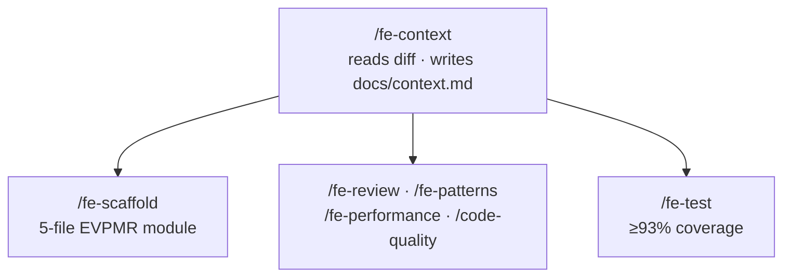
```mermaid
flowchart TD
    A["/fe-context\nreads diff · writes docs/context.md"]
    A --> B["/fe-scaffold\n5-file EVPMR module"]
    A --> C["/fe-review · /fe-patterns\n/fe-performance · /code-quality"]
    A --> D["/fe-test\n≥93% coverage"]
```

| Level | Source | What |
|-------|--------|------|
| L1 — Rules | Always-active skill files | EVPMR, tokens, Karpathy guidelines |
| L2 — Spec | `docs/context.md` | What's being built, constraints, decisions |
| L3 — Source | Diff output | Files touched by this branch |
| L4 — Errors | On demand | Failing tests, lint, TypeScript errors |
| L5 — History | Session | Conversation context |

---

## Model routing

Each skill runs on the everyday model. Escalation is inline — the AI consults the higher model for a specific question and continues without interrupting you.

**Claude Code is plan-aware.** `hooks/craftkit-routing.js` reads the logged-in account from `~/.claude.json` on every prompt and injects the detected tier as context: Gmail-domain login → personal, `organizationType` containing "enterprise" → enterprise, anything unreadable → personal (safe default).

| AI | Plan | Everyday | Escalate | Fusion panel |
|----|------|----------|----------|-------------|
| Claude Code | personal (Pro, Gmail login) | `claude-sonnet-5` | `claude-opus-4-8` | 2× opus → opus judge |
| Claude Code | enterprise | `claude-opus-4-8` | `claude-fable-5` | 2× fable → fable judge |
| Gemini CLI | — | `gemini-2.5-flash` | `gemini-2.5-pro` | — |
| Cursor | — | claude-sonnet / gpt-4o | claude-opus / o1 | — |
| Copilot | — | `claude-sonnet-5` | `claude-opus-4-8` | — |
| Codex CLI | — | `codex-mini-latest` | `o3` | — |
| Crush | — | provider-dependent | provider-dependent | — |

Escalation triggers: architecture decisions with non-obvious tradeoffs, security-sensitive code, debugging with no hypothesis after 2 attempts.

Fusion panel triggers: irreversible production changes, security architecture with meaningful attack surface, decisions where a single-model opinion may miss divergent reasoning paths. Runs 2 independent passes on the tier's escalate model → same model synthesizes using Track A (artifact: run+merge) or Track B (analysis: consensus/contradictions/unique/blind spots).

---

## Managing skills

**Never edit installed files directly** in `~/.claude/`, `~/.cursor/`, or VS Code settings — `sync.sh` owns them and will overwrite on next pull. Always edit source files in this repo.

### Add a rule (always-on)

```bash
# 1. create the file
echo '---\nname: my-rule\ndescription: What it enforces\n---\n\n...' > rules/my-rule.md

# 2. ship it
git add rules/my-rule.md && git commit -m "feat: add my-rule" && git push
# users: git pull → auto-installed
```

### Add a skill (on-demand)

> Not sure whether to add a skill or an agent? See [Skill vs agent](#skill-vs-agent--when-to-add-which).

```bash
mkdir -p skills/my-skill
# create skills/my-skill/SKILL.md with frontmatter: name, description, alwaysApply: false
git add skills/my-skill && git commit -m "feat: add my-skill" && git push
```

### Add a command (orchestrator)

```bash
# create commands/my-command.md with frontmatter: name, description
git add commands/my-command.md && git commit -m "feat: add my-command" && git push
```

### Add an agent (cold sub-agent for Claude Code)

```bash
# create agents/my-agent.md with frontmatter: name, description, tools, model, color
git add agents/my-agent.md && git commit -m "feat: add my-agent agent" && git push
# users: git pull → auto-installed to ~/.claude/agents/
```

### Remove a skill, command, or agent

```bash
git rm -r skills/<name>/       # skill
git rm commands/<name>.md      # command
git rm agents/<name>.md        # agent → also remove from subagent_type references in commands/
git commit -m "remove: <name>" && git push
# users: git pull → auto-uninstalled from all AI tools
```

---

## Tooling

External tools and inspirations bundled or adopted into this repo.

| Tool | Source | Purpose | How it's used |
|------|--------|---------|---------------|
| **RTK** | [github.com/rtk-ai/rtk](https://github.com/rtk-ai/rtk) | Filters shell output before it reaches the AI — 60–90% input token savings | Auto-installed on `bash install.sh`. All commands prefixed with `rtk` |
| **Caveman** | [github.com/JuliusBrussee/caveman](https://github.com/JuliusBrussee/caveman) | Strips AI output verbosity — 40–60% response token savings | Always-active via `rules/caveman.md`. lite / full / ultra modes |
| **Ponytail** | [github.com/DietrichGebert/ponytail](https://github.com/DietrichGebert/ponytail) | YAGNI-first decision ladder + over-engineering audit — 80–94% code reduction | Decision ladder in `karpathy-guidelines`, `ponytail:` comment convention, 3 skills: `/ponytail-review`, `/ponytail-audit`, `/ponytail-debt` |
| **Karpathy Guidelines** | [karpathy.ai](https://karpathy.ai) — adapted | Behavioral rules to prevent LLM coding pitfalls: think before coding, surgical changes, goal-driven execution | Always-active via `rules/karpathy-guidelines.md` |

---

## Changelog

| Version | Date | Changes |
|---------|------|---------|
| `v1.21.0` | 2026-08-06 | **Platform detection moved from inference to `cwd`.** The routing hook told the model to detect RN/web vs Android vs iOS itself, and `using-agent-skills` warned that announcing a `/fe-*` skill on a `.kt` or `.swift` task is a routing error — a rule against a mistake the setup invited, since the model only had filenames to go on and a native repo with no staged changes gives it nothing. That is deterministic work handed to a probabilistic step, against core behavior #7 (if code can answer, code answers). `hooks/craftkit-routing.js` now walks up from the hook payload's `cwd` (falling back to `process.cwd()`, capped at 12 levels) checking each level for `settings.gradle{,.kts}` / `build.gradle{,.kts}` → Android (MVP), `Podfile` / `Package.swift` / `*.xcodeproj` / `*.xcworkspace` → iOS (MVVM-C), `package.json` → React Native / web (EVPMR). Nearest ancestor wins, so an RN root reports RN while its `android/` subdir reports Android — the right answer in both places; several markers at one level report as mixed; no marker anywhere emits no line rather than a guess. The result is injected as an authoritative `Platform (detected from cwd)` line, so `"write tests for this"` in an Android repo can no longer land on `/fe-test`. **New `check.sh` check #11, behavioral not grep** — it builds three fixture dirs, runs the real hook against each, and asserts the label, plus asserts the hook exits 0 on malformed stdin. Both matter because a `UserPromptSubmit` hook that dies just yields no context: a marker typo or a parse crash removes the entire skill-first gate silently, and a grep-based check would pass on detection that never fires. Skips with a notice when `node` is off `PATH`. Verified to fail before being made to pass, for both classes. |
| `v1.20.0` | 2026-08-06 | **Barrel-import discipline moved to write time.** The guidance existed — `skills/fe-performance/SKILL.md` had a "Direct imports, not barrels" block — but it lived in an on-demand *performance* skill, so it was absent from context during ordinary feature and bugfix work. That is exactly when the mistake gets made: a shared helper was added to a package barrel and imported through it from three call sites, and the cost only surfaced in PR review. The barrel re-exported hooks, a query provider and a context alongside pure utils, so two of those importers pulled react-query, feature-control and provider code into their module graph for one string function. New **`## Imports`** section in `rules/fe-rules.md` (always active), covering the module-over-barrel rule with a monorepo example, the corollary that a new shared helper must **not** be added to the barrel (an available path invites the costly import next time), consistency when the file already imports from that barrel, and the test bonus — a deep-imported helper survives a `jest.mock` of the barrel with no `jest.requireActual` threading. Per the token audit, the `fe-performance` block collapses to a one-line pointer plus its own distinct job (audit existing barrel imports during a bundle-size investigation), so the concept has one home. Reaches the `fe-review` cold agent live via its existing `craftkitInject: fe-rules` — no hand-copied duplicate. |
| `v1.19.0` | 2026-08-05 | **The parallel workflows now run on iOS and Android, not just RN/web.** `/parallel-review`, `/parallel-ship`, and `/parallel-build` hardcoded `rtk tsc` + jest-93% gates and a `fe-*`-only agent set, and the classifier keyed on `View*.tsx`/`Presenter*.ts` — so a `.kt` or `.swift` branch landed in a command with the wrong gates and no matching reviewer, while the sequential `/build` `/fix` `/ship` had platform-routed for versions. Closed in four parts. (1) **`craftkitInject` resolves skills, not just rules** — `adapters/claude.sh` now looks up each injected name as `rules/<n>.md` first, then `skills/<n>/SKILL.md` (`_claude_inject_source_path`), so a cold agent can carry a live *skill checklist*. That is what makes native agents maintainable: no hand-copied duplicate to rot. (2) **Six native cold agents** — `android-review` `android-a11y` `android-performance` `ios-review` `ios-a11y` `ios-performance`, each a thin prompt over its injected skill, each told it cannot run Gradle/Bazel/SwiftLint/TalkBack/VoiceOver/Instruments and to name the manual check or measurement still owed instead of asserting one. `code-quality`, `ponytail-review`, and `adversarial` stay platform-agnostic and run on all three. (3) **Platform-aware classifier** — `using-agent-skills` gained Step 1.5 (detect platform; a mixed diff unions both tables) and per-platform Step 2 tables for MVP (Activity/Fragment/Widget, Presenter, ViewModel, Repository, Dagger, `strings.xml`) and MVVM-C (ViewController/View/Cell, ViewModel, Fetcher, Contract/Factory/Coordinator, `*.strings`); the adversarial trigger now counts layers in any of the three architectures, and Step 4 announces the detected platform. (4) **Step 0 in all three commands** — per-platform gate rows (`gradlew lintGeneralDebug` + `testGeneralDebugUnitTest`; `swiftlint lint` + `bazelisk test`), the 93% coverage bar scoped to RN/web with native reporting actual module coverage or stating it isn't measured, native context downgraded to sibling-screen reading for single screens, and the repeated per-agent payload blocks collapsed into one message template + an agent/platform/include-when table (which is what kept 12 agent variants from tripling these files). `parallel-build` also routes its scaffold/patterns/test phases per platform; native has no `*-patterns` agent by design — the patterns skill already ran in Phase 2 and the review agent covers the layer contract. **Two pre-existing routing bugs found by the follow-up repo audit and fixed in the same release.** (a) *Test intent was platform-blind* — the routing table sent every "write tests" / "coverage is low" phrasing, plus both ambiguous-test tiebreakers, to `/fe-test`, which is Jest + 93% + EVPMR paths; on a `.kt`/`.swift` repo that is the wrong skill while `/android-test` and `/ios-test` sat unreachable unless named. The row and tiebreakers now resolve platform first, `skills/fe-test/SKILL.md` opens with a platform gate that stops and redirects (and forbids carrying the 93% bar into native), and the hook + README rows match. (b) *`docs/context.md` was declared mandatory with no exceptions* while ten `{android,ios}-*` skills declared they don't use it — a direct contradiction inside an always-active rule. Standard context loading now states its scope up front (RN/web, plus native multi-screen only), names the sibling-screen baseline as correct for native single-screen work, generalizes project-root detection to `settings.gradle` / `*.xcodeproj`, and picks the generator per platform (`/fe-context` · `/android-context` · `/ios-context`); failure-mode #9 no longer reads as absolute. (c) *`skills/pr-message/` deleted* — a 7-line stub whose body only pointed at `commands/pr-message.md`. Because a skill with `alwaysApply: false` installs to the same dest a command does (`adapters/claude.sh:4-5`), the two passes wrote the same file every sync on all six tools; the 137-line command won only because the commands pass happens to run second. Ordering luck, not design. Removing the stub makes the sync idempotent for the first time — `commands: (up to date)` everywhere instead of a perpetual `+ installing: pr-message`. The state-file removal loop uninstalled the orphan automatically; nothing referenced the stub. (d) *Cursor re-wrote all four rules on every sync* — `install_cursor_rule` injects `alwaysApply: true` after the opening `---`, but `sync_rules_adapter` diffed the **raw source** against the **transformed dest**, so every rule compared as changed forever. Same bug class the agents pass already solved: `sync_rules_adapter` now honours an optional `effective_<adapter>_rule_source` hook (mirroring `effective_<adapter>_agent_source`, including the never-delete-the-source temp guard), and `adapters/cursor.sh` declares one over a shared `_cursor_render_rule` so install and comparison can't drift. Cursor was the only adapter transforming rules on install — the other five plain-`cp` to a staging path, so their raw diff was already honest. `sync.sh` is now idempotent end to end: a second run reports no work on any of the six tools. **Added `check.sh` — the repo's first verification step.** All four bugs above were mechanical and grep-findable, and all four survived because nothing greps: with no build, lint, or test suite, "verification" was `sync.sh` printing `Sync complete.`, which only proves files copied. `check.sh` codifies core behavior #7 (if code can answer, code answers) with ten checks, each one a regression guard for a bug that actually shipped — `subagent_type` resolution, skill/command dest collision, flat `skills/`, frontmatter/path name agreement, `craftkitInject` resolution, routing-hook targets, per-platform orchestrator coverage, absolute `docs/context.md` claims, README coverage of every agent and skill, and version agreement across `package.json`/README header/changelog. Each was verified to fail before being made to pass. Wired into `CLAUDE.md` and the README as a pre-commit gate. |
| `v1.18.0` | 2026-08-05 | **Comment bloat is now a scored rubric tag.** `v1.17.0` gave the writing side a comment-discipline block, but the ponytail rubric had no tag for it — so neither the write-time self-pass nor `/ponytail-review` ever scored comments, and only `agents/code-quality.md` (readability axis) caught them. Added a sixth tag **`narrate:`** to the rubric in `rules/karpathy-guidelines.md` rule 2 — fails on a comment that restates the code, or on comments denser than the file around it. One row propagates to every consumer: the write-time self-pass, `/ponytail-review`, `/ponytail-audit`, `/android-review`, `/ios-review`, all three scaffolds' after-generating checklists, and the `ponytail-review` agent (live via `craftkitInject`). Tag-specific protected list added so the guard can't strip what matters: a comment carrying a non-obvious *why*, license/pragma headers, and doc comments on public APIs. The comment-discipline block now closes on the causal point — excessive comments mean the code isn't expressive enough, so fix the code — and names `narrate:` as its enforcement. Overlaps `code-quality`'s comment-noise check only on the same `file:line` (→ `[CONSENSUS]` in synthesis, same precedent as the `delete:`/dead-code overlap). |
| `v1.17.0` | 2026-08-04 | **Ponytail moved to write time — kills the review-rewrite loop.** Ponytail lived only on the review side: writers got the abstract ladder, reviewers scored by a five-tag rubric they never saw, so `/ponytail-review` always found a pile and applying it churned files. Fixed in three places. (1) **Shared rubric** — the five tags (`delete:` `stdlib:` `native:` `yagni:` `shrink:`) and the protected list moved into `rules/karpathy-guidelines.md` rule 2 (always active); the three hand-maintained copies in `skills/ponytail-review`, `skills/ponytail-audit`, and `agents/ponytail-review` now reference it (the agent already receives it live via `craftkitInject`). One list, both sides. (2) **Write-time self-pass** — any turn that writes code scans its own diff against the rubric before reporting done, cutting each hit or marking it `ponytail:` with its ceiling, and reports `ponytail self-pass: clean` / what was cut. Wired as an explicit gate in `/build` Step 3, `/parallel-build` Phase 2 (+ report line), `/team-build` per-task definition of done, the after-generating checklists of **all three** scaffolds (`/fe-scaffold`, `/android-scaffold`, `/ios-scaffold`), and CI-gate #3 in `using-agent-skills` core behavior #6. `/android-review` and `/ios-review` gained an **Over-engineering** section with platform-specific hits (Android: forwarding UseCase, single-subclass `sealed class`, hand-rolled `map`/`associateBy`; iOS: single-conformer protocol, forwarding Fetcher wrapper, hand-rolled `compactMap`/`first(where:)`/`Result`, unread Dependency field). The `ponytail-review` agent is now the backstop, not the first pass. (3) **Apply = deletion, never rewrite** — findings act on the named `file:line` only (remove, or swap in the named stdlib/native call); no restructuring, renaming, or tidying while in there, and a rewrite-shaped finding is stated and left alone. The agent must also emit only deletion-actionable findings. |
| `v1.16.1` | 2026-08-03 | **Detached Jumbo.** Removed the `jumbo-cli` global-install block from `sync.sh` `ensure_tools` and its Tooling-table row. Jumbo is a *per-project* memory CLI (`.jumbo/`), but CraftKit never initialized one — it rode along as a global install with zero effect inside this repo, whose memory/context is already handled by `docs/context.md` + the routing/skills system. No behavior change here; existing global `jumbo` binaries are left untouched (uninstall manually with `npm rm -g jumbo-cli` if unused elsewhere). |
| `v1.16.0` | 2026-08-03 | **Automatic over-engineering guard + cheapest-tier reconcile.** New cold agent **`ponytail-review`** (`agents/ponytail-review.md`, `craftkitInject: karpathy-guidelines`, `model: sonnet`) — spawned by `/parallel-build` (Phase 5) and `/parallel-ship` (Phase 2) whenever non-test, non-resource source changes, so bloat (reinvented stdlib, speculative abstraction, dead flexibility) gets caught without a manual `/ponytail-review`. `/fix` gained an inline bloat check on the fix diff. Overlaps `code-quality` only on dead-code (→ `[CONSENSUS]` in synthesis, not waste); `parallel-review` deliberately excluded. Injection (not invocation) is how the discipline reaches cold agents — write-time reach for any future cold *writing* agent is the same `craftkitInject` hook. Also reconciled the plan-blind `cheapest — claude-haiku-4-5` label across 13 skills: the **Model routing** table gains a **Cheapest** column (personal `claude-haiku-4-5` / enterprise `claude-sonnet-5`), skills now reference the table instead of hardcoding haiku, and `hooks/craftkit-routing.js` injects the detected `cheapest=` alongside everyday/escalate. Enterprise floor is `claude-sonnet-5`, matching the sonnet pin on all cold agents (static frontmatter can't branch on plan). |
| `v1.15.0` | 2026-07-25 | **Plan-aware model routing for Claude Code.** `hooks/craftkit-routing.js` now reads `~/.claude.json` → `oauthAccount` on every prompt and detects account tier: Gmail-domain login → personal (everyday `claude-sonnet-5`, escalate `claude-opus-4-8`), `organizationType` containing "enterprise" → enterprise (everyday `claude-opus-4-8`, escalate `claude-fable-5`), anything unreadable/unrecognized → personal (safe default). Detected tier is injected as `additionalContext` each turn. `rules/using-agent-skills.md` **Model routing** table gains a Plan column and generalizes the escalation/fusion-panel process prose to reference "the tier's Escalate model" instead of a hardcoded `claude-opus-4-8`. README **Model routing** section synced to match. |
| `v1.14.0` | 2026-07-23 | Added the **Define → Plan → Document** layer — five opt-in general skills adapted from [addyosmani/agent-skills](https://github.com/addyosmani/agent-skills) (MIT), filling the repo's forward-planning gap (it was strong on execution + reasoning but had no spec/plan/discovery/docs step). **`/interview`** de-fuzzes an underspecified ask one question at a time to ~95% confidence; **`/spec`** writes a PRD (objective, scope, boundaries, acceptance); **`/plan`** breaks it into ordered verifiable tasks + deps and offers the existing `plan-roaster`; **`/adr`** records one decision (the *why*); **`/docs`** produces dual-audience docs (engineer + stakeholder) run through `/humanizer`. `/spec` `/plan` `/adr` write a delimited **PLANNING** block into `docs/context.md` that `/fe-context` now preserves verbatim — so downstream skills execute with intent, not guesses. Overlap avoided: `idea-refine` maps to existing `/ideate`, so it was not duplicated. Also added **`/define`** — a checkpoint-gated orchestrator chaining `/interview → /spec → /plan` (pausing for approval between phases, offering `/ideate` + `plan-roaster`) so an underspecified ask becomes a reviewed spec + task plan in one invoke; and wired the post-build pair as an **opt-in tail of `/parallel-ship`** (offers `/adr` + `/docs` once the verdict is READY TO MERGE). Ordering enforces dependencies: spec precedes plan, adr/docs are post-build. Opt-in only — `/parallel-build` unchanged. Routing wired in `hooks/craftkit-routing.js` (drift guard) + orchestrator table, tiebreaker, and discovery tree in `using-agent-skills.md`. |
| `v1.13.0` | 2026-07-21 | **Token diet for long/subagent-heavy sessions** — no behavior change. (1) Slimmed `hooks/craftkit-routing.js` (~2.3KB→~1.2KB, injected on *every* prompt): dropped the prose that duplicated the always-on routing table, kept the terse gate + the full skill roster (still required by the drift guard) + a pointer to `rules/using-agent-skills.md`. (2) Removed the **Skill authoring rules** detail from the synced always-on `using-agent-skills.md` — relocated to this repo's own `CLAUDE.md` ("Critical authoring rules"), which loads only when editing craftkit source, i.e. exactly when needed. Trims ~2KB from every global session baseline. (3) Compressed the **Model routing** escalation/fusion-panel *process* prose in place (kept triggers + tier table always-on — escalation is global runtime behavior with no reliable on-demand home). Net: lighter per-prompt injection + lighter per-session baseline, no routing/escalation semantics changed. |
| `v1.12.0` | 2026-07-20 | Added **`/think`** skill — curated systems/strategy reasoning router from [tjboudreaux/cc-thinking-skills](https://github.com/tjboudreaux/cc-thinking-skills) (MIT). Six gap-filling frameworks (cynefin, systems, feedback loops, theory-of-constraints, leverage points, second-order) for architecture and complex-system decisions. Deliberately **not** the full 39-skill set — the ~12 overlapping models (first-principles, inversion, red-team, via-negativa, five-whys, …) route to existing `/ideate`, `ponytail`, `adversarial`, `/debug` instead of duplicating them. One routing entry, not seven. Also added a **routing drift guard** to `sync.sh`: every skill in `skills/` must be named in `hooks/craftkit-routing.js` or the sync fails loud — closes the silent-drift seam where a new skill's routing wiring is forgotten (curated orchestrator/native tables stay hand-authored). |
| `v1.11.0` | 2026-07-20 | Added **`/ideate`** skill — parallel divergent ideation adapted from [UditAkhourii/adhd](https://github.com/UditAkhourii/adhd) (MIT). Spawns 5 isolated generators under distinct cognitive frames (first-principles, adversary, steal-from-adjacent, radical-simplicity, …), then a critic scores (`novelty·0.35 + viability·0.40 + fit·0.25`), clusters, flags traps, and deepens the top 3. Gated behind a 3-check pre-flight (open scope · no single right answer · high stakes) — ~10 agent calls, 5–10× a direct answer. Distinct from the fusion panel (generates options vs verifies one decision). Offered as opt-in escalation from `/debug` (fuzzy debugging) and `/parallel-build` (open architecture). Full spawn only on Claude Code + Gemini CLI; degraded/manual on Cursor/Copilot/Codex/Crush. |
| `v1.10.0` | 2026-07-16 | Added experimental **`/team-build`** orchestrator on Claude Code [agent teams](https://code.claude.com/docs/en/agent-teams): the session acts as team lead (escalated model) that scaffolds, writes a dependency-ordered task list, and spawns four everyday-model teammates (impl-a, impl-b, reviewer, tester) that claim tasks and message each other directly. One-file-one-owner law prevents teammate write conflicts; shared wiring files are single-owner tasks. Platform-routed (EVPMR / Android MVP / iOS MVVM-C); FE reviewer reuses the `fe-review` agent definition, native reviewers run the review skills. Explicit invocation only — never auto-routed; requires `CLAUDE_CODE_EXPERIMENTAL_AGENT_TEAMS=1`. |
| `v1.9.0` | 2026-07-14 | Added sanitized, architecture-agnostic **native mobile skill sets** for Android (MVP + Core framework, Dagger, Gradle DFMs) and iOS (MVVM-C, Bazel/CocoaPods, Quick+Nimble) — each with `patterns`/`scaffold`/`review`/`a11y`/`performance`/`test`/`context` (14 skills). iOS skills that were a gitignored local-only overlay (v1.8.0) are now generalized and shipped publicly. Shared orchestrators (`build`/`review`/`ship`/`fix`/`pr-message`) gained a **Step 0 platform-routing** block that detects RN/web vs Android vs iOS and dispatches to the matching skills. Routing hook + discovery tree updated. For concrete internal module names, drop a project-scoped override at `<repo>/.claude/skills/<name>/`. |
| `v1.8.2` | 2026-06-25 | Fixed a multi-minute stall in parallel workflows. The spawn → synthesize gap left no wait guidance, so the main thread improvised a `grep`/`while` busy-wait on `tasks/*.output` that kept spinning ~12 min after the agents had already come to rest (<2 min). Added a **Do not wait by polling** directive after the spawn paragraph in `parallel-review`, `parallel-ship`, `parallel-build`: the harness auto-wakes the main thread on agent completion — go straight to synthesis, never poll task files. |
| `v1.8.1` | 2026-06-25 | Fixed silent coverage loss in parallel workflows. `fe-a11y` agent was the only one on `model: haiku`; a haiku key 401 killed it and the run reported 4-of-5 agents as if the a11y axis were clean. Aligned `fe-a11y` to `sonnet` and added **Step 5 — Handle agent failures** to the classifier (`using-agent-skills`): a dead agent is now surfaced as a skipped coverage gap and gates the verdict to `INCOMPLETE` instead of `READY TO MERGE`/`DONE`. |
| `v1.8.0` | 2026-06-25 | Removed the iOS skill set from the public package — moved to a local-only overlay (gitignored, kept on disk so local sync still installs it, like `caveman*/` and `cavecrew/`). The skills hardcoded a private codebase's module layout and so don't generalize. |
| `v1.7.0` | 2026-06-24 | Added an on-demand iOS skill set (MVVM-C). _Superseded by v1.8.0 — moved to a local-only overlay; see above._ |
| `v1.6.2` | 2026-06-22 | `/pr-message` runs the generated message through the [humanizer](https://github.com/blader/humanizer) skill when installed (`~/.claude/skills/humanizer`) to strip AI-writing tells — optional, preserves markdown structure, no-op on tools without `/humanizer`. |
| `v1.6.1` | 2026-06-22 | `/pr-message` now emits a PR title (`#` heading) alongside the body — concise imperative, matches the branch's conventional-commit prefix when present. |
| `v1.6.0` | 2026-06-22 | Bundled [Jumbo](https://github.com/jumbocontext/jumbo.cli) — per-project memory/context CLI installed globally via `ensure_tools` (npm), alongside RTK. Per-project `.jumbo/` init stays a manual `jumbo` run inside each repo by design. Added to Tooling table. |
| `v1.5.0` | 2026-06-19 | Adopted fusion-fable independence-then-synthesis pattern. Model routing gains fusion panel tier (2× opus → opus judge) with Track A/B classification. Parallel command synthesis upgraded: [CONSENSUS]/[UNIQUE] confidence markers, explicit contradiction surfacing, adversarial findings reframed as blind spots. |
| `v1.4.0` | 2026-06-19 | New `agents/` folder with 7 cold sub-agent definitions (`code-quality`, `fe-review`, `fe-a11y`, `fe-patterns`, `fe-performance`, `adversarial`, `plan-roaster`). Auto-synced to `~/.claude/agents/` on `git pull`. Parallel commands (`parallel-review`, `parallel-ship`, `parallel-build`) updated to spawn agents by name — inline prompt duplication removed (~120 lines). |
| `v1.3.4` | 2026-06-19 | Replaced all ASCII flow diagrams with Mermaid — parallel-review, parallel-ship, parallel-build, classifier examples (A–D), and context flow. Fail/blocked paths added to ship and build diagrams. |
| `v1.3.3` | 2026-06-19 | Added Codex CLI adapter (`~/.codex/AGENTS.md` managed block) and Crush adapter (`~/.config/crush/CRUSH.md` rules + `~/.config/crush/skills/` per-command files). Both wired into sync.sh auto-sync on `git pull`. |
| `v1.3.2` | 2026-06-19 | Escalation model updated to `claude-opus-4-8` across all skills and commands. Context freshness check added to standard load procedure — detects branch/commit mismatch and auto-regenerates `docs/context.md`. Downgraded `fe-a11y`, `fe-scaffold` to cheapest model. Token optimizations: `fe-test` drops redundant context section + git log step. |
| `v1.3.1` | 2026-06-18 | Skill routing upgraded to mandatory gate: classify before every response, announce match or "No skill matched.", added as failure mode #11. Hook injects skill-first reminder every turn for per-turn reinforcement |
| `v1.3.0` | 2026-06-15 | Adopted ponytail: decision ladder in `karpathy-guidelines`, `ponytail:` comment convention, 3 new skills (`ponytail-review`, `ponytail-audit`, `ponytail-debt`), intent-first routing rule |
| `v1.2.0` | 2026-06-14 | Dynamic parallel workflows made default for `/build`, `/review`, `/ship`. README restructured with workflow diagrams, TOC, and token savings examples |
| `v1.1.0` | 2026-06-13 | Added `/parallel-review`, `/parallel-build`, `/parallel-ship` with classifier-based agent selection. Audited and cleaned all skills |
| `v1.0.3` | 2026-06-10 | Added `/pr-message` skill. Enforced `no-unused-vars` in `fe-rules`. Added `tsc --noEmit` verification after any TS change |
| `v1.0.2` | 2026-06-08 | Skill invocation announcements. Fluent tracker mock. Natural language triggers for `/fe-test`. Per-project Copilot agents auto-sync on `git pull` |
| `v1.0.1` | 2026-06-05 | Bash 3.2 support (macOS default). Natural language routing for `/fe-test`. `init-copilot-agents.sh` for per-project `@` agents |
| `v1.0.0` | 2026-06-01 | Three-tier namespace (`rules/`, `skills/`, `commands/`). `code-quality` skill. Inline model escalation. `fe-a11y` skill. Caveman embedded as rule. Skill auto-cleanup on `git pull` |
