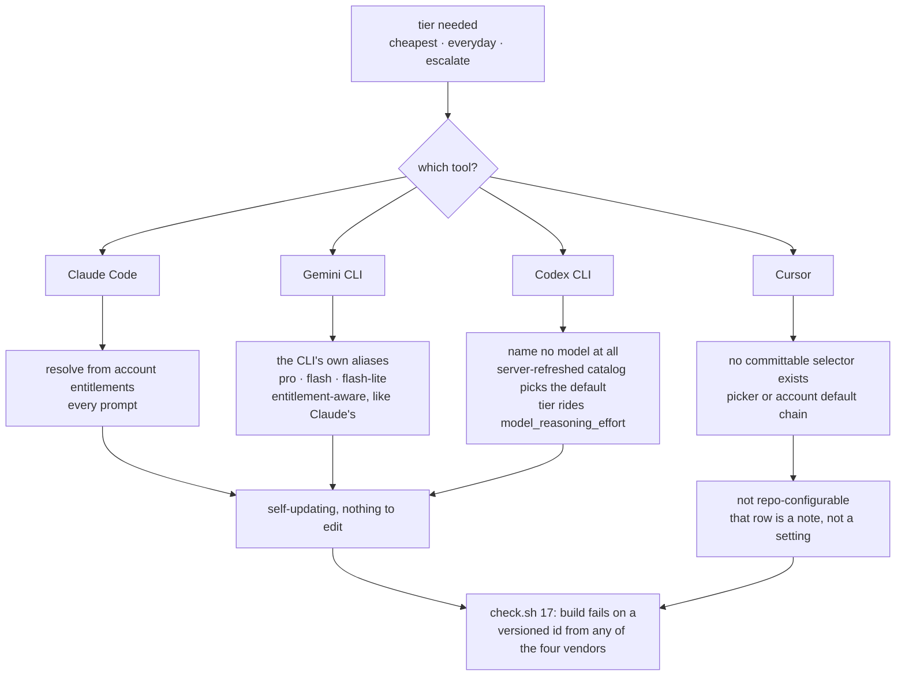

# Design notes

Why craftkit behaves the way it does. The [README](../README.md) says what each piece does and how
to use it; this file keeps the reasoning, most of which exists because the simpler version shipped
and broke. Release-by-release history lives in [CHANGELOG.md](../CHANGELOG.md).

## Enforcement gates

### Hook lifecycle

A hook dropped from `_CRAFTKIT_HOOKS` is uninstalled on the next sync, both the installed file and its `settings.json` registration, and the hook state file in `~/.craftkit-state/claude-hooks` is what makes that possible. Retiring a hook without that pass left the machine firing a gate whose source had been deleted, which is the same orphaning shape adapter retirement has.

### Shared helpers

[`craftkit-drift.js`](hooks/craftkit-drift.js) is the shared staleness answer: one `git diff --name-only <baseline> -- <paths>` per question, which honors `.gitattributes` clean filters, covers staged and worktree states together, and reports a rename instead of dying on the old path. It returns clean, drifted, or cannot-verify, and cannot-verify is never clean, because this repo squash-merges and a context doc's baseline commit leaves reachable history the moment its branch lands.

[`craftkit-filesize.js`](hooks/craftkit-filesize.js) holds `BIG_LINES` and the line probe both read-path hooks share. Two copies of "how big is big" would let one path truncate a file the other waved through, and that disagreement would surface only as a read budget nobody could explain.

[`craftkit-transcript.js`](hooks/craftkit-transcript.js) is the shared scanner all three gates read the current turn through, so they can never disagree about where the turn started. [`craftkit-platform.js`](hooks/craftkit-platform.js) plays the same role for the platform question, shared by the routing hook and the platform-rules hook: two copies drifting would route the prompt to one platform's skills while loading another's rules.

### The two read-path hooks

[`craftkit-read-cap.js`](hooks/craftkit-read-cap.js) is the one `PreToolUse` hook that rewrites instead of refusing. `rtk hook claude` already turns `cat F` into `rtk read F`, but passes no flags at any size, so a 2000-line file still lands whole and is re-sent on every turn after. This adds `-m 800`, the cap rtk already supports, to a bare `cat F` or `rtk read F` over 800 lines. `rtk read -m N` is not a plain cap: measured on rtk 0.49.0, a file of n lines passes whole when n is at or under N and shows exactly N/2 when it is over, so one constant serves as both threshold and flag value and the model sees 400 lines of anything past it. `check.sh` check 35 pins that ratio, because an rtk release that changed it would silently halve every big read again. `-m` and not `-l`: the `-l` filters strip comments and nothing else (10577 to 5506 bytes on `craftkit-routing.js`, a no-op on markdown), so they delete the non-obvious `why` comments and every `ponytail:` / `flag:` marker that `karpathy-guidelines` makes contract, while truncation loses a tail that rtk names in its own output (`[340 more lines]`). It matches both command shapes on purpose: it shares the `Bash` event with rtk's own hook, and which of two `updatedInput` results Claude Code applies is not ours to pick, so matching one shape would mean firing on one order only. If rtk's rewrite wins the merge, the read is uncapped and behavior equals today. A command carrying any shell metacharacter is left alone, because `cat f | wc -l` capped at 400 reports 400, not the real count. Escape hatch: `CRAFTKIT_READ_CAP=off`.

[`gate-read-size.js`](hooks/gate-read-size.js) is the Read-path half of the same problem. `rtk hook claude` only intercepts `Bash`, so the Read tool, the larger channel, had nothing on it, and a file read whole is re-sent on every turn for the rest of the session. Past 800 lines the gate refuses, and the refusal names the ways through: spawn [`bulk-read`](agents/bulk-read.md), which reads the file in its own context and returns bullets carrying `file:line`, or pass `offset` and `limit`, which is never refused at any size. Reading the whole file in consecutive slices is named as the thing that is not a way through, since it costs what the whole read cost. A read inside a subagent always passes, because that is the `bulk-read` call the refusal offers, and `Grep` is never gated, so finding the range to read costs nothing. Escape hatch: `CRAFTKIT_READ_GATE=off`.

It keeps no once-per-turn budget, unlike the other three. Theirs exists so a ten-edit turn does not cost ten prompts and train the click-through, and this one shows no prompt, so a budget would buy nothing and let the 2nd through Nth large read of a turn land whole.

`bulk-read` is the one cold agent whose read tools replace handed content instead of following a reference inside it, which `rules/grounding.md` and `partials/grounding-claims.md` both name as the single exception. Its bullets answer questions and cannot back an edit: when the answer is that a line must change, it names the range and the caller reads that slice. The cost shape check 34 guards is a different one, because `bulk-read` is single-shot rather than a review agent accumulating reads across a long turn.

### Gate behavior

- **Per turn, except the skill gate.** The two `Stop` gates judge the turn in front of them: a self-pass or a verification run in an earlier turn buys nothing later. `gate-skill-first.js` is the exception and is scoped to the session, because the misses it exists to catch are continuation turns ("apply the fixes") whose routing decision was made several turns back. Measured on 76 source-editing turns, asking on every unrouted one fires at 62%, while asking only when the session never routed fires at 18% and still reaches the miss population. A slash command you typed yourself arms it too.
- **A downgrade refuses, it does not revert.** `sync.sh` records the synced version in `~/.craftkit-state/version` and refuses to run from a checkout older than the install, because the state files hold names only: a one-commit-stale `main` uninstalled a live rule from all four tools this way, and the only symptom was rules quietly reverting. Two clones at different versions share that one file, so a deliberately old tree needs `CRAFTKIT_ALLOW_DOWNGRADE=1`.
- **`ask`, never `deny`, except on the Read path.** The human keeps the override, the agent does not. `gate-read-size.js` is the one exception, and it is measured rather than argued: an `ask` resolves to allow under auto-accept without surfacing anything. It fired on an 810-line read, wrote its turn stamp, and the file landed whole regardless, so the gate read as coverage while doing nothing. The refusal is also a different kind of claim. The other three judge whether a skill applies or whether a turn verified, which is a judgment a human should be able to overrule; this one asserts a file's line count and proposes a route, and it is affordable to refuse only because `offset`/`limit`, `Grep`, and a subagent read all stay open. Truncating instead, the way the Bash cap does, is unsafe here: rtk prints `[N more lines]` inside its own output while the Read tool prints nothing, so injecting a `limit` would hand the model 800 lines of a 2000-line file with no sign the file continued.
- **One prompt per unrouted turn.** The gate fires per tool call, so a ten-edit turn would have cost ten prompts, which trains you to click through it. The first ask stamps the turn and the rest of it passes. Denying the first edit therefore lets the remainder of that turn through, on the assumption the denial already redirected the agent.
- **Fail open.** An unreadable transcript, malformed stdin, or a project with no gate command passes. A gate that guesses is worse than one that abstains, so both abstain.
- **Subagents are enforced at the parent, not inside.** A subagent gets its own transcript under `<session>/subagents/`, so the parent's `Skill` call is not in it and the skill gate would prompt on every edit a `/parallel-build` implementer makes, where a background agent may have nobody able to answer. Sidechain turns therefore pass. What closes the loop is the Stop gate: a parent turn that spawned an agent takes its file list from `git status`, because the subagent's writes are invisible in the parent's transcript exactly as shell writes are.
- **Shell-route edits.** `sed -i`, a heredoc, or `tee` writes a file with no `Edit` tool call, so the skill gate never sees it (`PreToolUse` fires per tool, and the tool was `Bash`). The Stop gate closes that: a turn whose commands look write-ish, or which spawned an agent, has its file list taken from `git status` instead. A read-only turn on an already-dirty tree still passes, because the turn has to have written something first.
- **Announcing is not invoking, and only one gate sees that.** The other two key on code edits, so a turn producing only prose (a PR message, a humanized draft) passes both while the agent writes freehand under a skill's name. That is the worse half of the failure, because the announcement reads as evidence the skill ran. `gate-announce-honored.js` matches `Running /<name>` at line start against the `Skill` calls actually recorded in the turn. Line-anchored, fence-stripped, and limited to names that resolve to something installed, so documenting the format does not trip it. Known limit: plugin skills (`<plugin>:<name>`) are not enumerated and fail open.
- **A declaration is mandatory, which is what makes the check above stick.** Holding announcements honest is defeated by never announcing, and that trade is a downgrade: the lie becomes a silent skip, and the tell you could have checked is gone. So the same gate also refuses a turn that claimed nothing: every turn ends carrying either `Running /<skill>` or `No skill matched for this request.`, and a `Skill` call or a slash command you typed counts as the declaration on its own. An empty reply passes, because an interrupted turn claimed nothing to hold it to. Worst case on a forgotten line is one extra round trip, since `stop_hook_active` lets the retry through.
- **Locally installed skills are routed too.** Anything under `~/.claude/skills/` or `<project>/.claude/skills/` is not craftkit's and cannot be hardcoded into the table, so `craftkit-routing.js` enumerates those directories per prompt and appends whatever the table did not already name. `/humanizer` sat outside the classification set entirely until this existed. Enumeration stats through symlinks, which is how marketplace installers place a skill.
- **The Stop gate reads your project.** `check.sh` at the root means that is the required command; otherwise a `package.json` requires a typecheck and a lint. Neither present means no gate.
- **Path-scoped rules, per tool.** A rule whose frontmatter declares `platform: fe` (or `android`, `ios`, or a comma-separated set) is no longer always-on. Claude Code has no user-scope path-scoped rule mechanism: `.claude/rules/*.md` with `paths:` is project-scoped and checked in, while craftkit ships at user scope, so anything in the managed block loads in **every** project. `fe-rules` therefore taught EVPMR laws during Kotlin work. The scoped rule is now left out of the block and injected by `craftkit-platform-rules.js` at `SessionStart` only where the cwd matches. `SessionStart` rather than per-prompt because the body is ~1k tokens, and it fires on resume, clear, and compact too, so the rules survive a context reset. Cursor is the one tool with native scoping and gets `alwaysApply: false` plus real `globs` instead. Gemini CLI and Codex CLI have no conditional mechanism, so the rule stays always-on there; that is a stated limitation, not an oversight.
- **Escape hatch:** `CRAFTKIT_GATE=off` disables all three gates and the platform-rules injection for the session.

## Sharing text between skills, agents and commands

**`craftkitInject` avoids the hand-maintained duplicate.** Add `craftkitInject: <name>` to a **skill's, agent's or command's** frontmatter and the sync splices that body in as a managed block at install time, regenerated on every pull. Each name resolves `partials/<name>.md` first, then `rules/<name>.md`, then `skills/<name>/SKILL.md`, so a file can carry a live partial (`parallel-review` ← `partials/parallel-classifier`), a live rule (`fe-review` ← `fe-rules`), or a live skill checklist (`android-review` ← `skills/android-review`). Prefer it over copying text; a copy silently rots when the source changes. Agents and commands render on Claude Code only, since no other tool has those hosts. **Skills render on all four**, because every adapter installs the same `SKILL.md`, so a Claude-only splice would ship the other three a skill with its core section missing (`sync.sh:craftkit_render_injected`, gated by `check.sh` check 30).

**The ponytail rubric ships in two sizes too**, for the same reason and with a stronger guard. `rules/karpathy-guidelines.md` keeps the full rule, because the writing side needs the whole ladder; the `ponytail-review` agent injects `partials/ponytail-rubric.md`, which is the six-tag table and the protected list only. The agent is read-only, so the write-side rules (assumptions, surgical edits, run tests, checkpoint, the self-pass) were ~167 lines it could never act on, every spawn. `check.sh` diffs the two byte for byte, because "author under the exact list review scores by" stops being true the moment one is paraphrased.

**A rule can ship in two sizes.** `rules/grounding.md` is the always-on version, carrying the full provenance discipline for the session that reads it. Cold agents inject `partials/grounding-claims.md` instead, which keeps only the clauses an agent can act on (label findings, do not let an `[UNVERIFIED]` claim back an `[ERROR]`, review handed content). Measured at ~245 tokens per agent spawn against ~769 for the whole rule, which is ~1.5k saved on a six-agent build. Two files stay aligned by hand, and that is the cost of the split.

**A partial can serve a skill and its agent at once.** `partials/fe-state-location.md` holds the EVPMR state-location mapping and the props-drilling threshold, spliced into both `skills/fe-patterns` and `agents/fe-patterns`. The skill teaches it while building, the cold agent reviews against it, and one edit moves both. The agent previously carried a thinner paraphrase, which is how it came to review component trees with no threshold to review by.

**`partials/` is the lazy-shared namespace.** A procedure several commands run, but that nothing needs resident, goes here: it syncs to no tool on its own and only ever arrives spliced. That is how the parallel classifier stopped costing ~1.4k est. tokens in every session while staying a single source of truth. A partial nothing injects fails `check.sh` check 5, since no sync would otherwise report it.

## CI

**CI runs the gate.** `.github/workflows/check.yml` runs `check.sh` on every pull request and every push to `main`, on two legs: `macos-latest` with `/bin/bash` 3.2, which is the compatibility target and the only place a bash 4+ feature actually fails, and `ubuntu-latest` with bash 5 and GNU coreutils, where a BSD-only idiom shows up instead. Before this, the only gate the repo has ran solely on the author's machine and was self-reported.

## Intent resolution

One resolver serves every skill that touches intent: `partials/planning-resolve.md`, injected into `/spec` `/plan` `/adr` `/docs` `/eval`. A second copy of the glob rule is how two skills come to disagree about which feature is active, so `check.sh` check 32 holds the single copy and refuses any source file that still names the old shared PLANNING block.

## Model routing

The plan gate is load-bearing, not decoration. An earlier cut derived the window from "the top three families present" and looked equivalent, since it reproduced both plan rows, but the signal it leaned on was `additionalModelOptionsCache`, a *picker* list rather than an access list. Advertise fable to a Pro account and its everyday tier silently jumps to opus. Capping personal below the frontier family keeps everyday on sonnet no matter what the picker shows, and `check.sh` asserts both windows so the cap cannot quietly come off.

The other three tools reach the same self-updating property by their own means; only the Claude
path is entitlement-driven:

That last node earns its place: check 17 was Claude-scoped at first, which is exactly how `codex-mini-latest` sat in the table for six months after OpenAI retired it on **2026-02-12**. Working sources, and the independent re-verification pass behind them, are in `docs/research/self-updating-model-ids.md`.

## Retired tools

GitHub Copilot and Crush were supported through v1.23.0. Every kept tool exposes a headless entry point (`claude -p`, `cursor-agent`, `gemini -p`, `codex exec`), which is what lets one of them spawn work in another; Copilot is IDE-bound and Crush is TUI-only, so neither can participate in cross-tool agent fan-out.

## graphify

Install it project-scoped only (`graphify claude install` writes `<project>/CLAUDE.md` and
`<project>/.claude/settings.json`). Its global mode writes into `~/.claude/CLAUDE.md`, and its
uninstall strips up to the next `## ` heading, which takes craftkit's BEGIN marker with it.
`adapters/claude.sh` recovers from that, and `check.sh` check 21 holds the invariant. Its doc/PDF
semantic pass needs an LLM key, so point it at `GRAPHIFY_CLAUDE_CLI_MODEL` to reuse the session
instead of adding a provider.
