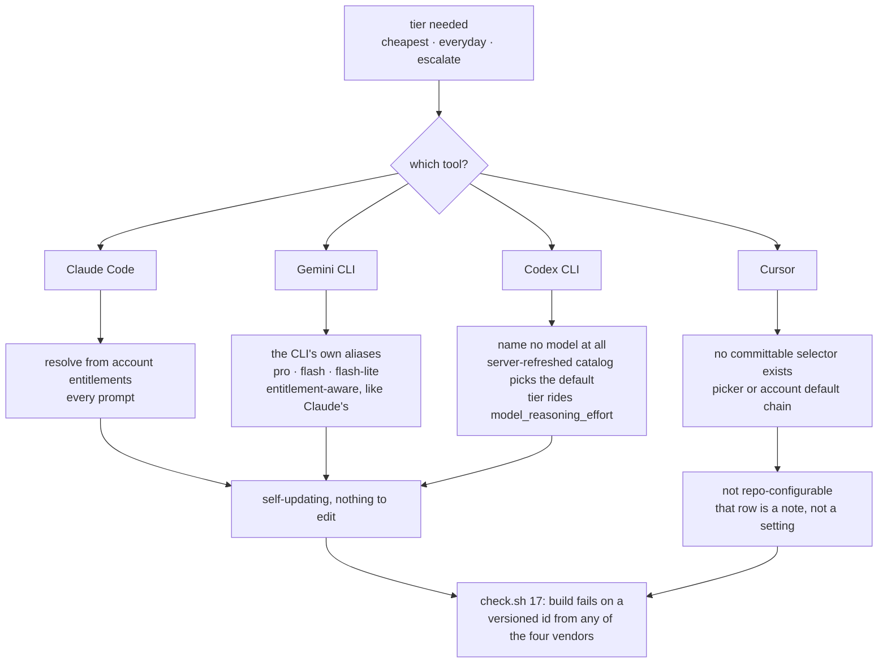

# Design notes

Why craftkit behaves the way it does. The [README](../README.md) says what each piece does and how
to use it; this file keeps the reasoning, most of which exists because the simpler version shipped
and broke. Release-by-release history lives in [CHANGELOG.md](../CHANGELOG.md).

## Enforcement gates

### Hook lifecycle

A hook dropped from `_CRAFTKIT_HOOKS` is uninstalled on the next sync, both the installed file and its `settings.json` registration, and the hook state file in `~/.craftkit-state/claude-hooks` is what makes that possible. Retiring a hook without that pass left the machine firing a gate whose source had been deleted, which is the same orphaning shape adapter retirement has.

### Shared helpers

| Helper | Shared by | What it holds | Why one copy |
|---|---|---|---|
| [`craftkit-drift.js`](hooks/craftkit-drift.js) | every staleness question | one `git diff --name-only <baseline> -- <paths>` per question: honors `.gitattributes` clean filters, covers staged and worktree states together, reports a rename instead of dying on the old path. Returns clean, drifted, or cannot-verify | cannot-verify is never clean, because this repo squash-merges and a context doc's baseline commit leaves reachable history the moment its branch lands |
| [`craftkit-filesize.js`](hooks/craftkit-filesize.js) | both read-path hooks | `BIG_LINES` and the line probe | two copies of "how big is big" would let one path truncate a file the other waved through, surfacing only as a read budget nobody could explain |
| [`craftkit-transcript.js`](hooks/craftkit-transcript.js) | all three gates | the scanner that reads the current turn | the gates can never disagree about where the turn started |
| [`craftkit-platform.js`](hooks/craftkit-platform.js) | routing hook, platform-rules hook | platform detection | two copies drifting would route the prompt to one platform's skills while loading another's rules |

- **Escape hatch:** `CRAFTKIT_GATE=off` disables all three gates and the platform-rules injection for the session.

## Sharing text between skills, agents and commands

Prefer sharing over copying: a copy silently rots when the source changes.

| Mechanism | How it works | Example | Why, and what it costs |
|---|---|---|---|
| **`craftkitInject`** | `craftkitInject: <name>` in a **skill's, agent's or command's** frontmatter splices that body in as a managed block at install time, regenerated on every pull. Each name resolves `partials/<name>.md`, then `rules/<name>.md`, then `skills/<name>/SKILL.md` | a live partial (`parallel-review` ← `partials/parallel-classifier`), a live rule (`fe-review` ← `fe-rules`), a live skill checklist (`android-review` ← `skills/android-review`) | agents and commands render on Claude Code only, since no other tool has those hosts. **Skills render on all four**, because every adapter installs the same `SKILL.md`, so a Claude-only splice would ship the other three a skill with its core section missing (`sync.sh:craftkit_render_injected`, gated by `check.sh` check 30) |
| **Ponytail rubric in two sizes** | `rules/karpathy-guidelines.md` keeps the full rule, because the writing side needs the whole ladder; the `ponytail-review` agent injects `partials/ponytail-rubric.md`, the six-tag table and the protected list only | `ponytail-review` | the agent is read-only, so the write-side rules (assumptions, surgical edits, run tests, checkpoint, the self-pass) were ~167 lines it could never act on, every spawn. `check.sh` diffs the two byte for byte, because "author under the exact list review scores by" stops being true the moment one is paraphrased |
| **Grounding rule in two sizes** | `rules/grounding.md` is the always-on version with the full provenance discipline; cold agents inject `partials/grounding-claims.md`, only the clauses an agent can act on (label findings, do not let an `[UNVERIFIED]` claim back an `[ERROR]`, review handed content) | every cold reviewer | measured at ~245 tokens per agent spawn against ~769 for the whole rule, ~1.5k saved on a six-agent build. Cost: two files stay aligned by hand |
| **One partial, skill and agent** | `partials/fe-state-location.md` holds the EVPMR state-location mapping and the props-drilling threshold, spliced into both `skills/fe-patterns` and `agents/fe-patterns` | `fe-patterns` | the skill teaches it while building, the cold agent reviews against it, one edit moves both. The agent previously carried a thinner paraphrase, which is how it came to review component trees with no threshold to review by |
| **`partials/`, the lazy-shared namespace** | a procedure several commands run, but that nothing needs resident, lives here: it syncs to no tool on its own and only ever arrives spliced | the parallel classifier | stopped costing ~1.4k est. tokens in every session while staying a single source of truth. A partial nothing injects fails `check.sh` check 5, since no sync would otherwise report it |

## CI

**CI runs the gate.** `.github/workflows/check.yml` runs `check.sh` on every pull request and every push to `main`, on two legs: `macos-latest` with `/bin/bash` 3.2, which is the compatibility target and the only place a bash 4+ feature actually fails, and `ubuntu-latest` with bash 5 and GNU coreutils, where a BSD-only idiom shows up instead. Before this, the only gate the repo has ran solely on the author's machine and was self-reported.

## Intent resolution

One resolver serves every skill that touches intent: `partials/planning-resolve.md`, injected into `/spec` `/plan` `/adr` `/docs` `/eval`. A second copy of the glob rule is how two skills come to disagree about which feature is active, so `check.sh` check 32 holds the single copy and refuses any source file that still names the old shared PLANNING block.

## Model routing

The plan gate is load-bearing, not decoration. An earlier cut derived the window from "the top three families present" and looked equivalent, since it reproduced both plan rows, but the signal it leaned on was `additionalModelOptionsCache`, a *picker* list rather than an access list. Advertise fable to a Pro account and its everyday tier silently jumps to opus. Capping personal below the frontier family keeps everyday on sonnet no matter what the picker shows, and `check.sh` asserts both windows so the cap cannot quietly come off.

The other three tools reach the same self-updating property by their own means; only the Claude
path is entitlement-driven:

That last node earns its place: check 17 was Claude-scoped at first, which is exactly how `codex-mini-latest` sat in the table for six months after OpenAI retired it on **2026-02-12**. Working sources, and the independent re-verification pass behind them, are in `docs/research/self-updating-model-ids.md`.

## Retired tools

GitHub Copilot and Crush were supported through v1.23.0. Every kept tool exposes a headless entry point (`claude -p`, `cursor-agent`, `gemini -p`, `codex exec`), which is what lets one of them spawn work in another; Copilot is IDE-bound and Crush is TUI-only, so neither can participate in cross-tool agent fan-out.

## graphify

Install it project-scoped only (`graphify claude install` writes `<project>/CLAUDE.md` and
`<project>/.claude/settings.json`). Its global mode writes into `~/.claude/CLAUDE.md`, and its
uninstall strips up to the next `## ` heading, which takes craftkit's BEGIN marker with it.
`adapters/claude.sh` recovers from that, and `check.sh` check 21 holds the invariant. Its doc/PDF
semantic pass needs an LLM key, so point it at `GRAPHIFY_CLAUDE_CLI_MODEL` to reuse the session
instead of adding a provider.
